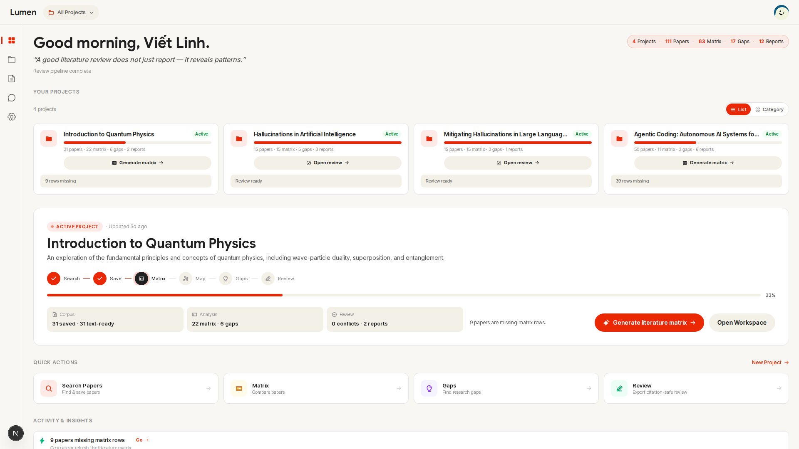
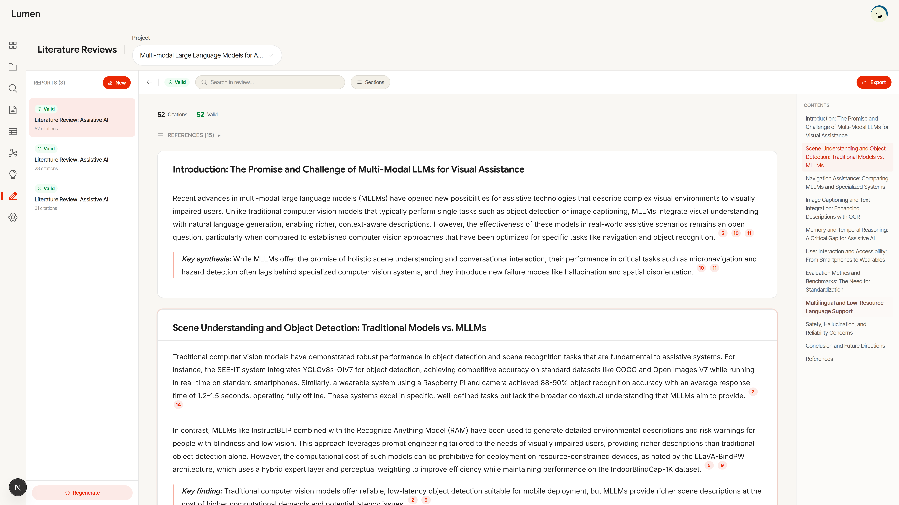
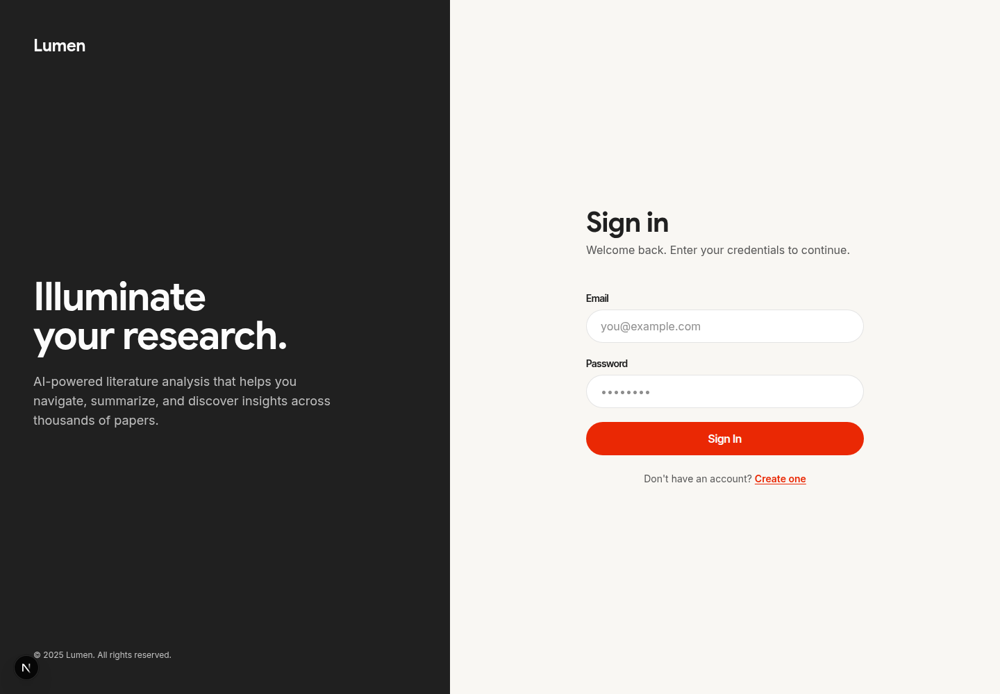

# Lumen - AI Literature Review Assistant


**🎥 [Watch the MVP Demo Video](https://youtu.be/uNt316BZaY8)**

Lumen is a research workflow assistant for building citation-safe literature
reviews. It helps a researcher create projects, search and save papers, extract
structured evidence, generate a literature matrix, identify research gaps and
conflicts, visualize a knowledge map, and export review drafts that only cite
papers saved in the project.



## What Works

### Frontend

- Public landing page at `http://localhost:3000`.
- Login and registration screens.
- Authenticated app shell with sidebar navigation.
- Dashboard with project, paper, matrix, gap, and report stats.
- Project list, project creation, project detail, paper list, PDF download, PDF
  full-text panel, and paper removal.
- Paper search page with project selection, pagination, search sessions, AI
  screening, AI query suggestions, and auto-save flow.
- Literature matrix page with generation, editable rows, confidence display,
  and row deletion.
- Research gaps and conflict detection page with generation, evidence display,
  expansion, and deletion.
- Knowledge map page with graph filters, layout controls, search, and node
  detail panel.
- Literature review reports page with generation, validation status, section
  navigation, search, and Markdown export.
- Settings page components.

### Backend

- FastAPI application with automatic table creation on startup.
- JWT auth: register, login, current user, and password change.
- Project CRUD with ownership checks.
- Paper search, AI query suggestion, AI screening, search sessions, session
  history, pagination, auto-save, and unsave.
- Project paper save/deduplication, PDF download, PDF text extraction, chunk
  storage, full-text retrieval, and LLM-based PDF normalization.
- Literature matrix listing, generation, row editing, and row deletion.
- Hybrid retrieval over paper chunks.
- Research gap generation/list/delete with evidence records.
- Conflict detection generation/list with evidence records.
- Knowledge graph endpoint built from saved project evidence.
- Report generation/list/detail/export with citation validation status.
- Admin user listing and user updates.
- Stats endpoint for dashboard totals.
- LangGraph workflow entry point for controlled research workflows.
- AI provider adapters for Anthropic, OpenAI, and DeepSeek-compatible backends.

### Local Infrastructure

- Docker Compose PostgreSQL 16 with pgvector on host port `5434`.
- Makefile targets for setup, backend, frontend, tests, linting, formatting, and
  type checking.
- Backend tests for health, hybrid retrieval, log hook behavior, and PDF
  normalization.

## Screenshots

### Product Preview



### Landing Page


### Login Page



## Requirements

- Python `3.13`
- `uv`
- Node.js `20.20+` or Node.js `22 LTS`
- `pnpm`
- Docker with Compose support

## Environment Setup

Create a local environment file from the example:

```bash
cp .env.example .env
```

For basic local boot, the database and auth settings in `.env.example` already
match `docker-compose.yml`.

AI-backed features need at least one provider key:

- `ANTHROPIC_API_KEY`
- `OPENAI_API_KEY`
- `DEEPSEEK_API_KEY`

Embedding, paper search, and multi-source enrichment are controlled by the
remaining variables in `.env.example`.

## Run Locally

Install dependencies:

```bash
make setup
```

Start PostgreSQL with pgvector:

```bash
docker compose up -d db
```

Start backend and frontend together:

```bash
make dev
```

Or start them in separate terminals:

```bash
make backend
make frontend
```

Default local URLs:

- Frontend: `http://localhost:3000`
- Backend API: `http://localhost:8010`
- Health check: `http://localhost:8010/api/health`
- PostgreSQL: `localhost:5434`

Check the API:

```bash
curl http://localhost:8010/api/health
```

## Sample Queries

Here are a few sample queries you can use in the system to search for papers:
- "Machine learning applications in early stage cancer detection"
- "Impact of microplastics on marine ecosystems"
- "Advancements in solid-state battery technology for EVs"
- "Effectiveness of cognitive behavioral therapy for remote workers"
- "Optimization algorithms for supply chain management post-pandemic"

## Quality Checks

Backend:

```bash
make lint
make typecheck
make test
make check
```

Frontend:

```bash
make lint-frontend
make typecheck-frontend
```

## Useful Commands

```bash
# Install backend and frontend dependencies
make setup

# Run FastAPI only
make backend

# Run Next.js only
make frontend

# Run backend tests
make test

# Run backend lint, type check, and tests
make check
```

## Project Structure

```text
app/                 FastAPI backend
app/routers/         HTTP route modules
app/services/        Domain services and AI workflow helpers
app/agents/          LangGraph workflow state and nodes
app/db/              SQLAlchemy models and session setup
frontend/            Next.js 16 app
frontend/app/        App Router pages and layouts
frontend/components/ Reusable UI components
docs/                Product, architecture, roadmap, and screenshots
tests/               Backend tests
docker-compose.yml   Local PostgreSQL + pgvector
Makefile             Local setup, dev, and verification commands
```
