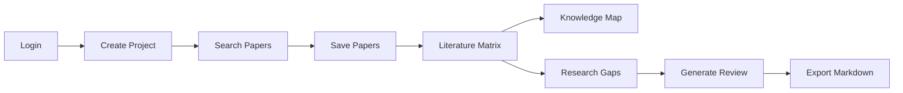

# AI Literature Review Assistant Documentation

## Purpose

AI Literature Review Assistant is a web application for helping researchers
move from a broad research topic to a defensible literature review draft. It
supports a repeatable research workflow: find real papers, screen them, extract
comparable evidence, organize the field, identify gaps, and generate a review
whose citations trace back to papers stored in the project database.

The minimum viable product focuses on eight capabilities:

1. Login.
2. Create Project.
3. Search Papers.
4. Save Papers.
5. Literature Matrix.
6. Knowledge Map.
7. Research Gap Detection.
8. Citation-safe Literature Review Export.

## Recommended Stack

| Layer | Technology |
|-------|-----------|
| Frontend | Next.js 16, React 19, TypeScript, Tailwind v4, shadcn/ui, Cytoscape.js |
| Backend | FastAPI (Python 3.13), SQLAlchemy async, JWT auth |
| Database | PostgreSQL 16 + pgvector (Docker) |
| AI Provider | DeepSeek V4 via OpenAI-compatible adapter, Anthropic Claude |
| Agent Orchestration | LangGraph (linear workflow graph) |
| Paper Sources | Semantic Scholar, OpenAlex, arXiv (via PaperHub) |
| RAG | Custom Hybrid RAG (keyword + vector + section boosts + reranker) |
| Deployment | Coolify + Docker, GitHub Actions, GHCR |

## High-Level Workflow

The workflow is a linear pipeline. The user drives each step through the UI.
The LangGraph agent runs behind the scenes for the AI-heavy steps (matrix
extraction, gap detection, review generation) but the user remains in control.

### Search

The user searches through the backend. Results come from Semantic Scholar and
PaperHub (which wraps OpenAlex, arXiv, EuropePMC, PMC). The search response
includes source diagnostics and a language coverage audit. Query variants are
generated for language-aware search.

### Save and Screen

The user saves relevant papers into the project corpus. Saved papers become the
only papers available for matrix generation, gap detection, and citation-safe
review export. The backend deduplicates by DOI, arXiv ID, and Semantic Scholar
ID.

### Literature Matrix

The system generates structured rows for saved papers using RAG-aware
extraction. Each row includes: research problem, method, dataset/context,
key result, limitation, contribution, and relevance. Rows are editable because
AI extraction can be incomplete or wrong.

### Knowledge Map

The system generates an interactive force-directed graph from saved papers and
their matrix rows. Nodes represent papers, methods, datasets, and limitations.
Edges represent relationships. Built with Cytoscape.js.

### Research Gap Detection

The system generates candidate gaps from matrix rows. Each gap must include
evidence papers and an explanation. Gaps without evidence are rejected by the
backend. The system also detects potential conflicting findings between papers
that share methods or datasets but report opposing results.

### Citation-Safe Review Export

The system generates a literature review draft and validates all citation IDs
against saved project papers. The reference list is built from database
metadata, not from model-generated text. Invalid citations are rejected or
trimmed. If >30% of citations are invalid, the system retries once with a
stricter prompt.

## Core Concepts

### Project

A project is the user's research workspace. It has a topic, optional research
questions, selected papers, matrix rows, generated gaps, and report drafts. The
project boundary is also the citation boundary: the AI can only cite papers
attached to the current project.

### Paper

A paper is a real academic work retrieved from an external source. Each paper
has at least a title, author list, year, source URL, and source identifier.
DOI, venue, citation count, abstract, arXiv ID, Semantic Scholar ID, and
OpenAlex ID are stored when available. The system never creates a paper record
from an LLM-generated citation.

### Literature Matrix

A structured table where each row summarizes one saved paper by method,
dataset, result, limitation, and relevance. This matrix is what makes gap
detection explainable.

### Research Gap

A gap must reference evidence from selected papers. A valid gap explains: what
is missing, which papers reveal the limitation, and what kind of future study
could address it. The system ranks gaps by evidence strength.

### Citation Guardrail

The citation guardrail is a backend rule, not a prompt alone. The model must
return structured citation IDs that refer to saved project papers. The backend
validates those IDs before saving or exporting the review. Invalid IDs are
rejected or the section is regenerated.

## Assignment Requirement Mapping (AI20K-031)

| Requirement | Covered In | Status |
| --- | --- | --- |
| Tìm & sàng lọc bài báo từ nguồn học thuật | Search endpoint + PaperHub sources | Done |
| Tóm tắt & phân nhóm theo hướng tiếp cận/phương pháp/kết quả | Literature matrix with editable cells | Done |
| Xây dựng bản đồ tri thức | Knowledge map with Cytoscape.js | Done |
| Phát hiện khoảng trống nghiên cứu | Gap detection with evidence validation | Done |
| Phát hiện mâu thuẫn giữa nghiên cứu | Conflict detection from matrix rows | Done |
| Viết tổng quan có trích dẫn chính xác | Report generation + citation guardrail | Done |
| Guardrail chống bịa trích dẫn | Backend citation validation + retry | Done |
| OpenAI/Claude (gợi ý) | AIProvider interface (DeepSeek, Anthropic, OpenAI-compatible) | Done |
| RAG | Hybrid RAG (keyword + vector + section boosts + reranker) | Done |
| Academic API (Semantic Scholar/arXiv) | Semantic Scholar + PaperHub (OpenAlex, arXiv, EuropePMC, PMC) | Done |
| Citation | `review_citations` table; citation validation query | Done |
| FastAPI | Backend with 13 routers, 16 services | Done |
| Deployed online (URL truy cập) | Coolify + Docker + GHCR | Pending |
| Đăng nhập & phân quyền | JWT auth + researcher/admin roles | Done |
| Giao diện UI/UX hoàn chỉnh | 14 pages with Next.js 16 App Router | Done |
| Quản lý user | Admin endpoints (list, activate/deactivate) | Done |
| Không chấp nhận notebook/CLI/localhost | Web app, deploy pending | Pending |

## Glossary

| Term | Meaning |
| --- | --- |
| Project paper | A paper record tied to a specific project (`project_papers` table). Only saved project papers can be cited in reports. |
| Citation guardrail | A backend validation rule that rejects any generated citation ID not found in the project's saved papers. |
| Hybrid RAG | A retrieval strategy combining keyword search, vector similarity, section boosts, and reranking. |
| Literature matrix | A structured table where each row summarizes one saved paper by method, dataset, result, limitation, and relevance. |
| Language coverage audit | A search output showing the distribution of candidate papers by language and any ranking adjustments applied. |
| Evidence chunk | A retrieved text segment that carries a `project_paper_id`, source field, score, and retrieval reason. |

## Documentation Map

- `architecture/system-overview.md`: system-level architecture and data flow.
- `architecture/backend-architecture.md`: FastAPI service boundaries and LangGraph workflow.
- `architecture/frontend-architecture.md`: Next.js 16 application structure and pages.
- `architecture/database-design.md`: relational schema and pgvector usage.
- `architecture/api-design.md`: endpoint design with request/response examples.
- `architecture/agent-rag-strategy.md`: LangGraph agents and Hybrid RAG design.
- `mvp.md`: MVP scope, user flow, demo flow, and acceptance criteria.
- `team-plan.md`: week-by-week work split for three members.
- `roadmap.md`: eight-week project timeline.
- `risks.md`: risk register and mitigations.
- `status.md`: current implementation status.

## Example Demo Scenario

Topic: "Retrieval-Augmented Generation for medical question answering."

1. Log in as a researcher.
2. Create a new project or open the seeded project.
3. Search using Semantic Scholar + PaperHub.
4. Save 10 to 15 relevant papers.
5. Generate the literature matrix.
6. Edit one matrix row to show human control.
7. Generate research gaps.
8. Open a gap and show supporting papers.
9. Generate a literature review.
10. Show citation validation status.
11. Export Markdown.
12. Click a citation and show the saved paper metadata.

The most important moment is step 12. It proves the review is not just fluent
generated text. It shows the chain from source paper to matrix row to gap to
cited paragraph.
