# AI Literature Review Assistant Documentation

## Purpose

AI Literature Review Assistant is a proposed web application for helping
researchers move from a broad research topic to a defensible literature review
draft. The product is not a general chatbot and should not be designed as one.
Its value comes from supporting a repeatable research workflow: find real
papers, help the user screen them, extract comparable evidence, organize the
field, identify gaps or contradictions, and generate a review section whose
citations can be traced back to papers stored in the project database.

The original pain point is concrete. Researchers often spend weeks searching
across academic sources, reading hundreds of abstracts, deciding which papers
matter, manually building comparison tables, and still worrying that they have
missed an important work. LLMs can speed up synthesis, but they introduce a new
failure mode: they may invent citations, overstate conclusions, or create
research gaps that sound plausible but are not supported by evidence. This
project should therefore optimize for evidence-grounded workflow rather than
fluent text generation.

The minimum viable product focuses on eight capabilities:

1. Login.
2. Create Project.
3. Search Papers.
4. Save Papers.
5. Literature Matrix.
6. Knowledge Map.
7. Research Gap Detection.
8. Citation-safe Literature Review Export.

Other ideas such as full PDF ingestion, live collaboration, advanced knowledge
graphs, LaTeX generation, contradiction classification, benchmark suggestion,
and cross-domain synthesis are valuable, but they are not required for the first
deliverable. The documentation in this folder is written to keep the team
honest about that boundary.

## Product Positioning

The product should be presented as a research workflow assistant. A user creates
a research project, searches for papers from Semantic Scholar, OpenAlex, and
arXiv, and uses Exa plus Firecrawl to expand search queries and crawl supporting
research pages when metadata is thin. The user then selects the papers that
belong in the project corpus. The system
summarizes each paper in a structured form: contribution, method, dataset,
main result, limitation, and relevance to the project topic. From that structured
evidence, the system builds a literature matrix and suggests research gaps.
The final output is a literature review draft that uses only verified paper
records from the database.

This framing matters because it keeps the project aligned with the real pain
point. A simple chatbot over papers may be easier to build, but it does not
directly solve the problem of missed literature, weak screening, unclear
research gaps, or citation trust. A workflow product can demonstrate clear
progress at each step and gives the evaluation committee something visible to
test: search quality, screening decisions, matrix rows, gap evidence, and final
citations.

## Recommended Stack

The recommended stack is intentionally conventional:

- Frontend: Next.js 16, React, TypeScript, Tailwind.
- Backend: FastAPI, packaged as a Docker image.
- Database: self-hosted PostgreSQL with pgvector in Docker.
- AI provider: opencode-go using DeepSeek V4 through a compatible backend
  adapter.
- Agent orchestration: LangGraph for controlled stateful research workflows.
- RAG strategy: custom Hybrid RAG over PostgreSQL full-text search, pgvector,
  metadata filters, and citation-aware reranking.
- Evaluation: Ragas for RAG and workflow evaluation.
- Stretch graph-RAG: LightRAG after the MVP is stable.
- Paper sources: Semantic Scholar, OpenAlex, arXiv.
- Search and crawl enrichment: Exa for semantic research search and Firecrawl
  for crawl/scrape-backed result enrichment.
- Deployment: Coolify running Docker services, with images built by GitHub
  Actions and pushed to GHCR.

Next.js 16 with the App Router gives the team file-based routing, built-in API
route support, server-side rendering where needed, and a simple deployment path
as a Docker container. TypeScript reduces frontend integration mistakes when the
API grows. Tailwind keeps styling consistent without requiring a custom design
system.

FastAPI is a good backend choice because the project needs typed request and
response models, async paper source clients, background-friendly workflows, and
automatic OpenAPI documentation. The backend should be the richest part of the
system: it performs source fan-out, metadata normalization, deduplication,
citation enrichment, abstract enrichment, Exa query expansion, Firecrawl crawl
enrichment, language-bias auditing, matrix extraction, gap evidence
construction, citation validation, and export generation. The frontend should
not contain research logic.

PostgreSQL is the right default database because the core data is relational:
users own projects, projects contain paper records, paper records have
extracted evidence, and reports cite saved papers. It should run as a Docker
service with a persistent volume managed by Coolify, not as an external managed
database service.
pgvector avoids introducing a separate vector database during the MVP. A
separate vector service can be added later only if retrieval volume or latency
proves PostgreSQL is not enough.

DeepSeek V4 is selected as the first LLM provider because the project needs a
single predictable model path for structured extraction and review generation.
The backend should call it through an opencode-go compatible HTTP adapter so
the rest of the system depends on a stable internal interface rather than on
provider-specific code scattered across services.

The system should not be designed as one giant prompt that does every task.
It should use one main model provider but multiple specialized LangGraph nodes:
query planner, search agent, crawl/enrichment agent, language-bias auditor,
matrix extractor, gap analyzer, review writer, and citation validator. These
nodes are not free-form autonomous agents. Each node has a typed input, typed
output, allowed tools, and backend validation. This gives the project the
benefits of agents without losing control of citations and workflow state.

## High-Level Workflow

```mermaid
flowchart LR
    A["User logs in"] --> B["Create research project"]
    B --> C["Query Planner Agent"]
    C --> D["Search Agent: APIs + Exa"]
    D --> E["Crawl Agent: Firecrawl"]
    E --> F["Review and save papers"]
    F --> G["Enrichment Agent"]
    G --> H["Matrix Extraction Agent"]
    H --> I["Hybrid RAG evidence retrieval"]
    I --> J["Gap Analysis Agent"]
    J --> K["Review Writer Agent"]
    K --> L["Citation Validator"]
    L --> M["Export Markdown or DOCX"]
```



The workflow deliberately keeps a human review step after paper search. This
is not only a UX choice; it is a quality-control mechanism. Search APIs may
return irrelevant papers, duplicate records, short abstracts, or works that are
only loosely related to the topic. If the system writes a literature review
without user approval, it can create a polished but misleading report. By
forcing the selected corpus to be visible and editable, the product makes the
final review easier to defend.

The search workflow should also control language bias. English results and
high-citation papers will usually dominate academic APIs. For topics related to
Vietnamese, local policy, low-resource languages, or regional education, that
default ranking can hide important non-English or local work. The backend
should detect the query language, generate English and original-language query
variants, use Exa and Firecrawl with language-aware options, and show a small
language coverage audit in the search results.

## Agentic Workflow and RAG Strategy

The project should use a controlled agentic workflow, not a fully autonomous
research bot. LangGraph is the recommended orchestration layer because the
research process is long-running, stateful, and benefits from checkpoints. A
failed crawl, invalid matrix row, or rejected citation should not force the
whole workflow to start over.

The initial graph should be deterministic:

```text
QueryPlanner -> Search -> CrawlEnrichment -> LanguageBiasAudit
-> UserScreening -> MatrixExtraction -> HybridRetrieval
-> GapAnalysis -> ReviewWriting -> CitationValidation
```

Hybrid RAG should replace default vector-only top-k retrieval. Default RAG is
too weak for this product because it can retrieve semantically similar text
without respecting paper metadata, citation validity, language coverage, or the
literature matrix. The MVP retrieval layer should combine:

- PostgreSQL full-text search over title, abstract, matrix row, and limitation.
- pgvector similarity over abstract, enrichment summary, and matrix chunks.
- Metadata filters by project, saved-paper status, year, language, method,
  dataset, and source.
- Reranking with DeepSeek V4 over candidate evidence chunks.
- Citation-aware filtering so retrieved evidence always carries
  `project_paper_id`.

Ragas should be used for evaluation, not for runtime orchestration. It can help
measure retrieval relevance, faithfulness, citation-support quality, and
workflow regressions on a small seeded evaluation set. LightRAG is a stretch
option for graph-RAG and knowledge-map work after the MVP works end to end.

## Core Concepts

### Project

A project is the user's research workspace. It has a topic, optional research
questions, selected papers, matrix rows, generated gaps, and report drafts. The
project boundary is also the citation boundary: the AI can only cite papers
attached to the current project.

### Paper

A paper is a real academic work retrieved from an external source or saved from
previous searches. Each paper should have at least a title, author list, year,
source URL, and source identifier. DOI, venue, citation count, abstract, arXiv
ID, Semantic Scholar ID, and OpenAlex ID should be stored when available. The
system should never create a paper record from an LLM-generated citation alone.

### Literature Matrix

The literature matrix is the main bridge between retrieval and synthesis. It
turns paper summaries into comparable rows. For the MVP, each row should include:
paper, research problem, method, dataset or study context, key result,
limitation, and relevance. This matrix is what makes gap detection explainable.

### Research Gap

A research gap is not just an interesting future direction. In this product, a
gap must reference evidence from selected papers. A valid gap should explain:
what is missing, which papers reveal the absence or limitation, why the absence
matters, and what kind of future study could address it. The system should rank
gaps by evidence strength instead of confidence-sounding language.

### Citation Guardrail

The citation guardrail is a backend rule, not a prompt alone. During generation,
the model must return structured citation IDs that refer to saved project
papers. The backend validates those IDs before saving or exporting the review.
If an ID is missing, invalid, or not attached to the project, the backend rejects
the section or asks the model to regenerate using valid IDs only. This is the
central trust feature of the project.

## Assignment Requirement Mapping (AI20K-031)

| Requirement | Covered In | Status |
| --- | --- | --- |
| Tìm & sàng lọc bài báo từ nguồn học thuật | `architecture/api-design.md` — search endpoint; `architecture/backend-architecture.md` — source adapters | MVP |
| Tóm tắt & phân nhóm theo hướng tiếp cận/phương pháp/kết quả | `architecture/database-design.md` — `literature_matrix_rows`; `architecture/backend-architecture.md` — matrix service | MVP |
| Xây dựng bản đồ tri thức | `architecture/frontend-architecture.md` — Knowledge Map tab using react-force-graph-2d | MVP |
| Phát hiện khoảng trống nghiên cứu | `architecture/backend-architecture.md` — gap detection service; `architecture/api-design.md` — gaps endpoints | MVP |
| Phát hiện mâu thuẫn giữa nghiên cứu | `architecture/backend-architecture.md` — contradiction detection service | MVP |
| Viết tổng quan có trích dẫn chính xác | `architecture/backend-architecture.md` — report generation + citation guardrail | MVP |
| Guardrail chống bịa trích dẫn | `architecture/api-design.md` — citation guardrail contract; `architecture/database-design.md` — citation validation query | MVP |
| OpenAI/Claude (gợi ý) | `architecture/agent-rag-strategy.md` — DeepSeek V4 with AIProvider interface swapable to OpenAI/Claude | Covered |
| RAG | `architecture/agent-rag-strategy.md` — Hybrid RAG (pgvector + full-text + metadata) | MVP |
| Academic API (Semantic Scholar/arXiv) | `architecture/backend-architecture.md` — Semantic Scholar, OpenAlex, arXiv + Exa + Firecrawl | MVP |
| Citation | `architecture/database-design.md` — `review_citations` table; citation validation query | MVP |
| FastAPI | `architecture/backend-architecture.md` | MVP |
| Deployed online (URL truy cập) | `architecture/system-overview.md` — Coolify + Docker + GHCR | MVP |
| Đăng nhập & phân quyền | `architecture/backend-architecture.md` — JWT auth + researcher/admin roles | MVP |
| Giao diện UI/UX hoàn chỉnh | `architecture/frontend-architecture.md` — 8 screens (Login, Dashboard, Search, Papers, Matrix, Gaps, Knowledge Map, Export) built with Next.js 16 App Router | MVP |
| Quản lý user | `architecture/api-design.md` — admin endpoints; `architecture/backend-architecture.md` — admin routes | MVP |
| Không chấp nhận notebook/CLI/localhost | Web app deployed on Coolify with public URL | MVP |

## Glossary

| Term | Meaning |
| --- | --- |
| Project paper | A paper record tied to a specific project (`project_papers` table). Only saved project papers can be cited in reports. |
| Citation guardrail | A backend validation rule that rejects any generated citation ID not found in the project's saved papers. |
| Hybrid RAG | A retrieval strategy combining PostgreSQL full-text search, pgvector similarity, metadata filters, and reranking. |
| Literature matrix | A structured table where each row summarizes one saved paper by method, dataset, result, limitation, and relevance. |
| Research facet | AI-extracted structured fields for a paper: method family, domain, dataset, metric, limitation type, contribution type. |
| Language coverage audit | A search output showing the distribution of candidate papers by language and any ranking adjustments applied. |
| Evidence chunk | A retrieved text segment that carries a `project_paper_id`, source field, score, and retrieval reason. |

## Documentation Map

This folder is organized as follows:

- `review/project_review.md`: critical review of the proposed requirements,
  including strengths, weaknesses, risks, and MVP scope reduction.
- `review/final_review.md`: final project review after the documentation set,
  focused on feasibility, technical risk, hallucination risk, and demo value.
- `architecture/system-overview.md`: system-level architecture, data flow,
  Docker/Coolify deployment shape, and design trade-offs.
- `architecture/backend-architecture.md`: FastAPI service boundaries,
  LangGraph workflow orchestration, paper source clients, AI service, RAG, and
  validation.
- `architecture/frontend-architecture.md`: Next.js 16 application structure,
  pages, state management, data fetching rules (no useEffect), UX workflow, and
  error states.
- `architecture/database-design.md`: relational schema, pgvector usage,
  citation validation model, indexes, and example SQL.
- `architecture/api-design.md`: endpoint design with request and response
  examples, error model, workflow API, and validation rules.
- `architecture/agent-rag-strategy.md`: decision record for LangGraph agents,
  Hybrid RAG, Ragas evaluation, and LightRAG stretch scope.
- `mvp.md`: the exact MVP scope, user flow, demo flow, and acceptance criteria.
- `team-plan.md`: week-by-week work split for two members.
- `roadmap.md`: eight-week project timeline with exit criteria per week.
- `risks.md`: risk register and mitigations.

## Development Principles

The project should prefer a small number of reliable features over a large set
of shallow AI demos. Search, save, matrix, gap, and citation-safe export are
the core. Every additional feature should be judged by whether it improves the
demo flow and the user's ability to produce a defensible literature review.

The backend should be the source of truth for project ownership, paper records,
extracted evidence, generated gaps, and citation validation. The frontend should
make the workflow clear and auditable, not hide important decisions behind a
single "Generate" button. The AI layer should produce structured outputs that
can be validated, stored, and shown to the user. Free-form text should be the
last step, not the only artifact.

For a team of two people in eight weeks, the product should avoid unnecessary
infrastructure while still matching the intended deployment environment. Use a
single Docker Compose style stack on Coolify: frontend container, backend
container, PostgreSQL + pgvector container, and persistent volumes. Use GitHub
Actions to build Docker images and push them to GHCR, then let Coolify pull and
deploy those images. Use one AI provider at first, DeepSeek V4 through
opencode-go, but orchestrate it through LangGraph nodes rather than one
monolithic LLM call. Use Hybrid RAG over PostgreSQL + pgvector before adding a
heavier graph-RAG framework. Use abstracts, metadata, citation graph signals,
and source enrichment first, then add full-text PDF ingestion only after the
core workflow is deployed. Use Markdown export before DOCX or LaTeX export.
These choices keep the project feasible without weakening the core academic
value.

## Example Demo Scenario

A good final demo can use the topic "Retrieval-Augmented Generation for medical
question answering." The user logs in, creates a project, searches papers from
the configured sources, saves 10 to 20 papers, generates a literature matrix,
opens the gap analysis view, selects one gap, and exports a short literature
review section. The presenter should be able to click a citation in the review
and show the exact saved paper record that supports it.

That final click is important. It proves the product is not merely generating
academic-sounding text. It demonstrates a verifiable chain from paper source to
project corpus, from corpus to evidence matrix, from matrix to gap, and from gap
to cited review. That chain is the strongest answer to the original problem.
