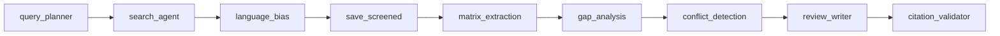
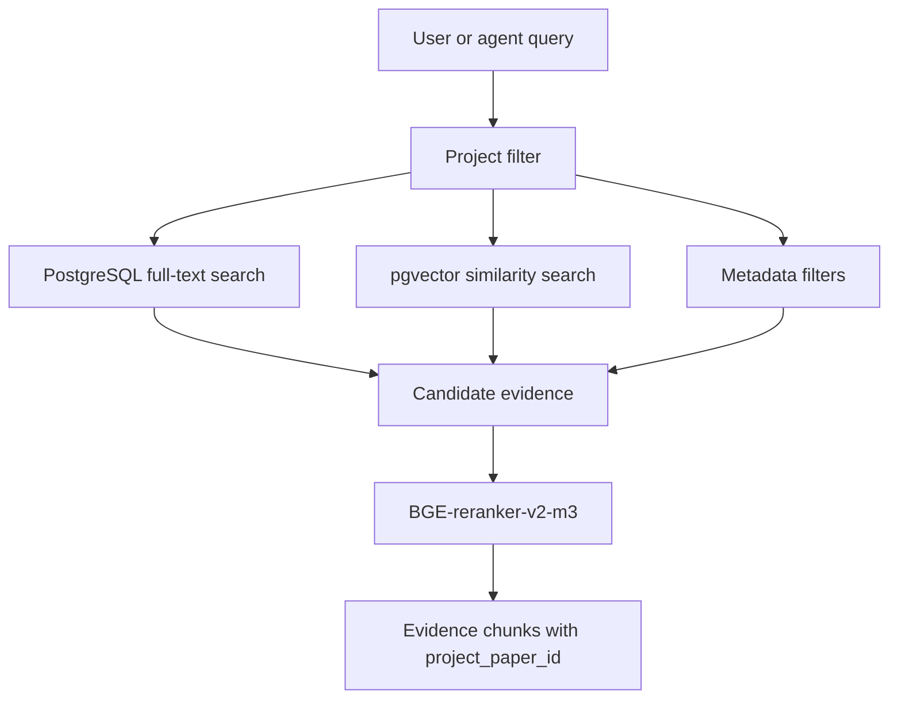

# Agent and RAG Strategy

## Purpose

This document explains the AI orchestration and RAG choices for AI Literature
Review Assistant. The key decision is to use one main LLM provider,
opencode-go with DeepSeek V4, but not to use one LLM prompt for every task.
The backend runs a controlled agentic workflow with specialized nodes and
validated outputs.

The project avoids default vector-only RAG. Literature review needs evidence
tied to real saved papers, citation IDs, matrix rows, language coverage, and
gap evidence. Retrieval must be auditable because citation safety is one of the
main product promises.

## Decision Summary

| Area | Decision | Why |
| --- | --- | --- |
| Agent orchestration | LangGraph | Stateful graph, checkpoints, fixed workflow nodes |
| LLM provider | DeepSeek V4 (OpenAI-compatible) + Anthropic | One primary provider keeps cost and config simple |
| Runtime RAG | Custom Hybrid RAG | Needs project filters and citation-aware evidence |
| Avoid as MVP core | RAGFlow, Microsoft GraphRAG, LlamaIndex | Too large or too heavy for 8-week MVP |

## Why Not One LLM Call

A single model call can generate fluent text, but it cannot reliably perform
the whole literature review workflow. The app needs to search, normalize,
deduplicate, handle language bias, extract structured evidence, retrieve
supporting chunks, detect gaps, write a review, and validate citations. These
steps have different failure modes.

The better design is one LLM provider powering many typed workflow nodes.

## LangGraph Workflow

LangGraph coordinates the AI workflow as a fixed graph with checkpoints:



Each node has typed input/output. The graph can retry failed nodes. Nodes that
need DB access (`matrix_extraction`, `gap_analysis`, `conflict_detection`,
`review_writer`) receive an async session via the `_wrap()` function.

## Hybrid RAG Design

The retrieval service combines:



- Full-text search over title, abstract, matrix rows, limitation, and
  enrichment text.
- Vector similarity over abstract chunks and matrix chunks.
- Metadata filters for project, saved status, language, source, year.
- Reranking with BGE-reranker-v2-m3 cross-encoder.
- A required `project_paper_id` for every retrieved evidence item.

The last rule is critical. If retrieved evidence cannot be linked to a saved
project paper, it cannot be used as a citation source.

## Why Not Default RAG

Default RAG usually means:

```text
embed chunks -> vector top-k -> put chunks into prompt -> generate answer
```

That is not enough for this project. It may retrieve text that is semantically
similar but not valid for the current project. It may ignore language coverage,
paper screening status, matrix rows, and citation constraints.

Hybrid RAG is a better fit because literature review is not just semantic
similarity. It is evidence selection under constraints.

## Final Recommendation

```text
LangGraph for controlled agent workflow
DeepSeek V4 as the primary model provider (Anthropic as fallback)
NVIDIA Nemotron for embeddings + reranking (free via API, 0 local RAM)
PostgreSQL full-text search + pgvector + metadata filters for Hybrid RAG
```

This gives the project an agentic architecture without sacrificing reliability,
scope control, or citation safety.
