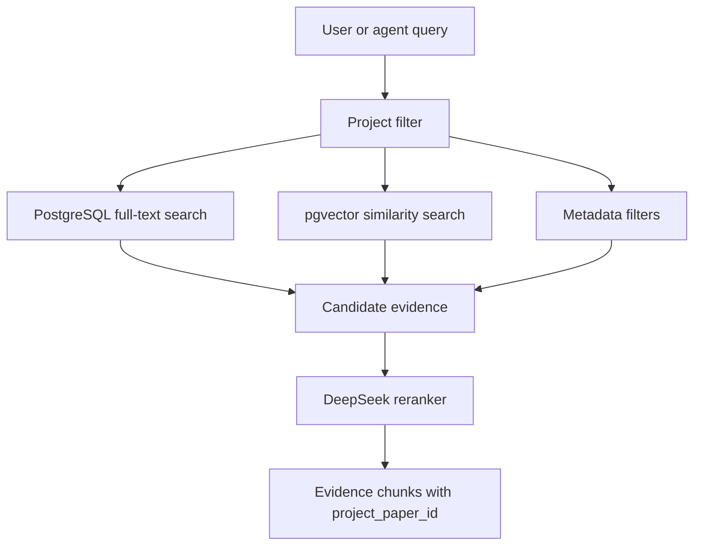

# Agent and RAG Strategy

## Purpose

This document explains the AI orchestration and RAG choices for AI Literature
Review Assistant. The key decision is to use one main LLM provider,
opencode-go with DeepSeek V4, but not to use one LLM prompt for every task.
The backend should run a controlled agentic workflow with specialized nodes and
validated outputs.

The project should also avoid default vector-only RAG. Literature review needs
evidence tied to real saved papers, citation IDs, matrix rows, language
coverage, and gap evidence. Retrieval must be auditable because citation safety
is one of the main product promises.

## Decision Summary

| Area | Decision | Why |
| --- | --- | --- |
| Agent orchestration | Use LangGraph | Stateful graph, checkpoints, fixed workflow nodes |
| LLM provider | Use opencode-go + DeepSeek V4 | One provider keeps cost and config simple |
| Runtime RAG | Build custom Hybrid RAG | Needs project filters and citation-aware evidence |
| Evaluation | Use Ragas | Good fit for RAG and workflow evaluation |
| Stretch graph-RAG | Consider LightRAG | Useful for knowledge map and relation retrieval |
| Avoid as MVP core | RAGFlow, Microsoft GraphRAG | Too large or too heavy for 8-week MVP |

## Why Not One LLM Call

A single model call can generate fluent text, but it cannot reliably perform
the whole literature review workflow. The app needs to search, crawl, normalize,
deduplicate, handle language bias, extract structured evidence, retrieve
supporting chunks, detect gaps, write a review, and validate citations. These
steps have different failure modes.

Using one prompt for all of them would create several problems:

- The output would be hard to debug.
- The UI could not show intermediate evidence.
- Citation validation would happen too late.
- Search and crawl failures would be hidden inside generated prose.
- The system would be harder to test.

The better design is one LLM provider powering many typed workflow nodes.

## Controlled LangGraph Workflow

LangGraph is recommended because the workflow is stateful and multi-step. A
research project may run search today, enrichment tomorrow, and report export
later. Some steps may fail or require user review. LangGraph supports this
shape better than a single function call.

Recommended graph:

```mermaid
flowchart LR
    A["QueryPlanner"] --> B["SearchAgent"]
    B --> C["CrawlEnrichmentAgent"]
    C --> D["LanguageBiasAgent"]
    D --> E["UserScreening"]
    E --> F["MatrixExtractionAgent"]
    F --> G["HybridRetrieval"]
    G --> H["GapAnalysisAgent"]
    H --> I["ReviewWriterAgent"]
    I --> J["CitationValidatorAgent"]
```



Each node should have:

- Typed input state.
- Typed output state.
- Allowed tools.
- Validation rules.
- Stored step output.
- Clear retry behavior.

This is agentic, but not fully autonomous. The graph should not invent new
tools, skip screening, cite unsaved papers, or use crawled web text as a final
citation source.

## Hybrid RAG Design

The MVP should implement Hybrid RAG directly in the backend:



The retrieval system should combine:

- Full-text search over title, abstract, matrix rows, limitation, and
  enrichment text.
- Vector similarity over abstract chunks, enrichment summaries, and matrix
  chunks.
- Metadata filters for project, saved status, language, source, year, method,
  dataset, and evidence quality.
- Reranking with DeepSeek V4 when the candidate set is small enough.
- A required `project_paper_id` for every retrieved evidence item.

The last rule is critical. If retrieved evidence cannot be linked to a saved
project paper, it cannot be used as a citation source.

## Why Not Default RAG

Default RAG usually means:

```text
embed chunks -> vector top-k -> put chunks into prompt -> generate answer
```

That is not enough for this project. It may retrieve text that is semantically
similar but not valid for the current project. It may ignore language coverage,
paper screening status, matrix rows, and citation constraints. It also makes
it hard to explain why a gap was generated.

Hybrid RAG is a better fit because literature review is not just semantic
similarity. It is evidence selection under constraints.

## Ragas Evaluation

Ragas should be used to evaluate retrieval and generation quality on a small
seeded dataset. It should not block the live user flow. The team can run it in
development, CI, or an admin-only endpoint.

Useful evaluation targets:

- Retrieval relevance: did Hybrid RAG retrieve useful evidence?
- Faithfulness: does the answer stay grounded in retrieved evidence?
- Citation support: do cited papers support the claim?
- Context precision: are irrelevant chunks kept out?
- Workflow regression: did a change make gap or report quality worse?

The seeded evaluation set can be small. For example, five research questions,
ten saved papers, expected evidence paper IDs, and expected unsupported claims.
This is enough to catch obvious regressions.

## LightRAG as Stretch

LightRAG is a good stretch candidate because this product has graph-shaped
knowledge: papers connect to methods, datasets, findings, limitations, and
gaps. It can support a future knowledge map and relation-aware retrieval.

Do not make LightRAG a core MVP dependency. It adds integration complexity and
may distract from the main evidence chain. Add it only after:

- Search and save work online.
- Matrix generation works.
- Hybrid RAG returns citation-aware evidence.
- Gap generation uses evidence.
- Report export validates citations.

## Frameworks Not Recommended as MVP Core

### Microsoft GraphRAG

Microsoft GraphRAG is useful as a methodology for graph-based retrieval and
community summaries, but it is heavier than needed for the MVP. It is better
for larger corpora and deeper graph experiments.

### RAGFlow

RAGFlow is a full RAG platform. It is powerful, but using it as the core could
make the project look like a platform integration rather than a product the
team designed. It is also too broad for the current architecture.

### LlamaIndex or Haystack

LlamaIndex and Haystack are good frameworks. They are reasonable alternatives
if the team later needs richer document ingestion or prebuilt RAG components.
For the MVP, a custom Hybrid RAG layer is clearer because the database schema
already stores papers, matrix rows, gaps, and citations.

## Final Recommendation

Use:

```text
LangGraph for controlled agent workflow
opencode-go + DeepSeek V4 as the model provider
PostgreSQL full-text search + pgvector + metadata filters for Hybrid RAG
Ragas for evaluation
LightRAG only as a stretch graph-RAG feature
```

This gives the project an agentic architecture without sacrificing reliability,
scope control, or citation safety.
