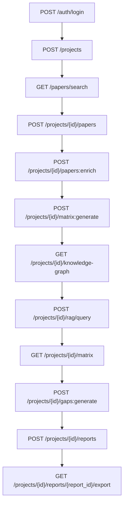

# API Design

## Purpose

The API is the contract between the React frontend and the FastAPI backend. It
must support the complete MVP workflow: login, project creation, paper search,
paper saving, literature matrix generation, research gap generation, and
citation-safe literature review export. The API should expose enough structure
for the frontend to show intermediate evidence rather than only final AI text.
The backend also owns research enrichment after papers are saved: it fetches
extra metadata, citation/reference signals, open-access links, and AI-extracted
research facets before matrix and gap workflows run.

The most important design principle is that the backend owns trust decisions.
The frontend can render citations, papers, gaps, and reports, but it should not
decide whether a citation is valid. The API must provide explicit validation
status and clear error responses. This keeps the citation guardrail enforceable
even if the frontend has a bug.

## API Style

The backend should expose JSON REST endpoints under `/api`. FastAPI will
generate OpenAPI documentation automatically from Pydantic schemas. The API
should use resource-oriented routes for stable entities and action routes for
long-running AI workflows.

Examples:

- Resource route: `GET /api/projects/{project_id}`.
- Action route: `POST /api/projects/{project_id}/matrix:generate`.

Using action suffixes for AI workflows makes the API clearer than pretending
generation is a normal CRUD create operation. Matrix rows can be CRUD resources,
but generating rows is a workflow action.

LangGraph should run behind the API, not in the browser. The frontend can start
or inspect an agent run, but it cannot decide which tools the agent may call.
The backend owns graph state, checkpoints, tool permissions, and validation.

## Authentication

### POST /api/auth/register

Creates a new user account.

Request:

```json
{
  "email": "student@example.com",
  "password": "StrongPassword123"
}
```

Response:

```json
{
  "user": {
    "id": "2b57d8c8-3699-48b3-90fd-2cf05b578f56",
    "email": "student@example.com",
    "role": "researcher"
  },
  "access_token": "jwt-token",
  "token_type": "bearer"
}
```

The API should reject duplicate emails and weak passwords with actionable
messages. The password policy does not need to be enterprise-grade, but it
should prevent empty or trivial passwords.

### POST /api/auth/login

Authenticates an existing user.

Request:

```json
{
  "email": "student@example.com",
  "password": "StrongPassword123"
}
```

Response:

```json
{
  "user": {
    "id": "2b57d8c8-3699-48b3-90fd-2cf05b578f56",
    "email": "student@example.com",
    "role": "researcher"
  },
  "access_token": "jwt-token",
  "token_type": "bearer"
}
```

All project endpoints require:

```http
Authorization: Bearer <jwt-token>
```

### GET /api/auth/me

Returns the current user. The frontend uses this endpoint to restore the session
after a page reload.

Response:

```json
{
  "id": "2b57d8c8-3699-48b3-90fd-2cf05b578f56",
  "email": "student@example.com",
  "role": "researcher",
  "is_active": true
}
```

## Projects

### POST /api/projects

Creates a research project.

Request:

```json
{
  "title": "RAG for Medical Question Answering",
  "topic": "Retrieval-Augmented Generation for medical question answering",
  "research_question": "How do RAG systems improve factuality in medical QA?"
}
```

Response:

```json
{
  "id": "project-uuid",
  "title": "RAG for Medical Question Answering",
  "topic": "Retrieval-Augmented Generation for medical question answering",
  "research_question": "How do RAG systems improve factuality in medical QA?",
  "paper_count": 0,
  "matrix_status": "idle",
  "gap_status": "idle",
  "report_status": "idle",
  "created_at": "2026-05-30T11:00:00Z"
}
```

The backend should store project ownership from the authenticated user, not
from a request field. The frontend must not be able to create a project for
another user.

### GET /api/projects

Lists projects owned by the current user.

Response:

```json
{
  "items": [
    {
      "id": "project-uuid",
      "title": "RAG for Medical Question Answering",
      "topic": "Retrieval-Augmented Generation for medical question answering",
      "paper_count": 12,
      "matrix_status": "completed",
      "gap_status": "completed",
      "report_status": "valid",
      "updated_at": "2026-05-30T12:10:00Z"
    }
  ]
}
```

### GET /api/projects/{project_id}

Returns project details and summary counts. This endpoint should not return all
matrix rows or report content by default because those can grow. Use dedicated
endpoints for those resources.

### PATCH /api/projects/{project_id}

Updates title, topic, or research question. If the topic changes after papers
have been saved, the backend should allow it but the UI should warn that
existing matrix and gap outputs may no longer match the topic.

## Paper Search

### GET /api/papers/search

Searches academic sources, Exa, and Firecrawl-backed web research results, then
returns normalized candidates. This endpoint is not project-scoped because a
user may search before saving results, but it still requires authentication to
prevent abuse.

Query parameters:

```text
query=Retrieval-Augmented Generation medical QA
sources=semantic_scholar,openalex,arxiv,exa,firecrawl
year_from=2020
limit=25
target_languages=en,vi
language_policy=balanced
include_crawl=true
```

Response:

```json
{
  "query": "Retrieval-Augmented Generation medical QA",
  "detected_language": "en",
  "query_variants": [
    {
      "source": "semantic_scholar",
      "query": "Retrieval-Augmented Generation medical question answering",
      "language": "en"
    },
    {
      "source": "exa",
      "query": "recent research papers on RAG for medical QA in low-resource languages",
      "language": "en"
    },
    {
      "source": "firecrawl",
      "query": "RAG hỏi đáp y khoa tiếng Việt nghiên cứu",
      "language": "vi"
    }
  ],
  "items": [
    {
      "candidate_id": "candidate-temp-id",
      "title": "Retrieval-Augmented Generation for Knowledge-Intensive NLP Tasks",
      "authors": ["Patrick Lewis", "Ethan Perez"],
      "year": 2020,
      "venue": "NeurIPS",
      "abstract": "Large pre-trained language models...",
      "doi": null,
      "arxiv_id": "2005.11401",
      "semantic_scholar_id": "paper-id",
      "openalex_id": null,
      "url": "https://arxiv.org/abs/2005.11401",
      "citation_count": 12000,
      "source_names": ["arxiv", "semantic_scholar"],
      "language": "en",
      "language_bias_note": null,
      "deduplication_key": "arxiv:2005.11401"
    }
  ],
  "language_bias_audit": {
    "policy": "balanced",
    "candidate_counts_by_language": {
      "en": 21,
      "vi": 4
    },
    "english_dominance_score": 0.84,
    "adjustments_applied": [
      "included_original_language_query",
      "limited_citation_count_boost_for_non_english_candidates"
    ]
  },
  "source_diagnostics": [
    {
      "source": "semantic_scholar",
      "status": "ok",
      "result_count": 20
    },
    {
      "source": "openalex",
      "status": "ok",
      "result_count": 25
    },
    {
      "source": "arxiv",
      "status": "ok",
      "result_count": 8
    },
    {
      "source": "exa",
      "status": "ok",
      "result_count": 10
    },
    {
      "source": "firecrawl",
      "status": "partial",
      "result_count": 4,
      "message": "Two pages could not be crawled but search results remain usable."
    }
  ]
}
```

The backend should normalize source fields before returning them. The frontend
should not need to know the raw Semantic Scholar or OpenAlex response formats.
It should also not need to call Exa or Firecrawl directly. The backend owns API
keys, query variants, crawl limits, language policy, and bias audit logic.

If one source fails, return partial results with diagnostics:

```json
{
  "source": "semantic_scholar",
  "status": "failed",
  "message": "Rate limit reached. Results from other sources are still available."
}
```

This is better than failing the whole search when one source is unavailable.

### Language Bias Parameters

The search endpoint should support simple controls:

| Parameter | Purpose |
| --- | --- |
| `target_languages` | Preferred languages for query variants and ranking |
| `language_policy` | `balanced`, `original_first`, or `english_first` |
| `include_crawl` | Whether Firecrawl may crawl result pages for metadata |
| `sources` | Can include academic APIs, `exa`, and `firecrawl` |

`balanced` is the recommended default. It keeps strong English papers but also
generates original-language query variants and prevents citation count from
fully dominating non-English results. For Vietnamese topics, this matters
because local or Vietnamese-language studies may have lower citation counts but
still be highly relevant.

## Project Papers

### POST /api/projects/{project_id}/papers

Saves selected paper candidates into a project. The request can accept a list so
the frontend can save multiple selected papers at once.

Request:

```json
{
  "papers": [
    {
      "title": "Retrieval-Augmented Generation for Knowledge-Intensive NLP Tasks",
      "authors": ["Patrick Lewis", "Ethan Perez"],
      "year": 2020,
      "venue": "NeurIPS",
      "abstract": "Large pre-trained language models...",
      "doi": null,
      "arxiv_id": "2005.11401",
      "semantic_scholar_id": "paper-id",
      "openalex_id": null,
      "url": "https://arxiv.org/abs/2005.11401",
      "citation_count": 12000,
      "source_names": ["arxiv", "semantic_scholar"],
      "status": "saved",
      "relevance_label": "core"
    }
  ]
}
```

Response:

```json
{
  "items": [
    {
      "project_paper_id": "project-paper-uuid",
      "paper_id": "paper-uuid",
      "title": "Retrieval-Augmented Generation for Knowledge-Intensive NLP Tasks",
      "status": "saved",
      "relevance_label": "core"
    }
  ],
  "deduplicated_count": 0
}
```

The backend should deduplicate against existing `papers` and existing
`project_papers`. Saving the same paper twice should not create two project
paper records.

### GET /api/projects/{project_id}/papers

Returns saved, rejected, or uncertain project papers.

Query parameters:

```text
status=saved
relevance_label=core
```

Response:

```json
{
  "items": [
    {
      "project_paper_id": "project-paper-uuid",
      "paper": {
        "id": "paper-uuid",
        "title": "Retrieval-Augmented Generation for Knowledge-Intensive NLP Tasks",
        "authors": ["Patrick Lewis", "Ethan Perez"],
        "year": 2020,
        "abstract": "Large pre-trained language models...",
        "url": "https://arxiv.org/abs/2005.11401"
      },
      "status": "saved",
      "relevance_label": "core",
      "user_note": null
    }
  ]
}
```

### PATCH /api/projects/{project_id}/papers/{project_paper_id}

Updates screening state, relevance label, or user note.

Request:

```json
{
  "status": "saved",
  "relevance_label": "related",
  "user_note": "Useful background for RAG architecture."
}
```

## Research Enrichment

### POST /api/projects/{project_id}/papers:enrich

Runs backend enrichment for saved project papers. This endpoint exists because
search results are not rich enough for strong matrix and gap generation. The
backend should merge source metadata, fetch extra citation/reference signals
where supported, use Exa for related research pages, crawl useful pages with
Firecrawl, detect language, and extract research facets with
opencode-go/DeepSeek V4.

Request:

```json
{
  "paper_ids": ["project-paper-uuid-1", "project-paper-uuid-2"],
  "overwrite_existing": false
}
```

Response:

```json
{
  "status": "completed",
  "enriched_count": 2,
  "failed_count": 0,
  "items": [
    {
      "project_paper_id": "project-paper-uuid-1",
      "enrichment_status": "completed",
      "method_family": "retrieval-augmented generation",
      "domain": "medical question answering",
      "dataset_names": ["Natural Questions", "PubMedQA"],
      "metric_names": ["accuracy", "factuality"],
      "limitation_types": ["English-only evaluation", "limited clinical validation"],
      "open_access_url": "https://arxiv.org/abs/2005.11401",
      "detected_language": "en",
      "crawled_markdown_available": true,
      "evidence_quality": "abstract-level"
    }
  ]
}
```

If enrichment partially fails, the endpoint should return per-paper status
rather than failing the whole batch. Matrix generation can still proceed with
papers that have enough title and abstract data, but the UI should show that
some enrichment is missing.

### GET /api/projects/{project_id}/papers/{project_paper_id}/enrichment

Returns enrichment data for a saved paper. The frontend uses this to show why a
paper was grouped into a method family or why a gap detector used it as
evidence.

## Literature Matrix

### POST /api/projects/{project_id}/matrix:generate

Generates or regenerates matrix rows for saved papers.

Request:

```json
{
  "paper_ids": ["project-paper-uuid-1", "project-paper-uuid-2"],
  "overwrite_existing": false
}
```

If `paper_ids` is omitted, the backend can generate rows for all saved papers
without existing rows. `overwrite_existing` should default to `false` to avoid
destroying user edits.

Response:

```json
{
  "status": "completed",
  "created_count": 2,
  "skipped_count": 1,
  "items": [
    {
      "id": "matrix-row-uuid",
      "project_paper_id": "project-paper-uuid-1",
      "research_problem": "Improving factual grounding in knowledge-intensive tasks",
      "method": "Retriever-generator architecture",
      "dataset_or_context": "Open-domain QA and knowledge-intensive NLP tasks",
      "key_result": "Retrieval improves factuality and task performance",
      "limitation": "Evaluation focuses mainly on English benchmark datasets",
      "contribution": "Introduces a general RAG formulation",
      "relevance": "Provides foundational method for the project topic",
      "extraction_confidence": "high"
    }
  ]
}
```

The backend should validate that every requested `project_paper_id` belongs to
the project. Matrix generation should ignore rejected papers.

### GET /api/projects/{project_id}/matrix

Returns matrix rows for the project.

### PATCH /api/projects/{project_id}/matrix/{row_id}

Allows the user to correct extracted fields. The backend should mark
`created_by` or `updated_by` so later analysis can show that a row was edited.

Request:

```json
{
  "method": "Dense retrieval plus sequence-to-sequence generation",
  "limitation": "Does not evaluate low-resource languages"
}
```

## Knowledge Map

### GET /api/projects/{project_id}/knowledge-graph

Returns a graph payload for the react-force-graph-2d frontend component. The
backend builds the graph from saved papers and their matrix rows. No separate
graph database is needed.

Response:

```json
{
  "nodes": [
    {
      "id": "paper-uuid-1",
      "label": "Retrieval-Augmented Generation for Knowledge-Intensive NLP Tasks",
      "type": "paper",
      "year": 2020,
      "connections": 4
    },
    {
      "id": "method-rag",
      "label": "Retrieval-augmented generation",
      "type": "method",
      "connections": 8
    },
    {
      "id": "dataset-nq",
      "label": "Natural Questions",
      "type": "dataset",
      "connections": 3
    },
    {
      "id": "lim-english-only",
      "label": "English-only evaluation",
      "type": "limitation",
      "connections": 5
    }
  ],
  "links": [
    { "source": "paper-uuid-1", "target": "method-rag", "relation": "uses_method" },
    { "source": "paper-uuid-1", "target": "dataset-nq", "relation": "evaluates_dataset" },
    { "source": "paper-uuid-1", "target": "lim-english-only", "relation": "has_limitation" },
    { "source": "paper-uuid-1", "target": "paper-uuid-2", "relation": "shares_method" }
  ],
  "stats": {
    "paper_count": 12,
    "method_count": 6,
    "dataset_count": 8,
    "limitation_count": 4,
    "total_edges": 47
  }
}
```

Query parameters:

```text
node_types=paper,method,dataset,limitation
min_connections=1
```

The `node_types` filter lets the frontend toggle visibility of each node type.
The `min_connections` filter hides isolated nodes. Both are optional; the
default returns the full graph.

The graph is computed on request from matrix rows and paper metadata. It does
not need to be stored separately. If the matrix changes, the next graph request
reflects the updated state.

## Conflicting Findings (Contradiction Detection)

### POST /api/projects/{project_id}/conflicts:generate

Detects potential conflicting findings by comparing matrix rows that share the
same method or dataset but report opposing results.

Request:

```json
{
  "min_shared_matrix_rows": 4
}
```

Response:

```json
{
  "status": "completed",
  "items": [
    {
      "id": "conflict-uuid",
      "title": "Opposing findings on RAG accuracy for PubMedQA",
      "description": "Paper A reports improved accuracy while Paper B reports no significant improvement on the same dataset.",
      "paper_a_id": "project-paper-uuid-1",
      "paper_a_title": "Retrieval-Augmented Generation for Knowledge-Intensive NLP Tasks",
      "paper_b_id": "project-paper-uuid-3",
      "paper_b_title": "Challenges in Retrieval-Augmented Generation",
      "shared_context": "PubMedQA benchmark",
      "claim_a": "RAG improves factuality accuracy",
      "claim_b": "RAG does not significantly improve accuracy",
      "possible_explanation": "Different retrieval configurations or evaluation subsets",
      "confidence": "medium"
    }
  ]
}
```

The UI should display these as "Potential Conflicting Findings" cards alongside
gap cards. Both paper IDs must be valid saved project papers.

## Research Gaps

### POST /api/projects/{project_id}/gaps:generate

Generates candidate research gaps from the literature matrix.

Request:

```json
{
  "max_gaps": 5,
  "include_low_confidence": false
}
```

Response:

```json
{
  "status": "completed",
  "items": [
    {
      "id": "gap-uuid",
      "title": "Limited evaluation on low-resource medical QA settings",
      "description": "The selected papers mainly evaluate English or general-domain QA datasets...",
      "suggested_direction": "Evaluate RAG pipelines on Vietnamese or other low-resource medical QA datasets.",
      "evidence_summary": "Saved papers use English benchmarks; one lists multilingual evaluation as future work.",
      "confidence": "medium",
      "evidence": [
        {
          "project_paper_id": "project-paper-uuid-1",
          "title": "Retrieval-Augmented Generation for Knowledge-Intensive NLP Tasks",
          "evidence_type": "missing_dataset",
          "note": "Uses English benchmark datasets."
        }
      ]
    }
  ]
}
```

The backend should reject generated gaps that have no evidence. If the matrix
has too few rows, the endpoint should return a clear error:

```json
{
  "error": {
    "code": "INSUFFICIENT_MATRIX",
    "message": "At least five saved papers with matrix rows are recommended before generating research gaps.",
    "details": {
      "current_matrix_rows": 2
    }
  }
}
```

### GET /api/projects/{project_id}/gaps

Returns stored gaps and evidence. The frontend uses this to render gap cards.

### DELETE /api/projects/{project_id}/gaps/{gap_id}

Allows users to remove low-quality gaps before generating the final report.

## Citation-Safe Review Reports

### POST /api/projects/{project_id}/reports

Generates a literature review draft with validated citations.

Request:

```json
{
  "title": "Literature Review: RAG for Medical Question Answering",
  "style": "academic",
  "include_gap_section": true,
  "selected_gap_ids": ["gap-uuid-1"],
  "output_format": "markdown"
}
```

The backend should load saved project papers, matrix rows, and selected gaps.
It should ask the AI provider for a structured report with citation IDs, then
validate those IDs before returning the report.

Response:

```json
{
  "id": "report-uuid",
  "title": "Literature Review: RAG for Medical Question Answering",
  "validation_status": "valid",
  "content_markdown": "## Literature Review\n\nRetrieval-augmented generation combines...",
  "references": [
    {
      "citation_label": "[1]",
      "project_paper_id": "project-paper-uuid-1",
      "title": "Retrieval-Augmented Generation for Knowledge-Intensive NLP Tasks",
      "authors": ["Patrick Lewis", "Ethan Perez"],
      "year": 2020,
      "url": "https://arxiv.org/abs/2005.11401"
    }
  ],
  "citation_audit": {
    "total_citations": 8,
    "invalid_citations": 0,
    "uncited_saved_papers": 4
  }
}
```

If validation fails:

```json
{
  "error": {
    "code": "INVALID_CITATION",
    "message": "The generated report referenced a paper ID that is not saved in this project.",
    "details": {
      "invalid_paper_ids": ["unknown-paper-id"],
      "suggested_action": "Regenerate the report using saved project papers only."
    }
  }
}
```

The frontend should not offer export when `validation_status` is invalid.

### GET /api/projects/{project_id}/reports

Lists generated reports for the project.

### GET /api/projects/{project_id}/reports/{report_id}

Returns a report, its reference list, and citation audit.

### GET /api/projects/{project_id}/reports/{report_id}/export

Downloads the report in the requested format. For MVP, `format=markdown` is
enough. The endpoint can return `text/markdown` or a downloadable file.

## Admin User Management

The minimum admin API should be small:

- `GET /api/admin/users`: list users.
- `PATCH /api/admin/users/{user_id}`: activate or deactivate a user.

Admin features are required only to satisfy basic user management. They should
not distract from the core research workflow.

## Agent Runs and Hybrid RAG

### POST /api/projects/{project_id}/agent-runs

Starts a controlled LangGraph workflow run. This is useful when the frontend
wants to run several backend steps as one auditable workflow.

Request:

```json
{
  "run_type": "full_review",
  "inputs": {
    "query": "RAG for medical question answering",
    "target_languages": ["en", "vi"],
    "max_papers": 20
  }
}
```

Response:

```json
{
  "agent_run_id": "agent-run-uuid",
  "status": "running",
  "current_node": "QueryPlanner"
}
```

### GET /api/projects/{project_id}/agent-runs/{agent_run_id}

Returns graph status, completed nodes, failed nodes, and visible state summary.
The UI should use this endpoint for progress display and debugging.

### POST /api/projects/{project_id}/rag/query

Runs Hybrid RAG over saved project evidence. This endpoint is primarily for
internal agent nodes and development diagnostics. It should not become a
general chatbot endpoint in the MVP.

Request:

```json
{
  "query": "What evidence supports low-resource language gaps?",
  "filters": {
    "languages": ["en", "vi"],
    "method_family": "retrieval-augmented generation"
  },
  "top_k": 8,
  "rerank": true
}
```

Response:

```json
{
  "retrieval_mode": "hybrid",
  "items": [
    {
      "project_paper_id": "project-paper-uuid",
      "paper_id": "paper-uuid",
      "source_field": "limitation",
      "text": "The paper evaluates English datasets only.",
      "score": 0.84,
      "retrieval_reason": "Matched low-resource language limitation"
    }
  ],
  "audit_id": "retrieval-audit-uuid"
}
```

Hybrid RAG must only return evidence from saved project papers. Evidence
without `project_paper_id` cannot be used in gap detection or report writing.

### POST /api/projects/{project_id}/evaluations/ragas

Runs a small Ragas evaluation over seeded questions, retrieved evidence, and
generated answers. This should be a development or admin endpoint, not a normal
user action.

Response:

```json
{
  "status": "completed",
  "metrics": {
    "retrieval_relevance": 0.78,
    "faithfulness": 0.82,
    "citation_support": 0.9
  }
}
```

## Rate Limiting

The `/api/papers/search` endpoint calls multiple external APIs and should not
be abused. Apply a simple per-user rate limit:

- Authenticated users: 30 search requests per minute.
- Enrichment runs: 10 per minute per user.
- Matrix/gap/report generation: 5 per minute per user.

If the limit is exceeded, return `429 Too Many Requests` with a `Retry-After`
header. Rate limiting protects Semantic Scholar and OpenAlex quotas and prevents
a single user from exhausting the demo deployment.

## Error Model

All errors should follow one shape:

```json
{
  "error": {
    "code": "ERROR_CODE",
    "message": "Human-readable explanation.",
    "details": {}
  }
}
```

Recommended codes:

- `UNAUTHORIZED`: missing or invalid token.
- `FORBIDDEN`: authenticated user lacks permission.
- `NOT_FOUND`: project or resource does not exist for this user.
- `SOURCE_FAILURE`: one or more academic APIs failed.
- `VALIDATION_ERROR`: request body is invalid.
- `AI_OUTPUT_INVALID`: model returned malformed structured output.
- `INSUFFICIENT_PAPERS`: project has too few saved papers.
- `INSUFFICIENT_MATRIX`: matrix rows are missing.
- `AGENT_RUN_FAILED`: LangGraph workflow run failed.
- `RETRIEVAL_EMPTY`: Hybrid RAG found no valid saved-paper evidence.
- `INVALID_CITATION`: report contains unsupported citation IDs.

The API should avoid returning raw stack traces. Logs can include detailed
debug information, but user-facing messages should explain what action can be
taken.

## Citation Guardrail Contract

The report generation endpoint must follow this contract:

1. Only load papers where `project_papers.status = 'saved'`.
2. Provide the model with a list of allowed `project_paper_id` values and short
   citation labels.
3. Require the model to output structured citation IDs.
4. Validate every citation ID against the database.
5. Reject or regenerate invalid output.
6. Build the reference list from database metadata, not from model text.
7. Store a citation audit with the report.

This contract is more important than prompt wording. The final reference list
must come from stored paper records. The model can decide where citations are
needed, but it cannot invent bibliographic entries.

## Long-Running Workflow Handling

The MVP can start with synchronous endpoints, but the API should be compatible
with async status later. A generation response may include:

```json
{
  "job_id": "job-uuid",
  "status": "running"
}
```

Then the frontend can poll:

```http
GET /api/jobs/{job_id}
```

For the first implementation, synchronous responses are acceptable for small
paper sets. The team should switch to background jobs only if real latency
breaks the demo flow.

## API Workflow Summary



This sequence is the demo path. Every endpoint outside this path should be
treated as secondary until the MVP works end to end.
