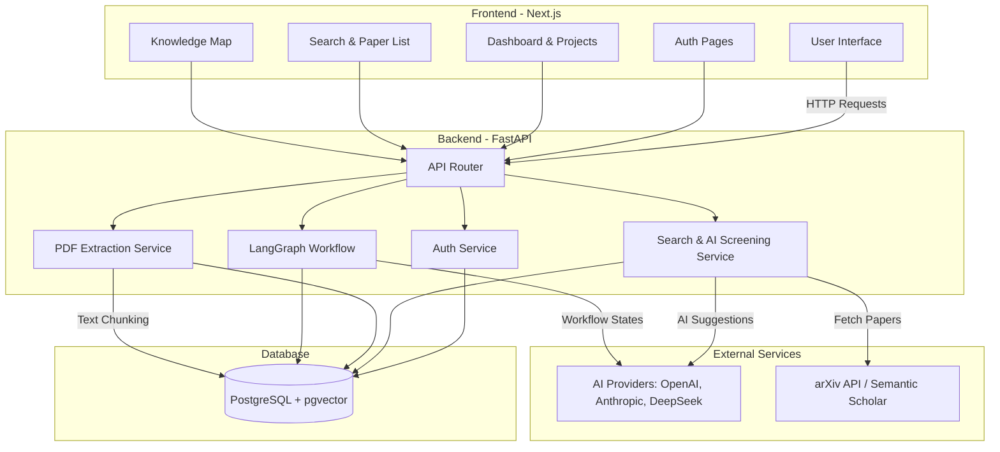
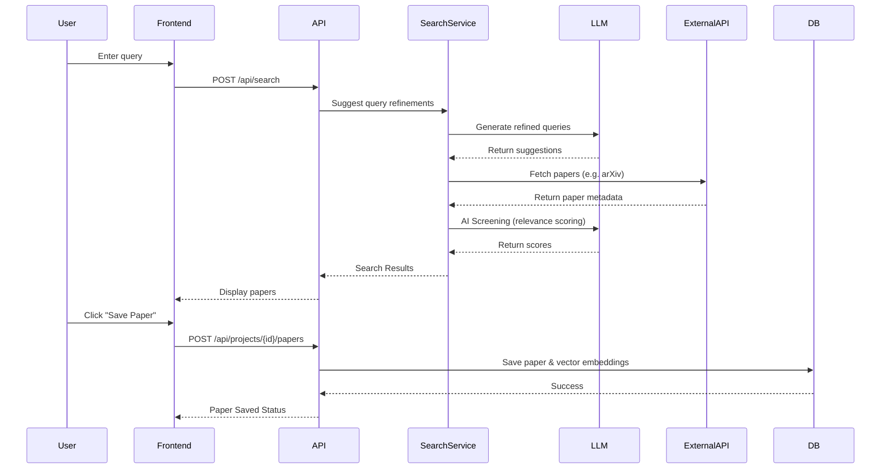

# Architecture Diagrams

## System Components & Data Flow

This diagram illustrates the high-level architecture of Lumen, showcasing the interaction between the frontend, backend, database, and AI providers.

## Detailed Data Flow: Paper Search & Save

