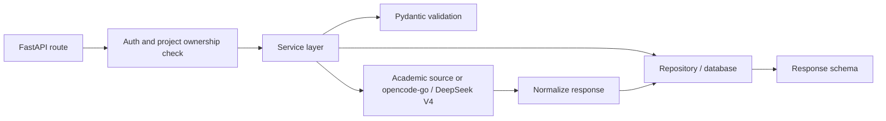
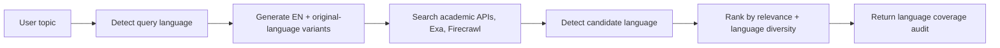
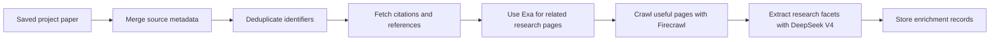
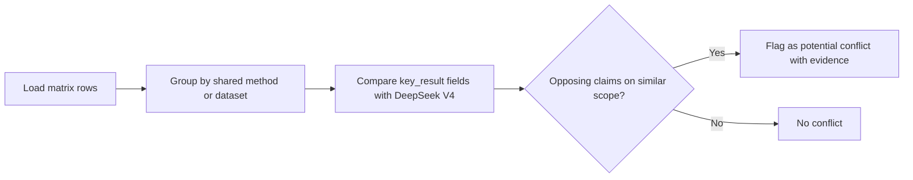

# Backend Architecture

## Purpose

The backend is the source of truth for users, projects, papers, literature
matrix rows, research gaps, reports, and citation validation. It should not be
treated as a thin proxy over an LLM. Its main responsibility is to enforce the
research workflow and protect the integrity of citations.

The backend uses FastAPI because the project needs typed request and response
models, async integration with academic APIs, clear validation errors, and
automatic OpenAPI documentation. LangGraph should orchestrate the research
workflow as a controlled graph of specialized nodes. The backend should be
implemented as a modular application with route modules, service modules,
source adapters, database models, agent nodes, retrieval utilities, and AI
workflow utilities.

## Suggested Module Structure

```text
backend/
  app/
    main.py
    core/
      config.py
      security.py
      errors.py
    db/
      session.py
      models.py
      repositories.py
    schemas/
      auth.py
      projects.py
      papers.py
      agents.py
      matrix.py
      knowledge_graph.py
      gaps.py
      reports.py
    routers/
      auth.py
      projects.py
      papers.py
      agents.py
      matrix.py
      knowledge_graph.py
      gaps.py
      reports.py
      admin.py
    services/
      query_planning.py
      paper_search.py
      paper_normalization.py
      research_enrichment.py
      citation_expansion.py
      language_bias.py
      literature_matrix.py
      gap_detection.py
      report_generation.py
      citation_guardrail.py
      hybrid_retrieval.py
      knowledge_graph.py
      embeddings.py
      ragas_evaluation.py
    agents/
      graph.py
      state.py
      query_planner.py
      search_agent.py
      crawl_enrichment_agent.py
      language_bias_agent.py
      matrix_extraction_agent.py
      gap_analysis_agent.py
      review_writer_agent.py
      citation_validator_agent.py
    sources/
      semantic_scholar.py
      openalex.py
      arxiv.py
      exa.py
      firecrawl.py
    ai/
      provider.py
      opencode_go.py
      prompts.py
      structured_outputs.py
    eval/
      ragas_metrics.py
```

This structure keeps route handlers small. Routers should parse input, call
services or start a LangGraph run, and return response schemas. Services should
contain reusable business logic. LangGraph nodes should compose those services
into the end-to-end research workflow. Source adapters should isolate external
API differences. Repository functions should isolate database queries. This
separation matters because the project will otherwise become prompt code mixed
with HTTP handlers, which is hard to test and hard to debug.

## Request Flow



Every project-scoped endpoint must check ownership before returning or changing
data. For example, `POST /projects/{project_id}/reports` should first load the
project for the authenticated user. If the project does not belong to that
user, return `404` or `403` consistently. Do not rely on frontend filtering.

## LangGraph Research Workflow

LangGraph should coordinate the AI workflow as a fixed graph with checkpoints.
The graph is agentic because nodes can call tools, but it is not a free agent
that invents its own process. Each node has a typed state input, a typed state
output, allowed tools, and backend validation.

```mermaid
flowchart LR
    A["QueryPlanner"] --> B["SearchAgent"]
    B --> C["CrawlEnrichmentAgent"]
    C --> D["LanguageBiasAgent"]
    D --> E["UserScreening"]
    E --> F["MatrixExtractionAgent"]
    F --> G["HybridRetrieval"]
    G --> H["GapAnalysisAgent"]
    H --> I["ReviewWriterAgent"]
    I --> J["CitationValidatorAgent"]
```



The graph state should include project ID, user ID, query variants, candidate
papers, source diagnostics, language-bias audit, saved paper IDs, enrichment
records, matrix rows, retrieval evidence, generated gaps, draft report, and
citation validation results. Storing this state makes the workflow debuggable
and lets the UI show progress without hiding decisions behind one "Generate"
button.

The graph should call DeepSeek V4 through the same `AIProvider` adapter used by
normal services. The model provider remains one implementation detail; the
workflow is split into multiple validated nodes.

## Authentication and Authorization

The MVP can use email and password with JWT access tokens. Passwords must be
hashed with a modern password hashing library. Roles should start simple:

- `researcher`: can manage their own projects.
- `admin`: can list users, disable users, and inspect basic system metadata.

Role-based access should be enforced only where needed. Most product endpoints
only need project ownership checks. Admin endpoints should not be built unless
they support the minimum requirement for basic user management.

## Query Planning and Paper Source Integration

The backend search flow should begin with query planning. A user topic is not
sent directly to every source unchanged. The system should detect language,
extract core concepts, generate English and original-language query variants,
and decide which sources should receive which query. This is where Exa and
Firecrawl become useful: Exa handles semantically rich web/research search, and
Firecrawl can search or crawl pages when the system needs clean content from
results.

Each paper or web source should implement a common interface:

```python
class PaperSource:
    async def search(
        self,
        query: str,
        limit: int,
        year_from: int | None,
        languages: list[str],
    ) -> list[RawPaper]:
        ...
```

The service layer then combines results:

1. Build query variants from the user topic.
2. Query enabled sources.
3. Convert each raw result into a canonical paper candidate.
3. Deduplicate candidates.
4. Attach source diagnostics.
5. Crawl selected result pages with Firecrawl when metadata is thin.
6. Apply language-bias scoring and source diversity.
7. Return ranked results to the frontend.

The canonical paper model should include title, authors, year, abstract, venue,
DOI, source URL, Semantic Scholar ID, OpenAlex ID, arXiv ID, citation count,
and source names. Missing fields should remain null rather than being invented.
If a source fails, the response should include a warning so the UI can show
partial results.

Exa should be used for broad semantic search and discovery of related research
pages. Firecrawl should be used for result enrichment, not as an uncontrolled
web scraper. For example, when Exa finds a project page or an open-access paper
landing page, Firecrawl can extract clean markdown so the backend can recover
abstracts, links, or metadata that an academic API did not provide.

## Language Bias Service

The language-bias service should make multilingual search behavior explicit.
It does not need to solve all fairness problems, but it should prevent the
system from silently returning only English, high-citation papers for every
topic.

Recommended logic:



The service should store:

- Query language.
- Target languages requested by the user.
- Query variants sent to each source.
- Candidate language distribution.
- Whether the result set is English-dominant.
- Which ranking adjustments were applied.

Language-bias handling should be conservative. The system should not remove
high-quality English papers just to force balance. It should lower the chance
that non-English papers disappear only because citation count, venue prestige,
or English keyword matching dominates the ranking.

## Research Enrichment Service

The backend should enrich saved papers before matrix generation. Search results
are only the first layer of data. After a paper is saved, the enrichment service
should merge metadata from all available sources, fill missing identifiers,
collect citation count and reference signals where available, detect
open-access URLs, crawl useful pages with Firecrawl, add Exa-discovered related
pages when relevant, and create AI-extracted research facets. The goal is to
make the backend corpus richer than a flat list of abstracts.

Recommended enrichment stages:



Research facets should include method family, domain, dataset, metric,
limitation type, contribution type, and evidence quality notes. The matrix
service can then use enriched data instead of relying only on the original
search response. This design makes the backend more valuable and improves the
quality of later gap detection.

## Hybrid RAG Service

The MVP should use a custom Hybrid RAG service rather than default vector-only
retrieval. The service should retrieve evidence from saved project papers only.
It should combine:

- PostgreSQL full-text search over title, abstract, enrichment text, matrix
  rows, limitations, and gap evidence.
- pgvector similarity over abstract chunks, enrichment summaries, and matrix
  chunks.
- Metadata filters for project ID, saved status, language, year, source,
  method family, dataset, and evidence quality.
- Reranking with DeepSeek V4 when the candidate set is small enough.

Every retrieved chunk must include `project_paper_id`, `paper_id`, source field,
score, and retrieval reason. This requirement is what connects RAG to citation
guardrails. A retrieved paragraph without a valid project paper ID cannot be
used as evidence for a review claim.

Ragas should be used offline or in development to evaluate retrieval relevance,
faithfulness, and citation support. It should not sit in the user-facing request
path unless the team has enough time to optimize latency.

## Literature Matrix Service

The literature matrix service loads saved project papers and asks the AI
provider to extract structured fields. The provider should be opencode-go with
DeepSeek V4 behind the internal `AIProvider` interface. The prompt should
request JSON, but the backend must still validate the response. A safe matrix
row schema is:

```json
{
  "paper_id": "uuid",
  "research_problem": "What problem the paper addresses",
  "method": "Main method or approach",
  "dataset_or_context": "Dataset, domain, or study setting",
  "key_result": "Main finding",
  "limitation": "Stated or inferred limitation",
  "relevance": "Why this paper matters to the project topic",
  "confidence": "high"
}
```

If the AI cannot extract a field from the title or abstract, it should return
`"not specified"` rather than making a guess. This rule should be stated in the
prompt and enforced by the UI through visible low-confidence markers.

## Gap Detection Service

Gap detection should operate on matrix rows and Hybrid RAG evidence, not raw
abstracts alone. The service should ask the model to identify missing or
underexplored areas by comparing methods, datasets, domains, results, and
limitations. The LangGraph `GapAnalysisAgent` should receive retrieved evidence
chunks that already carry valid project paper IDs. A valid gap must include
evidence:

```json
{
  "title": "Low-resource language evaluation is underexplored",
  "description": "Most saved papers evaluate English datasets only...",
  "evidence_paper_ids": ["uuid-1", "uuid-2"],
  "evidence_summary": "These papers report English-only evaluation...",
  "suggested_direction": "Evaluate the same retrieval pipeline on Vietnamese QA datasets.",
  "risk_level": "medium"
}
```

The backend should reject gaps with empty evidence. This is strict, but it
protects the main value proposition. If the AI cannot find evidence-based gaps,
the system should say so rather than producing generic future work.

## Contradiction Detection

The assignment requires detecting contradictions between studies. True
contradiction detection is hard because papers often differ in datasets,
metrics, and experimental settings. The MVP should implement a pragmatic
approach: flag "potential conflicting findings" from matrix rows rather than
claiming definitive contradictions.

The service should compare matrix rows that share the same method or dataset
but report opposing results. For example, if Paper A reports "RAG improves
accuracy on PubMedQA" and Paper B reports "RAG does not improve accuracy on
PubMedQA," that is a candidate conflict worth surfacing.

Detection logic:



A valid conflict finding should include:

```json
{
  "title": "Opposing findings on RAG accuracy for PubMedQA",
  "description": "Paper A reports improved accuracy while Paper B reports no significant improvement on the same dataset.",
  "paper_a_id": "uuid-1",
  "paper_b_id": "uuid-2",
  "shared_context": "PubMedQA benchmark",
  "claim_a": "RAG improves factuality accuracy",
  "claim_b": "RAG does not significantly improve accuracy",
  "possible_explanation": "Different retrieval configurations or evaluation subsets",
  "confidence": "medium"
}
```

The UI should label these as "Potential Conflicting Findings" not
"Contradictions." The backend should store them with the same evidence
requirements as gaps: both paper IDs must be valid saved project papers. If the
matrix has too few rows or no shared contexts, the service should return an
empty list rather than forcing weak detections.

This approach satisfies the assignment requirement while staying honest about
the difficulty of true contradiction detection.

## Report Generation and Citation Guardrail

Report generation should use saved papers, selected matrix rows, stored gaps,
and Hybrid RAG evidence. The LangGraph `ReviewWriterAgent` should return
structured sections:

```json
{
  "sections": [
    {
      "heading": "Retrieval-Augmented Generation in Medical QA",
      "paragraphs": [
        {
          "text": "Recent systems combine retrieval with generation to improve factual grounding.",
          "citation_paper_ids": ["uuid-1", "uuid-3"]
        }
      ]
    }
  ]
}
```

The citation guardrail service validates that every cited paper ID:

1. Exists in the database.
2. Belongs to the current project.
3. Is attached to a saved paper, not only a transient search result.
4. Has enough metadata to appear in the reference list.

If validation fails, the report should not be exported. The backend can attempt
one regeneration with a stricter prompt, but it should not silently remove
citations because that may change the meaning of a paragraph.

## Background Work

For MVP, synchronous requests may be acceptable for small projects, but AI
tasks can be slow. A pragmatic compromise is to start with normal HTTP
endpoints and add status fields:

- `matrix_status`: idle, running, completed, failed.
- `gap_status`: idle, running, completed, failed.
- `report_status`: idle, running, completed, failed.

If time allows, the backend can use FastAPI background tasks for generation.
The team should avoid introducing Celery or a queue unless long-running tasks
become a real blocker.

## Error Handling

Errors should be clear and actionable:

```json
{
  "error": {
    "code": "INVALID_CITATION",
    "message": "The generated report cited a paper that is not saved in this project.",
    "details": {
      "paper_id": "uuid-x",
      "suggested_action": "Regenerate the report or remove the unsupported claim."
    }
  }
}
```

The backend should distinguish user errors, source failures, AI failures, and
validation failures. This makes the frontend easier to build and helps the team
debug the demo.

## Testing Priorities

The backend should have focused tests for:

- Paper normalization and deduplication.
- Project ownership checks.
- Citation guardrail validation.
- Matrix schema validation.
- Gap rejection when evidence is missing.
- Report export reference generation.

These tests protect the core promise. Testing every AI output is unrealistic,
but testing the validation boundaries is achievable and valuable.
