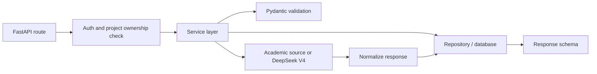
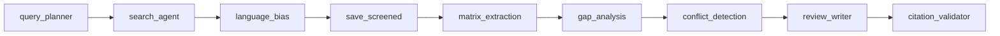
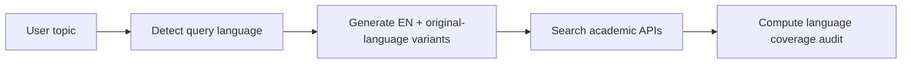

# Backend Architecture

## Purpose

The backend is the source of truth for users, projects, papers, literature
matrix rows, research gaps, reports, and citation validation. It should not be
treated as a thin proxy over an LLM. Its main responsibility is to enforce the
research workflow and protect the integrity of citations.

The backend uses FastAPI because the project needs typed request and response
models, async integration with academic APIs, clear validation errors, and
automatic OpenAPI documentation. LangGraph orchestrates the research workflow as
a controlled graph of specialized nodes. The backend is implemented as a modular
application with route modules, service modules, source adapters, database
models, agent nodes, retrieval utilities, and AI workflow utilities.

## Module Structure

```text
backend/
  app/
    main.py
    core/
      config.py
      security.py
      embeddings.py
    db/
      session.py
      models.py
    schemas/
      auth.py
      project.py
      paper.py
      matrix.py
      gaps.py
      conflicts.py
      reports.py
      knowledge_graph.py
    routers/
      auth.py
      project.py
      paper.py
      search_session.py
      agent.py
      matrix.py
      gaps.py
      conflicts.py
      reports.py
      knowledge_graph.py
      admin.py
      stats.py
      health.py
    services/
      auth.py
      project.py
      paper_search.py
      search_session.py
      language_bias.py
      literature_matrix.py
      gap_detection.py
      conflict_detection.py
      report_generation.py
      knowledge_graph.py
      hybrid_retrieval.py
      reranker.py
      pdf_downloader.py
      pdf_ingestion.py
      pdf_normalizer.py
    agents/
      graph.py
      state.py
      nodes.py
    sources/
      base.py
      semantic_scholar.py
      paperhub.py
    ai/
      provider.py
      prompts.py
      structured_outputs.py
```

Routers parse input, call services or start a LangGraph run, and return
response schemas. Services contain reusable business logic. LangGraph nodes
compose those services into the end-to-end research workflow. Source adapters
isolate external API differences.

## Request Flow



Every project-scoped endpoint must check ownership before returning or changing
data. For example, `POST /projects/{project_id}/reports` should first load the
project for the authenticated user. If the project does not belong to that
user, return `404` or `403` consistently. Do not rely on frontend filtering.

## LangGraph Research Workflow

LangGraph coordinates the AI workflow as a fixed graph with checkpoints. The
graph is linear — each node has typed input/output and the graph can retry
failed nodes.



Nodes that need DB access (`matrix_extraction`, `gap_analysis`,
`conflict_detection`, `review_writer`) receive an async session via the
`_wrap()` function in `graph.py`.

## Authentication and Authorization

Email and password with JWT access tokens. Passwords hashed with bcrypt. Roles:

- `researcher`: can manage their own projects.
- `admin`: can list users, disable users, and inspect basic system metadata.

Most endpoints only need project ownership checks. Admin endpoints are minimal.

## Paper Source Integration

The backend searches through Semantic Scholar and PaperHub (which wraps
OpenAlex, arXiv, EuropePMC, PMC). Each source implements the `PaperSource`
interface:

```python
class PaperSource:
    async def search(
        self,
        query: str,
        limit: int,
        year_from: int | None,
        languages: list[str],
    ) -> list[RawPaper]:
        ...
```

The service layer:

1. Detects query language and generates variants.
2. Queries enabled sources.
3. Deduplicates candidates by DOI, arXiv ID, Semantic Scholar ID.
4. Attaches source diagnostics.
5. Returns ranked results to the frontend.

## Language Bias Service

The language-bias service detects query language, generates English and
original-language query variants, and computes a language coverage audit from
source diagnostics. It does not detect per-paper language (out of scope for
MVP).



## Hybrid RAG Service

The retrieval service combines:

- PostgreSQL full-text search over title, abstract, matrix rows, limitation,
  and enrichment text.
- pgvector similarity over abstract chunks and matrix chunks.
- Metadata filters for project ID, saved status, language, year, source.
- Reranking with NVIDIA Nemotron reranking API (free, no local model).
- A required `project_paper_id` for every retrieved evidence item.

Every retrieved chunk carries `project_paper_id`, source field, score, and
retrieval reason. This connects RAG to citation guardrails.

## Literature Matrix Service

Loads saved project papers, retrieves RAG chunks, asks the AI provider to
extract structured fields, validates output with `MatrixRowOutput` Pydantic
model, and upserts rows to DB. Rows are editable by users.

## Gap Detection Service

Operates on matrix rows and RAG evidence. Each gap must include evidence paper
IDs. Gaps with empty evidence are rejected. The backend validates that each
`evidence_paper_id` exists in `project_papers` with `status='saved'`.

## Conflict Detection Service

Compares matrix rows that share the same method or dataset but report opposing
results. Groups rows by shared method/dataset, sends groups to LLM for
comparison, validates paper IDs, and persists to `conflicting_findings` table.

## Report Generation and Citation Guardrail

Report generation loads saved papers, matrix rows, gaps, and RAG evidence. The
LLM generates structured sections with citation IDs. The backend validates
every citation ID against `project_papers`. If >30% are invalid, retries once
with a stricter prompt. The reference list is built from DB metadata, not model
text.

## Background Work

AI-heavy endpoints (matrix generation, gap detection, report generation,
auto-save) use background jobs. The endpoint creates a `BackgroundJob` record
and returns a `job_id` immediately. The frontend polls `GET /jobs/{id}` for
status.

## Error Handling

All errors follow one shape:

```json
{
  "error": {
    "code": "INVALID_CITATION",
    "message": "The generated report cited a paper that is not saved in this project.",
    "details": {}
  }
}
```

Error codes: `UNAUTHORIZED`, `FORBIDDEN`, `NOT_FOUND`, `SOURCE_FAILURE`,
`VALIDATION_ERROR`, `AI_OUTPUT_INVALID`, `INSUFFICIENT_PAPERS`,
`INSUFFICIENT_MATRIX`, `INVALID_CITATION`.

## Testing Priorities

12 test files covering: health check, hybrid retrieval, PDF normalizer,
matrix extraction, gap analysis, conflict detection, review writer, language
bias, background jobs, embedding quality, reranker, log hook.
