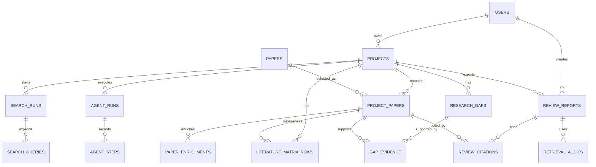

# Database Design

## Purpose

The database stores the evidence chain of the product. It must support user
ownership, project workspaces, real paper metadata, selected project papers,
backend enrichment records, structured matrix rows, research gaps, generated
reports, and citation validation. PostgreSQL is the correct default because
most data is relational. It should run as a Docker service with pgvector enabled
and a persistent volume managed by Coolify. External managed database services
are not part of the target architecture. pgvector is included so the team can
add semantic search or RAG over abstracts without introducing another service.

## Entity Relationship Overview



The design separates `papers` from `project_papers`. A paper can exist once in
the global paper table and be selected by many projects. A project-specific
paper record stores user decisions such as saved status, relevance label, and
notes. This prevents duplicate metadata while preserving project-specific
workflow state.

## Core Tables

### users

Stores authentication and role information.

```sql
CREATE TABLE users (
  id UUID PRIMARY KEY,
  email TEXT NOT NULL UNIQUE,
  password_hash TEXT NOT NULL,
  role TEXT NOT NULL CHECK (role IN ('researcher', 'admin')),
  is_active BOOLEAN NOT NULL DEFAULT TRUE,
  created_at TIMESTAMPTZ NOT NULL DEFAULT now()
);
```

### projects

Stores a research workspace owned by a user.

```sql
CREATE TABLE projects (
  id UUID PRIMARY KEY,
  owner_id UUID NOT NULL REFERENCES users(id),
  title TEXT NOT NULL,
  topic TEXT NOT NULL,
  research_question TEXT,
  status TEXT NOT NULL DEFAULT 'active',
  created_at TIMESTAMPTZ NOT NULL DEFAULT now(),
  updated_at TIMESTAMPTZ NOT NULL DEFAULT now()
);
```

The `topic` field is the search and synthesis anchor. `research_question` is
optional because early users may only know a broad topic.

### papers

Stores canonical paper metadata from academic sources.

```sql
CREATE TABLE papers (
  id UUID PRIMARY KEY,
  title TEXT NOT NULL,
  abstract TEXT,
  language TEXT,
  year INTEGER,
  venue TEXT,
  doi TEXT,
  arxiv_id TEXT,
  semantic_scholar_id TEXT,
  openalex_id TEXT,
  url TEXT,
  citation_count INTEGER,
  authors JSONB NOT NULL DEFAULT '[]'::jsonb,
  source_names TEXT[] NOT NULL DEFAULT '{}',
  created_at TIMESTAMPTZ NOT NULL DEFAULT now(),
  updated_at TIMESTAMPTZ NOT NULL DEFAULT now()
);
```

The system should never store an LLM-invented paper here. Records must come
from academic APIs or user-provided metadata that is validated later. For MVP,
external source records are enough.

Suggested indexes:

```sql
CREATE UNIQUE INDEX papers_doi_unique ON papers(doi) WHERE doi IS NOT NULL;
CREATE UNIQUE INDEX papers_arxiv_unique ON papers(arxiv_id) WHERE arxiv_id IS NOT NULL;
CREATE UNIQUE INDEX papers_semantic_scholar_unique
  ON papers(semantic_scholar_id)
  WHERE semantic_scholar_id IS NOT NULL;
CREATE INDEX papers_title_year_idx ON papers(title, year);
CREATE INDEX papers_language_idx ON papers(language);
```

### search_runs and search_queries

Stores the search protocol for a project. This is useful for reproducibility
and for auditing language bias.

```sql
CREATE TABLE search_runs (
  id UUID PRIMARY KEY,
  project_id UUID NOT NULL REFERENCES projects(id) ON DELETE CASCADE,
  user_query TEXT NOT NULL,
  detected_language TEXT,
  target_languages TEXT[] NOT NULL DEFAULT '{}',
  language_policy TEXT NOT NULL DEFAULT 'balanced',
  english_dominance_score NUMERIC,
  created_at TIMESTAMPTZ NOT NULL DEFAULT now()
);

CREATE TABLE search_queries (
  id UUID PRIMARY KEY,
  search_run_id UUID NOT NULL REFERENCES search_runs(id) ON DELETE CASCADE,
  source TEXT NOT NULL CHECK (
    source IN ('semantic_scholar', 'openalex', 'arxiv', 'exa', 'firecrawl')
  ),
  query_text TEXT NOT NULL,
  query_language TEXT,
  result_count INTEGER NOT NULL DEFAULT 0
);
```

The `english_dominance_score` can be a simple ratio of English candidates to
all candidates. It is not a fairness metric by itself, but it gives the UI a
concrete value to show when a search result set is language-skewed.

### project_papers

Stores paper selection and project-specific screening data.

```sql
CREATE TABLE project_papers (
  id UUID PRIMARY KEY,
  project_id UUID NOT NULL REFERENCES projects(id) ON DELETE CASCADE,
  paper_id UUID NOT NULL REFERENCES papers(id),
  status TEXT NOT NULL CHECK (status IN ('saved', 'rejected', 'uncertain')),
  relevance_label TEXT CHECK (relevance_label IN ('core', 'related', 'background')),
  user_note TEXT,
  saved_at TIMESTAMPTZ NOT NULL DEFAULT now(),
  UNIQUE(project_id, paper_id)
);
```

The final report can only cite `project_papers` with `status = 'saved'`.

### paper_enrichments

Stores backend-generated enrichment data for a saved project paper.

```sql
CREATE TABLE paper_enrichments (
  id UUID PRIMARY KEY,
  project_paper_id UUID NOT NULL REFERENCES project_papers(id) ON DELETE CASCADE,
  merged_source_payload JSONB NOT NULL DEFAULT '{}'::jsonb,
  related_papers JSONB NOT NULL DEFAULT '[]'::jsonb,
  references_payload JSONB NOT NULL DEFAULT '[]'::jsonb,
  open_access_url TEXT,
  crawled_markdown TEXT,
  detected_language TEXT,
  method_family TEXT,
  domain TEXT,
  dataset_names TEXT[] NOT NULL DEFAULT '{}',
  metric_names TEXT[] NOT NULL DEFAULT '{}',
  limitation_types TEXT[] NOT NULL DEFAULT '{}',
  evidence_quality TEXT NOT NULL DEFAULT 'unknown',
  enrichment_status TEXT NOT NULL CHECK (
    enrichment_status IN ('pending', 'completed', 'failed')
  ),
  error_message TEXT,
  enriched_at TIMESTAMPTZ
);
```

This table keeps the backend research process auditable. The frontend can show
enriched fields, but it should not compute them. The enrichment service can be
rerun without overwriting user-edited matrix rows.

### literature_matrix_rows

Stores structured evidence extracted from saved papers.

```sql
CREATE TABLE literature_matrix_rows (
  id UUID PRIMARY KEY,
  project_id UUID NOT NULL REFERENCES projects(id) ON DELETE CASCADE,
  project_paper_id UUID NOT NULL REFERENCES project_papers(id) ON DELETE CASCADE,
  research_problem TEXT,
  method TEXT,
  dataset_or_context TEXT,
  key_result TEXT,
  limitation TEXT,
  contribution TEXT,
  relevance TEXT,
  extraction_confidence TEXT NOT NULL DEFAULT 'medium',
  created_by TEXT NOT NULL CHECK (created_by IN ('ai', 'user')),
  updated_by UUID REFERENCES users(id),
  updated_at TIMESTAMPTZ NOT NULL DEFAULT now(),
  UNIQUE(project_paper_id)
);
```

This table is central to the product. It lets users inspect and correct the
evidence before gap detection and report generation.

### research_gaps and gap_evidence

Stores evidence-based candidate gaps.

```sql
CREATE TABLE research_gaps (
  id UUID PRIMARY KEY,
  project_id UUID NOT NULL REFERENCES projects(id) ON DELETE CASCADE,
  title TEXT NOT NULL,
  description TEXT NOT NULL,
  suggested_direction TEXT NOT NULL,
  evidence_summary TEXT NOT NULL,
  confidence TEXT NOT NULL CHECK (confidence IN ('low', 'medium', 'high')),
  created_at TIMESTAMPTZ NOT NULL DEFAULT now()
);

CREATE TABLE gap_evidence (
  id UUID PRIMARY KEY,
  gap_id UUID NOT NULL REFERENCES research_gaps(id) ON DELETE CASCADE,
  project_paper_id UUID NOT NULL REFERENCES project_papers(id) ON DELETE CASCADE,
  evidence_type TEXT NOT NULL CHECK (
    evidence_type IN ('limitation', 'missing_dataset', 'method_gap', 'result_pattern')
  ),
  note TEXT NOT NULL
);
```

The separate `gap_evidence` table is important. It prevents the gap feature
from becoming untraceable prose. The UI can display evidence papers directly.

### review_reports and review_citations

Stores generated reports and validated citations.

```sql
CREATE TABLE review_reports (
  id UUID PRIMARY KEY,
  project_id UUID NOT NULL REFERENCES projects(id) ON DELETE CASCADE,
  created_by UUID NOT NULL REFERENCES users(id),
  title TEXT NOT NULL,
  content_markdown TEXT NOT NULL,
  validation_status TEXT NOT NULL CHECK (
    validation_status IN ('valid', 'invalid', 'pending')
  ),
  created_at TIMESTAMPTZ NOT NULL DEFAULT now()
);

CREATE TABLE review_citations (
  id UUID PRIMARY KEY,
  report_id UUID NOT NULL REFERENCES review_reports(id) ON DELETE CASCADE,
  project_paper_id UUID NOT NULL REFERENCES project_papers(id),
  citation_label TEXT NOT NULL,
  paragraph_index INTEGER NOT NULL
);
```

The `review_citations` table gives the backend an audit trail. It also makes it
possible to show which papers support each paragraph in the UI.

### agent_runs and agent_steps

Stores LangGraph workflow runs and step-level state for debugging, resume, and
demo transparency.

```sql
CREATE TABLE agent_runs (
  id UUID PRIMARY KEY,
  project_id UUID NOT NULL REFERENCES projects(id) ON DELETE CASCADE,
  run_type TEXT NOT NULL CHECK (
    run_type IN ('search', 'enrichment', 'matrix', 'gap', 'report', 'full_review')
  ),
  status TEXT NOT NULL CHECK (status IN ('running', 'completed', 'failed')),
  input_state JSONB NOT NULL DEFAULT '{}'::jsonb,
  output_state JSONB NOT NULL DEFAULT '{}'::jsonb,
  error_message TEXT,
  created_at TIMESTAMPTZ NOT NULL DEFAULT now(),
  completed_at TIMESTAMPTZ
);

CREATE TABLE agent_steps (
  id UUID PRIMARY KEY,
  agent_run_id UUID NOT NULL REFERENCES agent_runs(id) ON DELETE CASCADE,
  node_name TEXT NOT NULL,
  status TEXT NOT NULL CHECK (status IN ('running', 'completed', 'failed')),
  input_snapshot JSONB NOT NULL DEFAULT '{}'::jsonb,
  output_snapshot JSONB NOT NULL DEFAULT '{}'::jsonb,
  tool_calls JSONB NOT NULL DEFAULT '[]'::jsonb,
  error_message TEXT,
  started_at TIMESTAMPTZ NOT NULL DEFAULT now(),
  completed_at TIMESTAMPTZ
);
```

These tables make the agent workflow auditable. They are also useful during
demo because the team can show which node produced query variants, enrichment
records, matrix rows, gaps, and citation validation results.

### retrieval_audits

Stores Hybrid RAG retrieval traces used by gap analysis and report generation.

```sql
CREATE TABLE retrieval_audits (
  id UUID PRIMARY KEY,
  project_id UUID NOT NULL REFERENCES projects(id) ON DELETE CASCADE,
  report_id UUID REFERENCES review_reports(id) ON DELETE CASCADE,
  query_text TEXT NOT NULL,
  retrieval_mode TEXT NOT NULL CHECK (
    retrieval_mode IN ('full_text', 'vector', 'hybrid', 'reranked')
  ),
  filters JSONB NOT NULL DEFAULT '{}'::jsonb,
  retrieved_chunks JSONB NOT NULL DEFAULT '[]'::jsonb,
  reranker_model TEXT,
  created_at TIMESTAMPTZ NOT NULL DEFAULT now()
);
```

Every retrieved chunk should include `project_paper_id`, chunk text, source
field, score, and retrieval reason. This table supports Ragas evaluation and
helps debug why a generated claim did or did not receive a valid citation.

## pgvector Usage

For MVP, embeddings are part of the Hybrid RAG path, but they are not the only
retrieval signal. The schema should support vector search while keeping
full-text search and metadata filters available:

```sql
CREATE TABLE paper_chunks (
  id UUID PRIMARY KEY,
  project_paper_id UUID NOT NULL REFERENCES project_papers(id) ON DELETE CASCADE,
  chunk_text TEXT NOT NULL,
  chunk_type TEXT NOT NULL CHECK (chunk_type IN ('abstract', 'summary', 'matrix')),
  embedding vector(1536),
  created_at TIMESTAMPTZ NOT NULL DEFAULT now()
);
```

The exact vector dimension depends on the embedding model used with the
opencode-go/DeepSeek V4 workflow. The team should set the dimension to match
the chosen embedding endpoint and document it in backend configuration.

## Citation Validation Query

The guardrail can validate citation IDs with a query like:

```sql
SELECT pp.id
FROM project_papers pp
JOIN projects p ON p.id = pp.project_id
WHERE pp.project_id = :project_id
  AND pp.id = ANY(:citation_ids)
  AND pp.status = 'saved'
  AND p.owner_id = :user_id;
```

If the number of returned rows does not equal the number of cited IDs, the
report is invalid. This validation should run before report export and before
storing a report as valid.

## Trade-Offs

The design is more structured than a minimal prototype, but that structure is
necessary because the product's main promise is trust. A single `reports` table
with generated text would be faster to build, but it would not prove source
integrity. Separating papers, project papers, matrix rows, gaps, evidence, and
citations creates more tables, but each table supports a visible part of the
research workflow.
