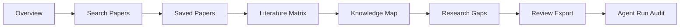

# Frontend Architecture

## Purpose

The frontend is the user's research workspace. It should make the literature
review workflow visible, editable, and trustworthy. The frontend should not be
just a chat box with a side panel. It should guide the user from project setup
to paper screening, matrix inspection, gap review, and final export.

The recommended stack is Next.js 16, React, TypeScript, and Tailwind. Next.js
gives the team file-based routing through the App Router, built-in API routes
that can proxy or extend backend endpoints when needed, server-side rendering
for pages that benefit from it, and a standard Dockerfile-based deployment path
on Coolify. TypeScript helps keep API integration reliable. Tailwind supports a
consistent interface without building a large custom component system. For the
knowledge map visualization, use react-force-graph-2d: it is a drop-in React
component that renders force-directed graphs from `{ nodes: [], links: [] }`
data using canvas-based rendering with d3-force-3d physics. It is lightweight,
supports zoom/pan/drag/hover/click interactions out of the box, and is the most
common choice in similar academic knowledge graph projects (Paper-Pulse,
CiteThreads, DataEngineX, ScholarGraph). No separate graph database is needed;
the backend builds the graph data from existing matrix rows and paper
relationships stored in PostgreSQL.

## Application Structure

Next.js 16 uses the App Router with file-based routing. Each folder in `app/`
becomes a route segment. Shared UI lives in `components/`. Backend API calls
live in `lib/api/`.

```text
frontend/
  app/
    layout.tsx                    # Root layout: providers, global styles, metadata
    page.tsx                      # Redirect to /login or /projects
    login/
      page.tsx                    # Login and registration screen
    projects/
      page.tsx                    # Project dashboard
      [projectId]/
        layout.tsx                # Project workspace layout with tabs
        page.tsx                  # Project overview
        search/
          page.tsx                # Search papers screen
        papers/
          page.tsx                # Saved papers screen
        matrix/
          page.tsx                # Literature matrix editor
        knowledge-map/
          page.tsx                # Knowledge map visualization
        gaps/
          page.tsx                # Research gaps and conflicting findings
        reports/
          page.tsx                # Review export screen
        audit/
          page.tsx                # Agent run audit timeline
    admin/
      page.tsx                    # Admin user management
  components/
    layout/
      Header.tsx
      Sidebar.tsx
      ProjectTabs.tsx
    forms/
      LoginForm.tsx
      ProjectCreateForm.tsx
      SearchForm.tsx
    papers/
      PaperCard.tsx
      PaperTable.tsx
      SourceBadge.tsx
    matrix/
      MatrixTable.tsx
      MatrixRowEditor.tsx
      ConfidenceBadge.tsx
    knowledge-map/
      KnowledgeGraph.tsx          # react-force-graph-2d wrapper
      GraphFilters.tsx
      NodeDetailPanel.tsx
    gaps/
      GapCard.tsx
      ConflictCard.tsx
      EvidencePanel.tsx
    reports/
      ReportPreview.tsx
      CitationList.tsx
      ValidationStatus.tsx
    feedback/
      LoadingSpinner.tsx
      ErrorAlert.tsx
      EmptyState.tsx
  lib/
    api/
      client.ts                  # Fetch wrapper with auth token
      auth.ts
      projects.ts
      papers.ts
      matrix.ts
      knowledge-graph.ts
      gaps.ts
      conflicts.ts
      reports.ts
    hooks/
      useAuth.ts
      useProject.ts
    types/
      api.ts                     # Shared TypeScript types for API responses
  stores/
    authStore.ts                 # Zustand
    projectStore.ts              # Zustand
  public/
  next.config.ts
  tailwind.config.ts
  tsconfig.json
  Dockerfile
```

The App Router replaces manual route configuration. Each `page.tsx` is a server
component by default; client components (interactive tables, graphs, forms) use
the `'use client'` directive. API calls go through `lib/api/client.ts` which
attaches the JWT token and handles 401 redirects. Pages compose feature
components from `components/`. Feature components receive typed data and
callbacks. This keeps the UI easier to modify when backend schemas change.

## Data Fetching Rules

The frontend must not use `useEffect` for data fetching. This is a hard rule,
not a guideline. `useEffect` for data fetching creates loading flicker,
waterfall requests, stale state bugs, and duplicated logic between server and
client rendering. Next.js 16 provides better patterns for every case.

The correct approach for each situation:

| Situation | Pattern | Example |
| --- | --- | --- |
| Page loads data from backend | Server component: `async` function, `await` fetch | `app/projects/page.tsx` fetches project list during SSR |
| Page needs dynamic data from URL params | Server component: receive `params` prop | `app/projects/[projectId]/matrix/page.tsx` receives `projectId` |
| User action triggers a backend call | Server Action: `'use server'` function | `savePapersAction(formData)` called from a form submit |
| Client component needs to refetch after mutation | `useSWR` or `useSWRMutation` with key | After saving a paper, trigger `mutate('/api/projects/123/papers')` |
| Client component needs polling (agent run status) | `useSWR` with `refreshInterval` | `useSWR('/api/agent-runs/123', fetcher, { refreshInterval: 2000 })` |
| Client component needs local UI state | `useState` or Zustand store | Selected paper IDs, graph filter toggles, form inputs |

If a developer is tempted to write `useEffect(() => { fetch(...) }, [dep])`,
the correct fix is one of:

1. Move the fetch into the parent server component and pass the data down as props.
2. Use a Server Action if the fetch is triggered by a user action.
3. Use `useSWR` if the client component needs to own the request lifecycle (polling, revalidation after mutation).

Lint rule to enforce this:

```javascript
// .eslintrc
{
  "rules": {
    "no-restricted-syntax": [
      "error",
      {
        "selector": "CallExpression[callee.name='useEffect'] > ArrowFunctionExpression > CallExpression[callee.name='fetch']",
        "message": "Do not use useEffect for data fetching. Use a server component, Server Action, or useSWR instead."
      }
    ]
  }
}
```

## Main Screens

### Login and Registration

The login screen should be simple: email, password, and submit. Registration
can be on the same page or a separate route. The frontend stores the access
token securely enough for the MVP and attaches it to API calls. If the token
expires, the user should be returned to login with a clear message.

### Projects Dashboard

The dashboard lists the user's projects with topic, paper count, matrix status,
last updated time, and report status. It should also provide a prominent
"Create Project" action. This screen proves that the app supports user-level
project management rather than a one-off demo.

### Project Workspace

The project detail page is the main product surface. It should use tabs or a
left navigation:

- Overview.
- Search Papers.
- Saved Papers.
- Literature Matrix.
- Knowledge Map.
- Research Gaps.
- Review Export.
- Agent Run Audit.

This structure mirrors the actual workflow. It also allows the demo presenter
to move step by step without explaining hidden state.



### Search Papers

The search screen should include query text, source filters, year range, and
result limit. Results should show title, authors, year, venue, citation count,
source badges, language, abstract preview, and actions to save or reject. The
UI should make duplicate detection visible when possible, for example by showing
combined source badges on a single result.

The search screen should also show the backend search protocol: query variants,
enabled sources, and a language coverage audit. This is especially important
for Vietnamese or low-resource-language topics. If 90% of candidates are
English despite a Vietnamese topic, the user should see that imbalance and be
able to rerun search with `original_first` or additional target languages.

### Saved Papers

The saved papers screen should show the project corpus. The user should be able
to remove mistakenly saved papers and mark papers as core or background. This
does not need to be complex. The key is that the final report uses this corpus,
not arbitrary search results.

### Literature Matrix

The matrix screen should be a table with editable cells. Important columns are
paper, method, dataset or context, key result, limitation, contribution, and
relevance. Each generated row should show whether it was extracted by AI and
whether any field is missing. Users should be able to edit fields because the
AI will make mistakes, especially from abstracts.

### Knowledge Map

The knowledge map screen is an interactive force-directed graph built from the
project's saved papers and matrix rows. It uses react-force-graph-2d and
requires no separate graph database; the backend builds `{ nodes: [], links: [] }`
data from PostgreSQL and the frontend renders it directly.

Node types and colors:

| Node type | Example | Color |
| --- | --- | --- |
| Paper | A saved project paper | Blue |
| Method | "RAG", "dense retrieval", "BM25" | Green |
| Dataset | "Natural Questions", "PubMedQA" | Orange |
| Limitation | "English-only evaluation" | Red |

Edge types:

| Edge | Meaning |
| --- | --- |
| Paper — uses → Method | Matrix row's `method` field |
| Paper — evaluates → Dataset | Matrix row's `dataset_or_context` field |
| Paper — has → Limitation | Matrix row's `limitation` field |
| Paper — shares method — Paper | Two papers with the same method family |
| Paper — shares dataset — Paper | Two papers evaluating the same dataset |

The backend graph builder service (`services/knowledge_graph.py`) runs these
steps:

1. Load all saved project papers with their matrix rows.
2. Extract unique methods, datasets, and limitations as concept nodes.
3. Create edges from paper → concept and paper ↔ paper (shared concept).
4. Return the graph payload to the frontend.

The frontend renders the graph with these interactions:

- **Hover** a node: highlight its direct neighbors and dim the rest.
- **Click** a paper node: open a side panel showing title, abstract, matrix row,
  and linked concepts.
- **Click** a concept node: highlight all papers that share it.
- **Filter** by node type: toggle papers, methods, datasets, limitations.
- **Search**: find a node by label text and zoom to it.
- **Zoom/pan**: standard mouse and trackpad gestures.

The knowledge map is not a decoration. It directly supports the demo:

- Show that two papers share the same method but evaluate different datasets →
  visible as two edges from the same method node.
- Show that a limitation node connects to many papers → cluster of red edges →
  natural research gap candidate.
- Click a paper node → prove the data comes from the saved corpus, not from
  model-generated text.

Node size should scale with connection count (`12 + sqrt(connections) * 6`,
max 50px) so high-connectivity papers and concepts stand out visually. Edge
thickness should be uniform for clarity.

### Research Gaps

The gap screen should present each gap as an evidence card. A card should show
the gap title, explanation, supporting papers, evidence summary, and suggested
research direction. The UI should avoid presenting gaps as absolute truth.
Labels such as "candidate gap" or "evidence-based suggestion" are more honest.
When available, the card should show the Hybrid RAG evidence chunks that led to
the gap, including paper title, source field, retrieval reason, and citation
status.

### Review Export

The review screen should show generated sections with citations and a reference
list. Each citation should be clickable or inspectable. The screen should show
validation status before export. If a citation fails validation, the user should
see which paragraph failed and why.

The agent run audit screen does not need to be prominent for normal users, but
it is useful for the demo. It should show LangGraph node status, tool calls,
retrieval audits, and validation results in a compact timeline. This helps prove
that the system is a controlled workflow rather than a black-box prompt.

## State Management

Next.js 16 server components can fetch data directly from the backend during
rendering. This is the default for pages that display project lists, paper
tables, matrix rows, gaps, and reports. Interactive components that need
client-side state (auth session, selected papers, graph filters, form inputs)
use the `'use client'` directive and Zustand for local state.

The key rule is that the backend remains the source of truth. The frontend
should not invent paper IDs, matrix rows, or validation status. It should call
the backend and render the returned state. Server components fetch on every
navigation so the user always sees current data without manual refetch logic.

Optimistic UI can be used for small client-side actions such as saving a paper,
but the UI must reconcile with backend responses. If saving fails due to
authentication or deduplication, the UI should show a clear message.

## UX Principles

The app should feel like a research tool, not a marketing site. Avoid a large
hero page as the first screen after login. The user should land on the project
dashboard. Tables, filters, side panels, and compact cards are appropriate.
The interface should emphasize scanning and comparison.

The system should avoid hiding uncertainty. Missing abstracts, missing DOI,
low-confidence extraction, partial source failures, and invalid citations should
be visible. This transparency builds trust and helps the user understand what
the AI can and cannot do.

## Error and Loading States

Each long operation should have a clear state:

- Searching papers.
- Saving selected papers.
- Generating matrix.
- Generating gaps.
- Generating report.
- Validating citations.

The UI should not freeze during these operations. It should show progress text
and allow the user to remain in the project. If an operation fails, the message
should say what failed and what the user can do next.

## Accessibility and Responsiveness

The MVP should support desktop first because the workflow is table-heavy, but
it should not break on tablets or small screens. Tables can become horizontally
scrollable. Buttons should have visible labels. Form errors should be displayed
near fields. Color should not be the only way to communicate status.

## Frontend Testing Priorities

The team should test:

- Login form behavior.
- Project creation flow.
- Paper search result rendering.
- Save paper action.
- Matrix table rendering and editing.
- Gap card evidence display.
- Report export validation display.

The frontend tests do not need to mock the whole AI workflow. They should verify
that API states are handled correctly and the user can complete the demo flow.

## Frontend-Backend Handoff Contract

Before a screen is considered complete, it should render success, loading,
empty, and error responses for its main endpoint. This matters because the
backend will call academic APIs and AI services that can fail independently.
Member A should keep small typed examples for each endpoint in the frontend
codebase so UI work can continue even when the backend is temporarily changing.
Member B should update those examples whenever an API response changes. This
simple contract prevents the final week from becoming a series of integration
surprises.
