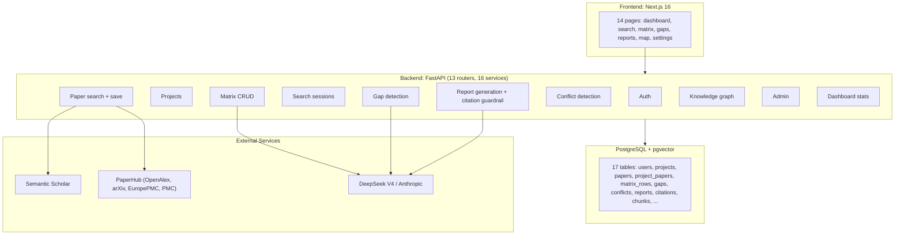
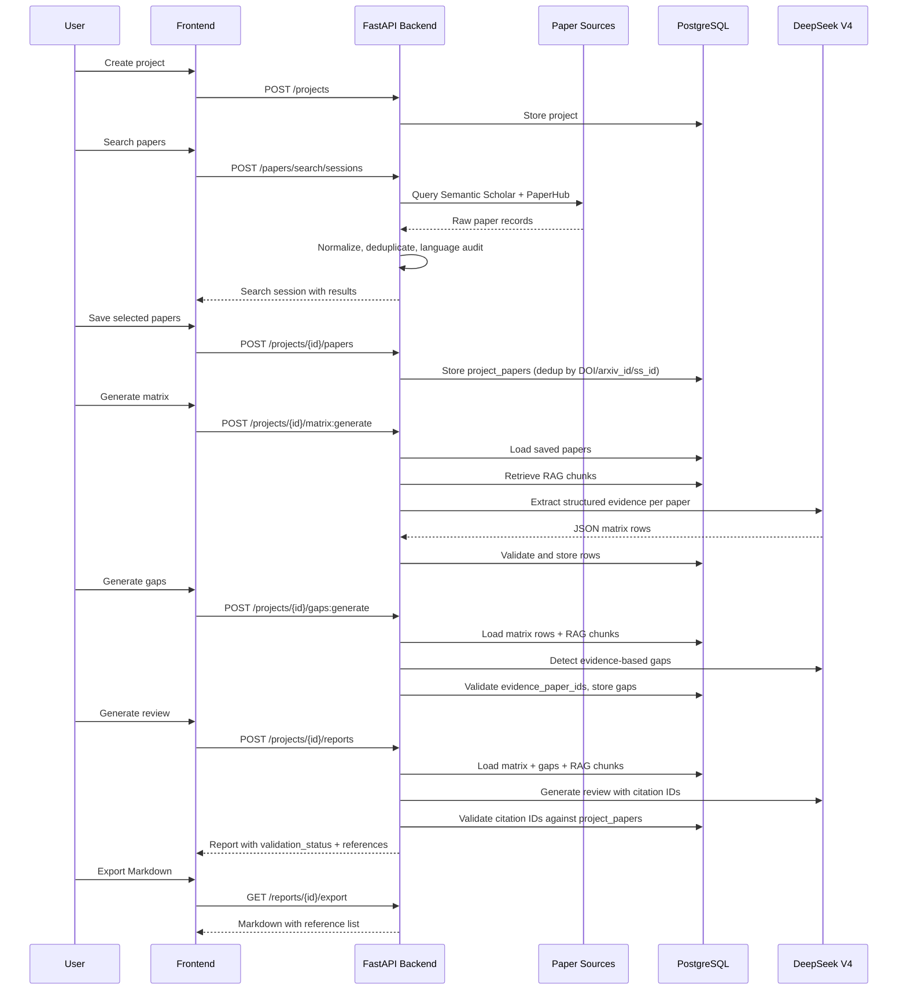
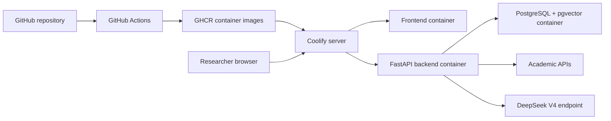

# System Overview

## Role of This Document

This document explains the end-to-end architecture of AI Literature Review
Assistant. It favors clear data ownership, predictable workflows, and
verifiable citations over broad automation.

The system has one central responsibility: help a researcher produce a
defensible literature review from real academic papers. Every generated claim
that appears in a review should be traceable to papers saved in the user's
project.

## Architecture Summary

The system is a three-layer web application:

- A Next.js 16 frontend for authentication, project management, paper
  screening, matrix editing, gap review, and report export.
- A FastAPI backend that owns authentication, project data, source integration,
  AI workflows, citation validation, and export generation.
- A self-hosted PostgreSQL database with pgvector, running in Docker, for
  relational data and semantic embeddings.

External dependencies:

- Semantic Scholar and PaperHub (wrapping OpenAlex, arXiv, EuropePMC, PMC) for
  paper discovery.
- DeepSeek V4 (via OpenAI-compatible API) for structured extraction, gap
  detection, and review generation.
- Anthropic Claude as an alternative LLM provider.
- LangGraph for stateful agentic workflow orchestration.
- Coolify for deployment, GitHub Actions for image builds, GHCR for image
  storage.



## Main Design Decisions

### Workflow Product, Not Chatbot

The system is organized around a visible workflow: project creation, paper
search, paper selection, matrix generation, gap analysis, and export. Each step
produces a concrete artifact that the user can inspect and correct.

### Controlled LangGraph Workflow

LangGraph coordinates fixed nodes with typed state. The graph is linear:

```
query_planner → search_agent → language_bias → save_screened
→ matrix_extraction → gap_analysis → conflict_detection
→ review_writer → citation_validator → END
```

Each node has typed input/output, and the graph can retry failed nodes. The
backend still owns paper identity, project ownership, citation validity, and
export rules.

### Store Structured Evidence Before Prose

The backend stores extracted fields (method, dataset, result, limitation) as
matrix rows before generating the review. This makes gap detection and report
generation inspectable and lets users correct extraction errors.

### Citation Guardrails in the Backend

The backend validates every generated citation ID against saved project papers
before saving or exporting. Invalid IDs are rejected or the section is
regenerated. This is the key differentiator from generic text generators.

### Hybrid RAG

The retrieval service combines PostgreSQL full-text search, pgvector similarity,
metadata filters, section boosts, and BGE-reranker-v2-m3 reranking. Every
retrieved chunk carries a `project_paper_id` for citation validation.

## Data Flow



## Deployment Shape



GitHub Actions builds frontend and backend images, pushes them to GHCR, and
Coolify pulls those images into a single application stack. PostgreSQL + pgvector
runs as a Docker service with a persistent volume. The frontend must never call
the AI provider directly — only the backend stores API keys.

## Non-Goals for MVP

- Full PDF parsing and full-text claim verification.
- Real-time multi-user collaboration.
- Multi-provider model switching in the UI.
- LightRAG or other graph-RAG frameworks.
- LaTeX/DOCX export.
- Exa/Firecrawl source adapters.

## Success Criteria

The architecture is successful if a new researcher can:

1. Log in and create a project.
2. Retrieve real papers from academic sources.
3. Select papers into a project corpus.
4. Generate and inspect a literature matrix.
5. Generate gaps tied to paper evidence.
6. Export a review where every citation points to a saved paper.

The core measure is evidence traceability.
