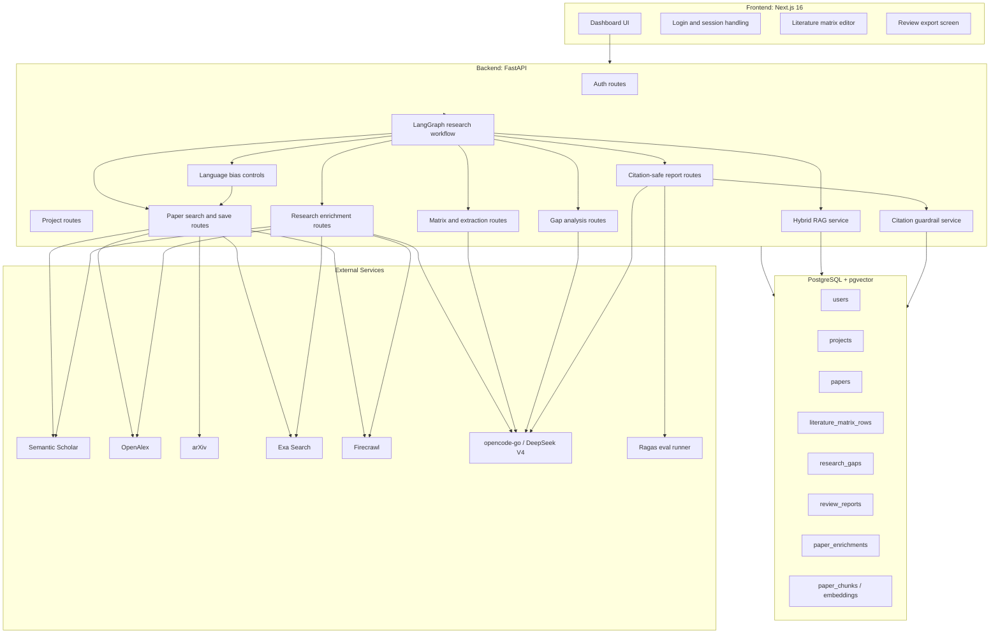
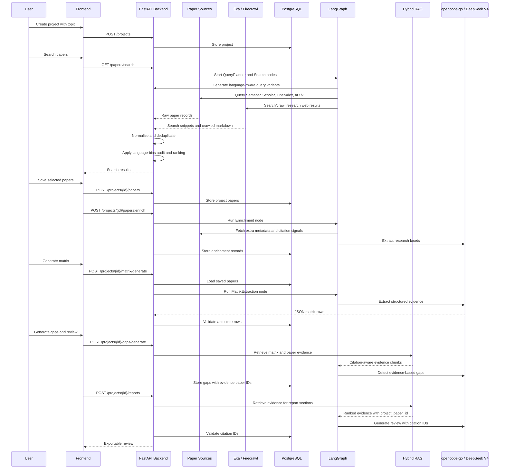
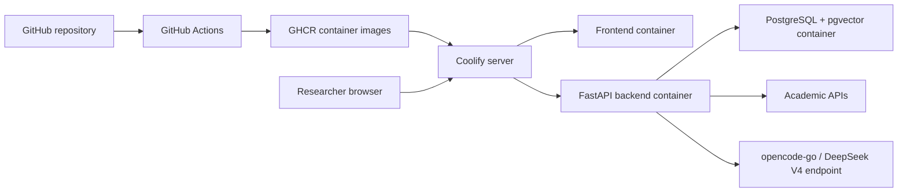

# System Overview

## Role of This Document

This document explains the end-to-end architecture of AI Literature Review
Assistant. It is intended for a new team member who needs to understand the
system before implementing features. The architecture is deliberately scoped for
a two-person student team and an eight-week timeline. It favors clear data
ownership, predictable workflows, and verifiable citations over broad
automation.

The system has one central responsibility: help a researcher produce a
defensible literature review from real academic papers. The system is not a
general-purpose AI writing tool. It should not let the model invent sources,
skip paper selection, or hide evidence. Every generated claim that appears in a
review should be traceable to papers saved in the user's project.

## Architecture Summary

The proposed system is a three-layer web application:

- A Next.js 16 frontend for authentication, project management, paper
  screening, matrix editing, gap review, and report export.
- A FastAPI backend that owns authentication, project data, source integration,
  backend research enrichment, AI workflows, citation validation, and export
  generation.
- A self-hosted PostgreSQL database with pgvector, running in Docker, for
  relational data and semantic embeddings.

External dependencies are kept narrow:

- Semantic Scholar, OpenAlex, and arXiv for paper discovery.
- Exa for semantic research search and query expansion.
- Firecrawl for crawl/scrape-backed enrichment of web research results.
- opencode-go with DeepSeek V4 for structured extraction, enrichment, gap
  detection, and review generation.
- LangGraph for stateful, checkpointed agentic workflow orchestration.
- Ragas for RAG and workflow evaluation.
- Coolify for deployment, GitHub Actions for image builds, and GHCR for image
  storage.



## Main Design Decisions

### Use a Workflow Product Instead of a Chatbot

The system should be organized around a visible workflow: project creation,
paper search, paper selection, matrix generation, gap analysis, and export. A
chat interface can be useful later, but it should not be the core MVP. Chatbots
are hard to evaluate because success depends on subjective answer quality. A
workflow is easier to demonstrate because each step produces a concrete
artifact.

The trade-off is that workflow products require more screens and data models.
However, that cost is justified because the original problem is not simply
"answer a question"; it is "help me conduct and write a literature review
without losing source integrity."

### Use Controlled LangGraph Agents, Not a Free Agent

The project should use agents for orchestration, not for uncontrolled autonomy.
LangGraph should coordinate fixed nodes with typed state: query planning,
search, Firecrawl enrichment, language-bias audit, matrix extraction, Hybrid
RAG retrieval, gap analysis, review writing, and citation validation. The graph
can retry failed nodes and preserve state, but it should not decide to invent
new tools or skip backend validation.

This design is stronger than a single LLM call because each step can be tested
and displayed. It is safer than a fully autonomous agent because the backend
still owns paper identity, project ownership, citation validity, and export
rules.

### Store Structured Evidence Before Writing Prose

The backend should store extracted fields for each paper before generating the
review. A matrix row might include method, dataset, result, contribution, and
limitation. This design makes gap detection and report generation inspectable.
It also lets users correct extraction errors.

The alternative is to pass abstracts directly to an LLM and ask for a final
review. That is faster to build, but it is less reliable. If the final output
is wrong, the user cannot easily see where the error came from. Structured
evidence provides a middle layer that can be reviewed.

### Keep Citation Guardrails in the Backend

Prompts alone are not a guardrail. The model may still output invalid citations.
The backend must validate generated citation IDs against the project corpus.
The report generation workflow should fail closed: if a citation ID is invalid,
the section is rejected or regenerated. The frontend should display validation
status before export.

This creates more backend work, but it is the key feature that separates this
project from a generic text generator.

### Use Dockerized PostgreSQL + pgvector for MVP

The project needs both relational and semantic search data. PostgreSQL handles
users, projects, papers, matrix rows, gaps, and reports naturally. pgvector can
store embeddings for abstract chunks or paper summaries. This avoids managing
a separate vector database in the MVP. The database should be deployed as a
Docker service with a persistent volume under Coolify, not as an external
managed database project. This keeps the deployment model consistent: the whole
product is reproducible from container images and environment variables.

The trade-off is that a dedicated vector database may perform better at large
scale. That does not matter for a student project where a project might contain
10 to 100 papers. If the system later grows to thousands of papers per user, a
separate vector store can be reconsidered.

### Use DeepSeek V4 Through opencode-go First

The architecture can define an AI provider interface, but the product should
start with one configured provider: opencode-go calling DeepSeek V4 through a
compatible HTTP contract. Supporting multiple providers at full quality doubles
testing and error handling. For MVP, one provider is enough to show
research enrichment, extraction, gap detection, and review generation. A second
provider can be added when the core workflow is stable.

The provider decision is separate from the agent decision. The system can use
one LLM provider while still running many specialized LangGraph nodes. This
keeps cost and configuration simple while avoiding one prompt that does every
research task.

### Use Hybrid RAG Instead of Default Vector Search

The MVP should not use default vector-only top-k retrieval as the core RAG
strategy. Literature review needs evidence tied to saved papers, matrix fields,
methods, datasets, language, and citation identifiers. The retrieval service
should combine PostgreSQL full-text search, pgvector similarity, metadata
filters, and DeepSeek reranking.

The retrieval output must always include `project_paper_id`, source metadata,
retrieved field, score, and reason. This makes later citation validation
possible. Ragas should evaluate retrieval relevance, answer faithfulness, and
citation support on a small seeded test set. LightRAG can be added later if the
team wants graph-RAG for knowledge maps, but it should not block the MVP.

### Put Research Enrichment in the Backend

The backend should do more than proxy search results. After papers are saved,
it should enrich them with additional metadata and evidence signals where
available: merged source identifiers, citation counts, related works,
references, source coverage, venue, abstract availability, open-access URL, and
AI-extracted research facets. This enrichment is backend work because it must
be stored, validated, and reused by matrix, gap, and report workflows.

Exa and Firecrawl belong in this backend layer. Exa should be used to generate
semantically rich research search results and discover useful web pages that
academic APIs may miss. Firecrawl should be used when the system needs clean
markdown from result pages, research project pages, open-access paper pages, or
PDF landing pages. Neither service should replace Semantic Scholar, OpenAlex,
or arXiv as the canonical paper sources. Instead, they improve recall and fill
metadata gaps before the user saves papers.

### Handle Language Bias in Search and Ranking

The backend should assume search is biased unless proven otherwise. English
queries, citation-count ranking, and global academic indexes tend to favor
English-language papers and high-resource regions. This can hide important
Vietnamese, local, or low-resource-language research.

The search pipeline should apply these rules:

1. Detect the user's query language and any target language mentioned in the
   topic.
2. Generate query variants in the original language and English.
3. Use source-specific language controls where available, including Firecrawl
   location/language options.
4. Store the language of each candidate paper or page when detectable.
5. Rank by relevance first, then diversify by source and language.
6. Do not over-penalize non-English papers only because they have fewer
   citations.
7. Show a language coverage audit so the user can see whether the corpus is
   English-heavy.

This does not mean forcing equal counts for every language. It means making the
bias visible and giving the user enough controls to correct it.

## Data Flow

The most important system flow is the path from user query to exported review:



This flow shows why the system stores intermediate state. Each step can be
retried independently. If paper search fails, the matrix remains intact. If
matrix generation has errors, the user can edit rows before generating gaps. If
citation validation fails, the saved papers and matrix are still usable.

## Deployment Shape



The deployment should use Docker images rather than separate managed frontend
and backend platforms. GitHub Actions builds the frontend and backend images,
pushes them to GHCR, and Coolify pulls those images into a single application
stack. PostgreSQL + pgvector runs as a Docker service with a persistent volume.
The frontend must never call the AI provider directly because that would expose
API keys. Only the backend stores the DeepSeek/opencode-go endpoint and secret.

### GitHub Actions to GHCR

The repository should contain a workflow that builds images on pushes to the
main branch and publishes them to GHCR. Coolify can then watch those images or
be triggered to redeploy.

```yaml
name: Build and publish containers

on:
  push:
    branches: [main]

permissions:
  contents: read
  packages: write

jobs:
  build:
    runs-on: ubuntu-latest
    strategy:
      matrix:
        service: [frontend, backend]
    steps:
      - name: Check out repository
        run: git clone "$GITHUB_SERVER_URL/$GITHUB_REPOSITORY" repo
      - name: Log in to GHCR
        run: echo "${{ secrets.GITHUB_TOKEN }}" | docker login ghcr.io -u "$GITHUB_ACTOR" --password-stdin
      - name: Build image
        run: docker build -t ghcr.io/${{ github.repository }}/${{ matrix.service }}:latest repo/${{ matrix.service }}
      - name: Push image
        run: docker push ghcr.io/${{ github.repository }}/${{ matrix.service }}:latest
```

The example uses shell steps so the project does not depend on unpinned
third-party GitHub Actions. If the team later uses reusable actions such as
checkout or Docker build actions, those actions should be pinned to full commit
SHAs.

## Reliability Strategy

The MVP should include pragmatic reliability features:

- Cache or store search results after the user saves them.
- Store extraction outputs so the user does not regenerate matrix rows
  unnecessarily.
- Use clear error messages when a paper source fails.
- Allow a seeded demo project with real saved papers.
- Validate LLM JSON before saving.
- Validate citation IDs before report export.

These choices are more important than complex scaling. The system will be
evaluated by whether it works end to end and whether its outputs can be trusted.

## Non-Goals for MVP

The following are intentionally out of MVP:

- Full PDF parsing and full-text claim verification.
- Real-time multi-user collaboration.
- Complex visual graph editing.
- Automatic systematic review protocol compliance.
- Multi-provider model switching in the UI.
- Fully autonomous agent planning without fixed graph nodes.
- LightRAG or other graph-RAG frameworks as core MVP dependencies.
- LaTeX export.
- True contradiction detection across experimental settings.

These can be added later, but including them too early would reduce the chance
of delivering a complete product.

## Success Criteria

The architecture is successful if a new researcher can:

1. Log in and create a project.
2. Retrieve real papers from academic sources.
3. Select papers into a project corpus.
4. Generate and inspect a literature matrix.
5. Generate gaps tied to paper evidence.
6. Export a review where every citation points to a saved paper.

The architecture is not successful if it only produces polished text. The core
measure is evidence traceability.
