# MVP Definition

## MVP Goal

The MVP is a complete deployed web application that demonstrates the core
research workflow of AI Literature Review Assistant. It should not attempt to
solve every part of academic research. It should prove one strong claim: a user
can create a project, collect real papers, turn them into a structured
literature matrix, generate evidence-based research gaps, and export a
literature review draft whose citations are validated against saved papers.

The MVP includes exactly these product capabilities:

1. Login.
2. Create Project.
3. Search Papers.
4. Save Papers.
5. Literature Matrix.
6. Knowledge Map.
7. Research Gap Detection.
8. Citation-safe Literature Review Export.

Features outside this list should be treated as stretch work. This includes
RAG chat, full PDF ingestion, collaborative editing, LaTeX export, and
multi-provider model switching in the UI.

LangGraph agents are an implementation detail for the MVP, not an extra user
feature. The user still sees the eight capabilities above. Internally, the
backend runs controlled nodes for search, enrichment, matrix extraction, gap
analysis, review writing, and citation validation. Hybrid RAG is also internal:
it retrieves evidence for gap and report generation, but it does not expose a
general chatbot in the MVP.

## User Flow

```mermaid
flowchart LR
    A["Login"] --> B["Create Project"]
    B --> C["Search Papers"]
    C --> D["Save Papers"]
    D --> E["LangGraph Enrichment Node"]
    E --> F["Matrix Extraction Node"]
    F --> G["Review and Edit Matrix"]
    G --> H["Knowledge Map Visualization"]
    H --> I["Hybrid RAG Evidence Retrieval"]
    I --> J["Gap Analysis Node"]
    J --> K["Citation-Safe Review Node"]
    K --> L["Export Markdown"]
```



### Step 1: Login

The user registers or logs in with email and password. The system creates a
session and loads the user's project dashboard. Login matters because the
assignment requires user management and because research projects must remain
separated between users.

Acceptance criteria:

- A user can register with email and password.
- A user can log in and log out.
- Authenticated API requests include a token.
- A user cannot access another user's projects.

### Step 2: Create Project

The user creates a project by entering a title, topic, and optional research
question. The project becomes the container for papers, matrix rows, gaps, and
reports.

Example:

```text
Title: RAG for Medical Question Answering
Topic: Retrieval-Augmented Generation for medical question answering
Research question: How do RAG systems improve factuality in medical QA?
```

Acceptance criteria:

- Project creation stores the project under the current user.
- The dashboard lists the project.
- The project page shows workflow tabs for search, papers, matrix, gaps, and
  review export.

### Step 3: Search Papers

The user searches through the backend. The MVP should support Semantic Scholar,
OpenAlex, arXiv, Exa, and Firecrawl-backed crawl enrichment. Academic APIs
remain the canonical paper sources. Exa improves semantic recall and Firecrawl
fills metadata gaps from research pages or open-access landing pages. The search
response should show source badges and enough metadata for screening.

Acceptance criteria:

- The user can enter a query and receive paper candidates.
- Results include title, authors, year, abstract preview, URL, source names,
  and citation count when available.
- If one source fails, the UI still shows partial results with a warning.
- Duplicate papers are merged when identifiers or normalized titles match.
- Search results include query variants and a language coverage audit.
- Vietnamese or original-language query variants are generated when relevant.

### Step 4: Save Papers

The user selects relevant papers and saves them into the project corpus. Saved
papers become the only papers available for matrix generation, gap detection,
and citation-safe review export.

After saving, the backend should enrich the corpus before downstream AI
features run. Enrichment merges metadata from available sources, fills missing
identifiers, checks citation/reference signals, detects open-access links, uses
Firecrawl for crawlable pages, and extracts research facets with
opencode-go/DeepSeek V4. This is not a separate MVP feature from the user's
point of view; it is the backend layer that makes the matrix and gap outputs
stronger.

Acceptance criteria:

- The user can save one or more papers from search results.
- The project page lists saved papers.
- Saving the same paper twice does not create duplicates.
- The user can remove or relabel a saved paper.
- The backend can store enrichment status for saved papers.

### Step 5: Literature Matrix

The system generates structured rows for enriched saved papers. The matrix
should be editable because AI extraction can be incomplete or wrong. The matrix
is the main evidence artifact.

Recommended columns:

| Column | Purpose |
| --- | --- |
| Paper | Links the row to a saved paper |
| Research problem | States what problem the paper addresses |
| Method | Captures the approach or method family |
| Dataset/context | Captures benchmark, domain, or study setting |
| Key result | Captures the main finding |
| Limitation | Captures the weakness or stated future work |
| Contribution | Captures what the paper adds |
| Relevance | Explains why it matters to the project |

Acceptance criteria:

- Matrix generation works for saved papers.
- The backend validates AI output before saving rows.
- The user can edit matrix fields.
- Missing information is shown as missing or low confidence, not fabricated.

### Step 6: Knowledge Map

The system generates an interactive force-directed graph from saved papers and
their matrix rows. Nodes represent papers, methods, datasets, and limitations.
Edges represent relationships: paper uses method, paper evaluates dataset, paper
has limitation, and papers sharing a method or dataset. The graph is built from
PostgreSQL data by the `knowledge_graph.py` service and rendered in the frontend
with react-force-graph-2d.

Acceptance criteria:

- The graph loads after matrix rows exist.
- Clicking a paper node shows its title, abstract, and matrix row.
- Clicking a concept node highlights all related papers.
- The user can filter by node type (paper, method, dataset, limitation).
- The graph reflects the current state of saved papers and matrix rows.

### Step 7: Research Gap Detection

The system generates candidate gaps from matrix rows. Each gap must include
evidence papers and an explanation. Generic gaps without evidence should not be
accepted.

Acceptance criteria:

- Gap generation requires a minimum number of matrix rows.
- Each generated gap includes title, description, suggested direction,
  evidence summary, and supporting saved papers.
- Gaps with no evidence are rejected by the backend.
- The UI displays gap evidence next to the gap claim.

### Step 8: Citation-Safe Literature Review Export

The system generates a literature review draft and validates all citation IDs
against saved project papers. The reference list is built from database
metadata, not from model-generated bibliography text.

Acceptance criteria:

- The user can generate a review from saved papers and selected gaps.
- Every paragraph with claims includes citation IDs.
- The backend rejects invalid citation IDs.
- The exported Markdown includes a reference list.
- The user can trace each citation back to a saved paper.

## Demo Flow

The final demo should use a seeded project with real papers to avoid depending
entirely on live API and AI latency. The team can still show live search, but
the seeded project should be available as a fallback.

Recommended demo topic:

```text
Retrieval-Augmented Generation for medical question answering
```

Demo script:

1. Log in as a researcher. (~15s)
2. Create a new project or open the seeded project. (~20s)
3. Search using Semantic Scholar, OpenAlex, arXiv, Exa, and Firecrawl. (~30s)
4. Save 10 to 15 relevant papers. (~30s)
5. Generate the literature matrix. (~60s)
6. Edit one matrix row to show human control. (~20s)
7. Generate research gaps. (~30s)
8. Open a gap and show supporting papers. (~20s)
9. Generate a literature review. (~60s)
10. Show citation validation status. (~15s)
11. Export Markdown. (~10s)
12. Click a citation and show the saved paper metadata. (~15s)

Total estimated time: 5 to 6 minutes. Rehearse twice in Week 7.

The most important demo moment is step 12. It proves that the review is not
just fluent generated text. It shows the chain from source paper to matrix row
to gap to cited paragraph.

## MVP Non-Goals

The MVP does not need:

- PDF upload and full-text parsing.
- Automatic claim-level verification against full text.
- Collaboration between multiple users in one project.
- LaTeX or DOCX export.
- Chatbot interface.
- Multiple AI providers in the UI.
- Fully autonomous open-ended agents.
- LightRAG or graph-RAG as a required MVP dependency.

These features can be valuable later, but including them in the MVP would
increase implementation risk without strengthening the core demo.

## MVP Quality Bar

The MVP is acceptable only if it is deployed online and works end to end. A
local-only prototype, notebook, or CLI script does not satisfy the project
requirement. The app must have a reachable frontend URL, an authenticated
backend, and persistent database storage. The target deployment is a Docker
stack on Coolify: frontend container, FastAPI backend container, and
PostgreSQL + pgvector container with a persistent volume. GitHub Actions should
build images and push them to GHCR so deployment is reproducible.

The quality bar is not "the AI always produces perfect reviews." The quality
bar is "the system exposes evidence, prevents invalid citations, and lets the
user inspect and correct intermediate artifacts." That is realistic and aligned
with the pain point.
