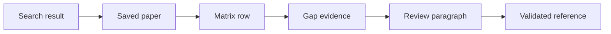

# Final Project Review

## Executive Summary

AI Literature Review Assistant is a strong project idea if it remains focused
on evidence-grounded literature review. The core pain point is real: researchers
lose significant time finding, screening, comparing, and citing papers. The
project becomes valuable when it helps users build a transparent evidence chain
from real academic sources to a literature review draft. It becomes weak if it
turns into a generic chatbot or a broad AI platform with many partially working
modules.

The proposed MVP is feasible for two people in eight weeks if the team strictly
limits scope to login, project creation, paper search, paper saving, backend
research enrichment, literature matrix, evidence-based gap detection, and
citation-safe export. The MVP is not feasible if the team also tries to
implement full-text PDF ingestion, complex knowledge graphs, true contradiction
detection, RAG chat, LaTeX generation, and multi-provider orchestration at
production quality.

The strongest architectural decision is storing structured intermediate
artifacts. Papers are saved as real metadata records. Matrix rows store methods,
datasets, results, and limitations. Gaps store evidence paper IDs. Reports
store validated citation IDs. This design is more work than sending all
abstracts to an LLM, but it directly addresses citation trust and research
traceability.

The revised architecture should use LangGraph for controlled agentic workflow.
This does not mean the app should become a fully autonomous research bot. It
means the backend uses graph nodes for query planning, search, enrichment,
matrix extraction, Hybrid RAG retrieval, gap analysis, review writing, and
citation validation. The single DeepSeek V4 provider can power these nodes, but
the workflow should not be one monolithic LLM call.

## Strengths

The project has a strong alignment with a painful academic workflow. Literature
review is not a single task; it is a sequence of discovery, screening,
comparison, interpretation, and writing. The proposed application mirrors this
sequence. That gives the project a clearer product shape than a simple
"summarize papers" tool.

The second strength is that the product uses real academic sources and
controlled enrichment sources. Semantic Scholar, OpenAlex, and arXiv provide
enough canonical paper coverage for a student MVP. Exa helps discover related
research pages, and Firecrawl can extract clean content from selected pages.
This matters because the final review must cite real papers rather than
model-made references.

The third strength is citation guardrails. The system does not rely only on a
prompt saying "do not hallucinate." Instead, the backend validates citation IDs
against saved project papers. This is the right level of enforcement. Prompting
can guide the model, but database validation is what prevents invalid citation
IDs from becoming exported references.

The fourth strength is the literature matrix. A matrix is a useful artifact for
researchers even without final prose generation. It helps users compare papers
by method, dataset, result, and limitation. It also makes gap detection more
credible because gaps can be derived from visible rows rather than opaque model
reasoning.

The fifth strength is demo clarity. The project can be demonstrated through a
clean sequence: log in, create a project, search papers, save papers, generate
matrix, generate gaps, export review, inspect citations. This is much easier to
evaluate than an open-ended chatbot.

## Weaknesses

The main weakness is that the original idea includes too many advanced
features. Knowledge maps, contradiction detection, full RAG chat, full-text PDF
parsing, citation validation, clustering, and review generation are all
substantial features. Combining them in one short project risks producing
surface-level implementations. A feature that only appears in the UI but does
not work reliably should be considered harmful because it makes the product
look less trustworthy.

The second weakness is that research gap detection can easily become generic.
LLMs often produce gap statements that sound academic but are not grounded in
the corpus. For example, "more real-world evaluation is needed" is often true
but not useful unless the system explains which papers reveal the missing
evaluation and why it matters. The project must enforce evidence for every gap.

The third weakness is that contradiction detection is not mature enough for
MVP. True contradiction detection requires comparing study context, metrics,
benchmarks, populations, and experimental setup. Two papers may appear to
disagree only because they evaluate different settings. A weak contradiction
detector could mislead users. It is better to remove it from MVP or label it as
"potential conflicting findings for human review" in a later version.

The fourth weakness is that the quality of generated reviews will depend on the
quality of abstracts and metadata. If papers do not include abstracts, the
system has limited evidence. Full-text ingestion could help, but it introduces
new complexity. The MVP should be honest: it can generate an abstract-grounded
review and should show missing information instead of inventing it.

The fifth weakness is deployment and integration burden. The assignment
requires an online deployed product with login and user management. That means
the team must spend real time on authentication, environment variables,
database hosting, CORS, deployment, and error handling. These tasks are less
glamorous than AI features but are required for acceptance.

## Technical Risks

### Paper Source Reliability

External source APIs may be slow, rate-limited, or inconsistent. Search results
may include duplicates, missing fields, irrelevant papers, language imbalance,
or noisy crawled pages. The backend must normalize source records, handle
language-bias audits, and return partial results when one source fails. A demo
should include seeded data from real papers to reduce dependency on live API
behavior.

### LLM Output Quality

LLMs may return malformed JSON, over-compress complex papers, or infer details
not present in abstracts. The backend must validate structured output and allow
missing fields. The UI must let users edit matrix rows. Without this, the matrix
could become a polished collection of errors.

### Citation Errors

Citation errors are the most important risk. They can appear in several ways:
the model may cite an invalid ID, cite a saved paper that does not support the
claim, or generate a bibliography entry not present in the database. The MVP
can strongly prevent invalid IDs and fake bibliography entries. It cannot fully
prove claim-level support without deeper evidence verification. The team should
communicate this distinction clearly.

### Data Ownership

Because the app includes login and project management, every project-scoped API
must enforce ownership. A user should not be able to access another user's
project by changing an ID in the URL. This must be tested because it is a common
full-stack mistake.

### Long-Running Tasks

Matrix generation, gap detection, and report generation may take time. The team
should avoid adding a complex job queue unless necessary, but the UI must show
running and failed states. For demo reliability, the system should store
generated outputs and avoid regenerating them unnecessarily.

## Feasibility With Two People in Eight Weeks

The MVP is feasible with strict scope control. The expected work is substantial
but manageable:

- Member A builds the frontend workflow, auth UI, project screens, paper search
  UI, matrix editor, gap cards, and export screen.
- Member B builds FastAPI, Dockerized PostgreSQL + pgvector, source adapters,
  backend enrichment, LangGraph orchestration, Hybrid RAG,
  opencode-go/DeepSeek V4 services, citation validation, Ragas evaluation, and
  Coolify/GHCR deployment support.

The schedule becomes risky if backend contracts are delayed. Member A should
build against mocked API responses while Member B implements endpoints. The
team should integrate weekly rather than waiting until all backend features are
complete.

The eight-week plan is realistic only if Week 6 produces a deployed integrated
version. If deployment is delayed until Week 8, the team will likely spend the
final week fixing infrastructure instead of preparing the demo.

## Feature Decisions

### Keep

Login should be kept because it is required and gives project ownership. Create
Project should be kept because it defines the research context. Search Papers
should be kept because it directly solves discovery. Save Papers should be kept
because it creates a controlled corpus. Literature Matrix should be kept because
it is the strongest intermediate artifact. Research Gap Detection should be
kept if every gap has evidence. Citation-safe Review Export should be kept
because it is the core trust feature.

### Cut From MVP

Full visual knowledge maps should be cut. A grouped matrix gives most of the
analytical value with less implementation risk. True contradiction detection
should be cut because it is hard to validate. PDF full-text parsing should be
cut because it introduces parsing, storage, copyright, and processing issues.
RAG chat should be cut unless the core workflow finishes early. LaTeX and DOCX
export should be cut in favor of Markdown export.

### Reduce

Clustering should be reduced to grouping matrix rows by method, dataset, topic,
or limitation. Gap detection should be reduced to three to five evidence-backed
candidate gaps. Multi-provider AI should be reduced to one provider behind a
backend interface.

## Hallucination and Citation Error Review

The project must not claim that it eliminates hallucination entirely. It can
claim a narrower and more defensible guardrail: generated citations are limited
to real saved papers in the project, and invalid citation IDs are rejected.

The remaining risk is claim support. A paragraph might cite a real paper but
overstate what the paper says. The MVP can reduce this risk by generating from
matrix rows, showing evidence, and allowing user review. Full claim-level
verification against full text is out of MVP.

The citation guardrail should be demonstrated with a negative test. For
example, the backend test can attempt to save a report citing a paper ID that
does not belong to the project. The expected result is rejection with
`INVALID_CITATION`. This is a strong technical proof for the final presentation.

## Academic Value

The project has academic value if it improves the process of literature review,
not merely the prose output. The matrix and gap evidence are academically
meaningful because they help researchers compare methods and identify missing
coverage. The system can also teach students what makes a research gap
defensible: it must be tied to evidence.

The academic value is weaker if the app only produces a final essay. Many tools
can generate academic-sounding text. The differentiator is traceability.

## Product Value

The product value is strongest for students, early-stage researchers, and teams
starting a new topic. It helps them create a first structured overview faster.
It is less suitable for final systematic reviews in regulated fields unless
more rigorous protocol tracking and full-text verification are added.

The product should be honest about this. It is a literature review assistant,
not an automated systematic review authority.

## Demo Value

The demo can be strong if it shows the evidence chain. The presenter should not
spend most of the time explaining the model. The better demo is visual:

If each click reveals real stored data, the committee can understand why the
system is trustworthy.

## Final Recommendation

Proceed with the project, but keep the MVP narrow. Build the full workflow
before adding stretch features. The best version of this project is not the one
with the most AI labels. It is the one that convincingly proves that every
generated literature review claim is connected to selected real papers and that
research gaps are based on visible evidence.

The final implementation should be judged by these questions:

1. Can a user complete the workflow online from login to export?
2. Are all cited papers real and saved in the project?
3. Can the user inspect the matrix behind the generated review?
4. Can the user see evidence for each research gap?
5. Does the system fail clearly when evidence or citations are insufficient?
6. Can the team show the LangGraph run and Hybrid RAG evidence behind a gap or
   review paragraph?

If the answer to these questions is yes, the project is feasible, useful, and
well aligned with the original pain point.
