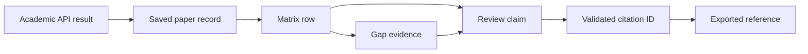

# Project Review

## Review Goal

This review evaluates the proposed AI Literature Review Assistant before
implementation. The goal is to identify what is strong, what is weak, what is
too ambitious for a two-person student project, and what should be kept for a
credible MVP. The review intentionally challenges the idea instead of assuming
that every feature is valuable. A literature review assistant can easily become
a broad AI platform with many impressive labels but weak execution. The project
should avoid that trap.

The original ambition includes paper discovery from Semantic Scholar, OpenAlex,
and arXiv; user screening; literature matrix generation; clustering by method
or topic; knowledge map construction; evidence-based research gap detection;
contradiction detection; citation-safe review generation; and hallucinated
citation guardrails. These are all relevant to the pain point, but they are not
equally feasible, equally demo-friendly, or equally necessary for the MVP.

## Requirement Review Matrix

| Feature | Pain Point Fit | Main Weakness | Demo Difficulty | Hallucination Risk | Recommendation |
| --- | --- | --- | --- | --- | --- |
| Paper discovery | High | API noise and duplicates | Medium | Low | Keep in MVP |
| User screening | High | Requires extra UI states | Low | Low | Keep in MVP |
| Literature matrix | High | AI extraction may be incomplete | Medium | Medium | Keep in MVP and allow edits |
| Method/topic grouping | Medium | Can become shallow clustering | Medium | Medium | Reduce to grouped matrix filters |
| Knowledge map | Medium | Undefined data model and high UI cost | High | Medium | Cut from MVP |
| Research gap detection | High | Generic gaps are easy to generate | Medium | High | Keep only with evidence |
| Contradiction detection | Medium | Needs normalized study context | High | High | Cut or label as stretch |
| RAG chat | Medium | Can distract from review workflow | Medium | Medium | Stretch after export works |
| Citation-safe export | High | Needs backend validation | Medium | High if unvalidated | Keep as core trust feature |
| Full PDF parsing | Medium | Parsing, copyright, storage, and latency | High | Medium | Cut from MVP |

The matrix shows the core product boundary. Features that directly support the
evidence chain should stay. Features that mostly improve presentation or broad
automation should wait until the MVP is deployed.

## Strengths

The strongest part of the idea is that it targets a real, painful research
workflow. Literature review is slow because the work is fragmented. A researcher
must search across several sources, scan many irrelevant papers, track metadata,
compare methods, notice repeated limitations, and then write a coherent review.
The problem is not merely "summarize this paper." The problem is organizing a
field well enough to make an academic contribution. The proposed product is
valuable because it addresses the whole workflow rather than only the final
writing step.

The second strength is the focus on real papers. Many AI writing tools are weak
for academic work because they generate fluent claims without verifiable
sources. By retrieving records from academic APIs and storing them in the
database, this project can make a strong claim: the system only cites papers
that exist in the user's project corpus. This is both technically important and
easy to explain in a demo.

The third strength is the literature matrix. This feature turns unstructured
research into a structured artifact. A matrix with columns such as method,
dataset, result, and limitation gives the user something useful even before the
AI writes any prose. It also creates the evidence base for later features. Gap
detection without a matrix is mostly prompt engineering. Gap detection from a
matrix is more defensible because the system can compare rows and show why it
believes a gap exists.

The fourth strength is the human-in-the-loop screening step. Fully automatic
literature review sounds attractive, but it is risky. Academic relevance is
context-dependent, and search APIs often return papers that match keywords but
not the research question. Letting the user save, reject, or mark papers as
uncertain makes the workflow more trustworthy. It also creates a better demo
because the evaluator can see that the user remains in control.

The fifth strength is that the stack is realistic. Next.js 16, React, FastAPI,
Dockerized PostgreSQL, and pgvector are enough for a complete deployed product.
The team does not need a complex microservice architecture, a separate vector
database, or multiple AI providers in the MVP. A single opencode-go/DeepSeek V4
provider keeps AI behavior easier to test. Coolify and GHCR give a practical
deployment path while still showing real DevOps work.

The sixth strength is that the system can be framed as a controlled agentic
workflow without becoming an uncontrolled autonomous agent. LangGraph fits the
project because the research process has multiple stateful steps, but each step
can still have strict input/output schemas. Hybrid RAG also gives a stronger
technical story than default vector search because evidence retrieval can use
paper metadata, matrix rows, language, and citation IDs.

## Weaknesses

The biggest weakness is scope. The full idea tries to solve paper search,
screening, summarization, clustering, knowledge maps, gap detection,
contradiction detection, citation validation, RAG chat, report generation,
authentication, user management, and deployment. Each of these could be a
separate project if implemented deeply. A two-person team in eight weeks cannot
build all of them at high quality. If the team tries, the likely result is a
wide demo with shallow features, fragile prompts, and little validation.

The second weakness is that "knowledge map" is underspecified. A knowledge map
can mean a graph of papers and citations, a graph of concepts and methods, a
timeline of research themes, or a visual clustering layout. These require
different data models and algorithms. If the team promises a knowledge map but
only displays a decorative graph, the feature will not solve the pain point. It
may even distract from the stronger literature matrix. For the MVP, a table and
grouped views are more useful than a visual graph.

The third weakness is contradiction detection. Detecting true contradictions
between studies is hard because papers often differ in datasets, metrics,
experimental settings, population, baseline, and evaluation protocol. A claim
like "method A outperforms method B" may appear contradictory to another paper
only because the benchmark changed. A reliable contradiction detector needs
structured extraction, normalization of metrics, and careful comparison. For a
student MVP, this feature is high risk and hard to validate. It should be
reduced to "potential conflicting findings" with evidence snippets, or moved
out of MVP.

The fourth weakness is the risk of hallucinated gap detection. LLMs are good at
producing plausible research gaps, but plausible is not enough. A generated gap
such as "more work is needed on real-world deployment" can fit almost any field.
Unless every gap is tied to extracted limitations and missing combinations in
the matrix, the feature can become generic. The product must define a strict
gap schema: gap statement, evidence papers, evidence type, affected method or
dataset, and suggested research direction. Without that schema, gap detection
will be hard to trust.

The fifth weakness is possible confusion between RAG and citation safety. RAG
retrieves context, but it does not automatically prevent citation errors. The
model can still cite a paper incorrectly, attach the wrong citation to a claim,
or cite a paper that was retrieved but does not support the claim. Citation
safety requires backend validation and source display. The project should not
claim "no hallucinations" simply because it uses RAG. The safer claim is:
"citations are restricted to verified project papers and invalid citation IDs
are rejected."

The project also risks overusing the word "agent." If the team presents an
agent that can do anything, the demo becomes harder to control and easier to
break. Agentic workflow should mean fixed LangGraph nodes with tools and
validation, not a free-form research bot.

The sixth weakness is data quality. Semantic Scholar, OpenAlex, arXiv, Exa, and
Firecrawl do not provide the same kind of data. DOI may be missing. Abstracts
may be absent. Citation counts may differ. Exa may return useful research web
pages rather than canonical paper records. Firecrawl may produce noisy markdown.
Duplicates across sources are common. If the product does not normalize and
deduplicate records, the matrix may contain duplicate papers or incomplete rows.
This is not glamorous, but it directly affects trust.

## Risks

### Technical Risk: Academic Source Integration

Paper and research search APIs have rate limits, inconsistent fields, and
different search semantics. Semantic Scholar may return rich citation metadata
but can be rate limited. OpenAlex has broad coverage but noisy results. arXiv is
excellent for preprints but does not cover all disciplines. Exa improves
semantic recall, while Firecrawl can enrich pages but may return noisy content.
The system needs source adapters with a common paper schema and clear fallback
behavior when one source fails.

### Technical Risk: LLM Structured Output

The system depends on LLMs to extract methods, datasets, results, and
limitations. These outputs can be incomplete or inconsistent. If the backend
stores arbitrary prose without schema validation, later modules will be weak.
The backend should request JSON output, validate it with Pydantic, and mark
low-confidence or missing fields instead of pretending every extraction is
complete.

### Product Risk: Too Much Automation

If the product hides search, screening, extraction, and writing behind one
button, users cannot inspect the reasoning. That hurts trust. A literature
review assistant should expose intermediate artifacts: search results, selected
papers, matrix rows, gap evidence, and citation mappings.

### Demo Risk: Slow or Unstable AI Calls

Live AI calls can fail due to network issues, API limits, model latency, or
cost. A demo should include cached project data and a seeded example project so
that the team can demonstrate the full workflow even if a live source is slow.
This does not mean faking the product. It means saving previously retrieved
real papers and generated artifacts for reliable presentation.

### Academic Risk: Weak Research Gap Claims

Research gap detection is the headline feature. If the app produces generic
gaps, the project loses academic credibility. The team must design gap outputs
around evidence and limits. It is better to show three well-supported gaps than
ten vague ideas.

### Security and Privacy Risk

The app has users, saved projects, and possibly API keys. User ownership must
be enforced on every project endpoint. The frontend must never expose server
LLM keys. The backend should keep generated content separate per user and
project. Admin features should be basic and auditable.

## Feature-by-Feature Critique

### Search Papers from Academic APIs, Exa, and Firecrawl

This feature is essential. It directly addresses the pain point of finding
relevant literature. However, the MVP should not promise perfect coverage.
Search should support a query, year range, source selection, and result limit.
The backend should deduplicate by DOI, arXiv ID, Semantic Scholar ID, OpenAlex
ID, and normalized title. Exa should improve semantic web/research discovery.
Firecrawl should enrich selected pages, not become a source of unverified
citations. Ranking can start with source-provided relevance, language coverage,
and citation count. A complex custom ranking model is unnecessary for MVP.

### User Screening

This feature should be kept. Screening gives the user control and protects
against poor search results. The MVP only needs statuses such as saved,
rejected, and maybe uncertain. AI-assisted relevance scoring is useful but not
required for the first demo. If implemented, it should explain why a paper is
likely relevant based on title and abstract.

### Literature Matrix

This is a core MVP feature. It solves a real workflow problem and supports gap
detection. The matrix should use structured fields rather than a single summary
column. It should be editable because extraction errors are inevitable. Editing
also gives users agency and improves demo credibility.

### Clustering by Method or Topic

Clustering is useful, but it should be simplified. Instead of implementing a
complex unsupervised clustering pipeline, the MVP can group papers by extracted
method family, application area, or dataset type. These groups can be generated
by the LLM from the matrix rows and then reviewed by the user. This is easier
to demo and easier to explain.

### Knowledge Map

This should be cut or reduced for MVP. A visual graph can look impressive but
will take time to implement well. It also needs a clear data model. For the
first version, a grouped matrix plus evidence cards solves more of the user's
problem. A knowledge map can be added later as a visualization of existing
matrix data.

### Research Gap Detection

This should be kept but constrained. The system should generate a small number
of evidence-based gaps. Each gap must reference at least two saved papers or one
clear repeated limitation. The backend should store gap evidence explicitly.
The UI should show the gap statement and the supporting papers side by side.

### Contradiction Detection

This should be removed from MVP or reframed as "potential conflicting findings."
True contradiction detection is difficult and could become misleading. If the
team keeps a reduced version, it should only flag cases where two matrix rows
make opposing result claims under similar tasks or datasets, and it must label
them as candidates for human review.

### Citation-Safe Review Generation

This is essential and should be a centerpiece. The output should be generated
from selected papers, matrix rows, and gaps. The model should return structured
sections with citation IDs. The backend should validate those IDs before export.
The UI should allow the user to inspect references.

### Full RAG Chat

RAG chat is useful but not required in the stated MVP. If time is limited, the
team should prioritize report generation and citation validation over chat.
Chat can be added after the core workflow works. If implemented, it should only
answer within the project corpus and display source papers.

## Scope Reduction Suggestions

The project should reduce scope around visualization, contradiction detection,
full-text ingestion, and multi-provider AI. The first version should use paper
metadata and abstracts rather than PDFs. Abstract-level review is not perfect,
but it is enough to demonstrate discovery, screening, matrix creation, and
citation-safe generation. Full-text extraction introduces PDF parsing failures,
copyright concerns, storage issues, and slow processing. It can be a later
enhancement.

The knowledge map should become a grouped matrix view. Instead of a graph, the
frontend can provide tabs or filters: by method, by dataset, by application,
and by limitation. This gives users most of the analytical value with much less
implementation risk.

Contradiction detection should become a non-MVP stretch feature. The MVP should
focus on gaps because gap detection is the central promise. A poor
contradiction detector could damage trust more than it helps.

The AI provider layer should start with one provider: opencode-go using
DeepSeek V4. The backend can define an interface so that a second provider can
be added later, but the UI does not need model switching. Model switching is
impressive for infrastructure demos, but it does not directly solve the
literature review pain point.

Agent orchestration should start with LangGraph, but only as a fixed workflow
graph. The team should avoid adding complex multi-agent negotiation or
subagents in the MVP. RAG should start as Hybrid RAG using PostgreSQL full-text
search, pgvector, metadata filters, and citation-aware reranking. Ragas should
be used to evaluate seeded retrieval and citation-support cases. LightRAG can
be listed as a stretch option for graph-RAG and knowledge maps, but it should
not be required for the MVP.

The export feature should start with Markdown. DOCX and LaTeX are useful, but
Markdown is enough for a demo and easier to validate. A good Markdown export
with correct references is more valuable than a fragile DOCX generator.

## MVP Recommendation

The recommended MVP is:

1. Login and basic user ownership.
2. Create research project with topic and optional research question.
3. Search papers from Semantic Scholar, OpenAlex, and arXiv.
4. Deduplicate and normalize paper records.
5. Save selected papers to the project.
6. Generate editable literature matrix rows from saved papers.
7. Generate three to five research gaps from the matrix.
8. Generate a literature review draft with validated citation IDs.
9. Export the review to Markdown with a reference list.

This scope directly addresses the pain point and can be demonstrated end to
end. It is also technically defensible. The project still includes academic
APIs, AI extraction, structured data, pgvector-ready design, citation
guardrails, frontend workflow, authentication, and deployment. That is enough
for a strong student project.

The team should define success by the quality of the evidence chain:

If the final demo can show this chain clearly, the project will be stronger
than a larger system with many unfinished AI features.
