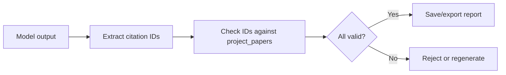

# Risk Register

## Purpose

This document lists the main risks for AI Literature Review Assistant and how
the team should mitigate them. The project combines academic APIs, LLM outputs,
database validation, authentication, and deployment. The biggest risks are not
only technical. Scope control, demo reliability, and citation trust are equally
important.

## Risk Matrix

| Risk | Likelihood | Impact | Mitigation |
| --- | --- | --- | --- |
| Scope becomes too large | High | High | Freeze MVP to eight features and move graph/chat/PDF to stretch |
| Paper APIs are slow or rate-limited | Medium | High | Use partial results, source diagnostics, and seeded demo data |
| Search returns irrelevant papers | High | Medium | Add user screening and relevance labels |
| Duplicate papers across sources | High | Medium | Deduplicate by DOI, arXiv ID, source IDs, and normalized title |
| Language bias hides local work | High | Medium | Generate multilingual queries and show language coverage audits |
| Firecrawl returns noisy content | Medium | Medium | Crawl only selected pages and validate extracted metadata |
| Agent workflow becomes too autonomous | Medium | High | Use fixed LangGraph nodes and backend validation |
| Default RAG retrieves unsupported context | Medium | High | Use Hybrid RAG with citation-aware evidence IDs |
| LLM extracts wrong matrix fields | High | Medium | Validate schema and allow user edits |
| Gap detection becomes generic | Medium | High | Require evidence paper IDs for every gap |
| Citation hallucination | Medium | High | Validate citation IDs against saved project papers |
| Report generation is slow | Medium | Medium | Limit paper count for MVP and cache generated artifacts |
| Auth ownership bug leaks data | Low | High | Test project ownership checks on every project endpoint |
| Coolify or GHCR deploy breaks near demo | Medium | High | Build GHCR images by Week 6 and rehearse Coolify deploys |
| DeepSeek V4 or opencode-go becomes unavailable | Low | High | Define backend AIProvider interface so OpenAI or Claude can replace it without changing workflow code |
| Coordination overhead with 3 people | Medium | Medium | Daily sync, API contracts written down, parallelizable ownership |

## Scope Risk

The project has many attractive feature ideas: knowledge maps, contradiction
detection, full PDF parsing, RAG chat, DOCX export, LaTeX export, and model
switching. The risk is that each feature gets a shallow implementation and the
core workflow remains unstable.

Mitigation:

- Treat the MVP list as fixed.
- Do not start stretch features until search, save, matrix, gaps, and export
  work on the Coolify deployment.
- Use `docs/mvp.md` as the scope contract.

## Hallucination and Citation Risk

The system uses LLMs, so hallucination cannot be eliminated entirely. The
project should focus on preventing the most damaging failure: fake or invalid
citations. The backend should validate every citation ID against saved project
papers. The reference list should be generated from database records, not from
model text.

Mitigation:

The team should also avoid claiming that the app guarantees factual truth.
The accurate claim is that the app restricts citations to real saved papers and
makes evidence visible.

## Academic Source Risk

Semantic Scholar, OpenAlex, arXiv, Exa, and Firecrawl use different fields and
coverage. Some papers may lack abstracts, DOI, venue, or citation counts. arXiv
preprints may not have peer-reviewed venues. OpenAlex may return broad matches.
Semantic Scholar may be rate-limited. Exa can surface useful web results that
are not canonical paper records. Firecrawl can extract noisy page content if a
page is not a clean research landing page.

Mitigation:

- Normalize into a common paper schema.
- Store missing fields as null.
- Show source badges and missing metadata in the UI.
- Return partial results when one source fails.
- Use Exa and Firecrawl as enrichment sources, not as unchecked citation truth.
- Seed a demo project with real saved papers.

## Language Bias Risk

Academic search is often biased toward English, high-citation, and high-resource
venues. This can be wrong for topics involving Vietnamese NLP, local education,
regional healthcare, or low-resource languages.

Mitigation:

- Detect the query language.
- Generate English and original-language query variants.
- Track candidate counts by language.
- Reduce over-reliance on citation count for non-English candidates.
- Show a language coverage audit in the search UI.

## AI Output Validation Risk

The model may return malformed JSON or fill missing fields with guesses. This
can corrupt the matrix and weaken gap detection.

Mitigation:

- Request structured JSON.
- Validate with backend schemas.
- Use explicit values such as `not specified` for missing information.
- Allow user edits.
- Store confidence levels.

## Demo Risk

Live demos are vulnerable to network failures, API limits, slow model responses,
and deployment issues. A project like this must demonstrate the full workflow,
so relying only on live generation is risky.

Mitigation:

- Deploy by Week 6 using Coolify.
- Build frontend and backend Docker images with GitHub Actions and push them
  to GHCR.
- Prepare a seeded project with real paper data.
- Rehearse the full demo twice in Week 7.
- Keep a Markdown export ready from the seeded project.

## AI Provider Risk

DeepSeek V4 or opencode-go may become slow, unavailable, or change pricing
during the project. If the backend is tightly coupled to one provider, an
outage blocks all AI features.

Mitigation:

- Define a backend `AIProvider` interface so a different provider (OpenAI,
  Claude, or a local model) can be swapped by changing configuration, not
  workflow code.
- Store generated matrix rows, gaps, and reports so the system does not depend
  on live AI calls during the demo.
- Test the provider interface with a second implementation before Week 6.

## Feasibility Risk

Three people can build the MVP in eight weeks, but only with strict scope control
and clear ownership. If the team adds contradiction detection, PDF parsing,
and graph visualization before the core workflow works, the project becomes
risky.

Mitigation:

- Member A owns frontend workflow.
- Member B owns backend and AI workflows.
- Member C owns infrastructure and testing.
- Define API contracts early.
- Test the evidence chain, not just UI rendering.

## Agent and RAG Risk

Agent orchestration can make the system look more advanced, but it can also
create hidden behavior if the graph is too autonomous. A literature review
assistant should not let an agent decide to skip screening, cite unsaved papers,
or use crawled web text as a citation source.

Mitigation:

- Use LangGraph as a fixed workflow graph, not as an open-ended autonomous bot.
- Define allowed tools for each node.
- Store `agent_runs` and `agent_steps` for auditability.
- Require Hybrid RAG evidence to include `project_paper_id`.
- Use Ragas on seeded examples to catch retrieval and citation regressions.
- Keep LightRAG as a stretch feature after the MVP, not a required dependency.

## Security Risk

The app handles user accounts, project data, and API keys. The most likely
security mistakes are exposing server keys in the frontend and failing to check
project ownership.

Mitigation:

- Store AI and paper API keys only in backend environment variables.
- Use backend proxy endpoints for all external calls.
- Check project ownership in every project-scoped endpoint.
- Keep admin features minimal.

## Product Value Risk

The system may become a generic review generator if the matrix and evidence
features are weak. That would make it hard to distinguish from ordinary LLM
writing tools.

Mitigation:

- Make the literature matrix a first-class UI screen.
- Show evidence for each gap.
- Make citation validation visible.
- Design the demo around traceability from paper to exported review.
