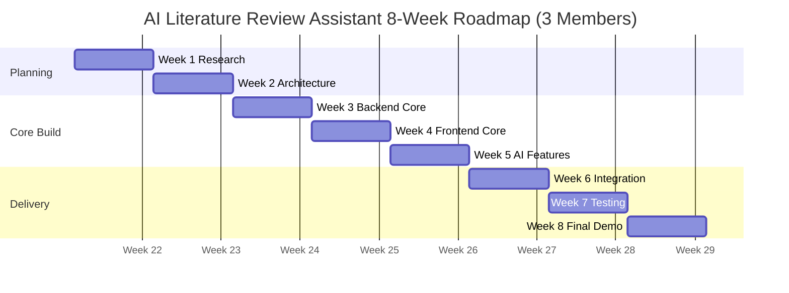

# Roadmap

## Timeline Overview

The roadmap covers eight weeks with three members. Member A owns the
full-stack critical path (DB + APIs + all frontend screens + integration).
Member B owns the AI/ML layer (paper sources, LangGraph, RAG, citation
guardrails). Member C owns infrastructure, testing, and demo polish.

The highest-risk work is paper source integration, structured AI extraction,
and citation validation. These should be implemented before optional visual
polish or stretch features.

The exact calendar dates can shift. The week sequence should not. Architecture
and API contracts must be settled before the AI workflow becomes complex.

## Week 1: Research

Goal: understand the domain, confirm scope, and avoid building the wrong
product.

Deliverables:

- Confirm MVP feature list.
- Review academic source APIs plus Exa and Firecrawl.
- Review similar literature review assistants.
- Define the demo topic.
- Draft initial UI wireframes.
- Draft canonical paper schema and language-bias audit schema.

Exit criteria:

- The team can explain the pain point in one minute.
- The team can explain which features are intentionally out of MVP.
- The team has chosen the demo topic and paper source strategy.

## Week 2: Architecture

Goal: turn the idea into buildable contracts.

Deliverables:

- Backend project skeleton.
- Frontend project skeleton.
- Database schema draft.
- API endpoint contracts.
- Auth strategy.
- opencode-go/DeepSeek V4 provider strategy.
- LangGraph state graph and node contract.
- Hybrid RAG and Ragas evaluation plan.
- Docker, Coolify, GitHub Actions, and GHCR deployment plan.

Exit criteria:

- Frontend and backend agree on request and response shapes.
- The database schema supports all MVP entities.
- The team has a local development environment running.

## Week 3: Backend Core

Goal: implement the backend foundation and paper search.

Deliverables:

- Auth endpoints.
- Project endpoints.
- Paper source adapters.
- Exa and Firecrawl adapters.
- Language-aware query planner.
- LangGraph workflow skeleton.
- Paper normalization and deduplication.
- Dockerized PostgreSQL + pgvector local stack.
- Save papers endpoint.
- Initial backend tests.

Exit criteria:

- A user can create a project through the API.
- The backend can search at least two academic sources plus Exa or Firecrawl.
- Saved papers are persisted without duplicates.

## Week 4: Frontend Core

Goal: implement the main user workflow up to saved papers.

Deliverables:

- Login and session handling.
- Project dashboard.
- Project workspace navigation.
- Search papers screen.
- Saved papers screen.
- Error and loading states.

Exit criteria:

- A user can log in, create a project, search papers, and save papers through
  the UI.
- The UI handles partial source failures without breaking.

## Week 5: AI Features

Goal: implement the AI-assisted research workflow.

Deliverables:

- Matrix generation endpoint.
- Backend research enrichment endpoint.
- Language-bias ranking and search audit logic.
- Hybrid RAG service over full-text search, pgvector, and metadata filters.
- Ragas evaluation seed set.
- Matrix editor UI.
- Gap detection endpoint.
- Gap evidence UI.
- Report generation endpoint.
- Citation guardrail validation.

Exit criteria:

- Saved papers can become matrix rows.
- Hybrid RAG returns evidence with valid `project_paper_id`.
- Gaps are generated only with evidence.
- Invalid report citations are rejected by the backend.

## Week 6: Integration

Goal: connect all modules and deploy a first complete version.

Deliverables:

- Full frontend-backend integration.
- Markdown export.
- Basic admin user management.
- Seeded demo project.
- GitHub Actions workflow that builds images and pushes to GHCR.
- First Coolify deployment for frontend, backend, and PostgreSQL + pgvector.

Exit criteria:

- The MVP path works end to end on Coolify-deployed infrastructure.
- The seeded demo project can be opened and presented.
- API keys are stored server-side only.

## Week 7: Testing

Goal: harden the product for demo and evaluation.

Deliverables:

- Backend tests for deduplication, ownership, matrix validation, gap evidence,
  and citation guardrails.
- Frontend workflow testing.
- Deployment rehearsal.
- Error state review.
- Documentation updates.

Exit criteria:

- The team can complete the demo twice without manual database fixes.
- Known high-risk errors have visible user messages.
- Citation guardrail behavior is demonstrated with a negative test.

## Week 8: Final Demo

Goal: stabilize, present, and defend the product.

Deliverables:

- Final deployed URL.
- Demo script.
- Final project report.
- Screenshots.
- Seeded demo data.
- Technical explanation of architecture and guardrails.

Exit criteria:

- The app is reachable online.
- Login works.
- The demo flow works end to end.
- The team can explain why the app prevents hallucinated citations.

## Stretch Features After MVP

Stretch features should only start if the MVP is deployed and stable:

- RAG chat over saved papers.
- LightRAG or graph-RAG knowledge map.
- Full-text PDF extraction for open-access papers.
- Visual knowledge map based on matrix rows.
- Candidate contradiction detection.
- DOCX or LaTeX export.
- Multi-provider AI settings beyond opencode-go/DeepSeek V4.

These should not be started before Week 6 unless the core workflow is already
working.
