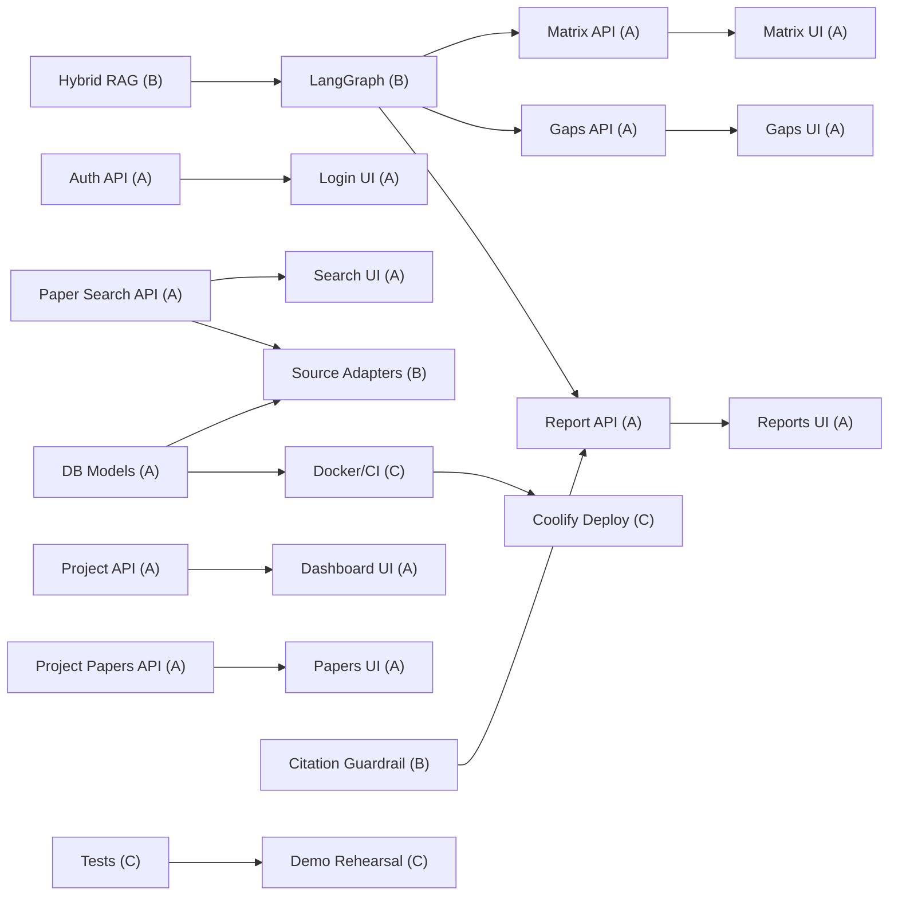

# Team Plan (3 Members)

## Team Structure

The project is designed for three members over eight weeks. Member A is the
full-stack lead and carries the most work — including building the backend
foundation that Member B (AI/ML Engineer) needs before starting AI features.
Member C owns infrastructure, testing, and demo polish.

The dependency flow is: **A builds first → B layers AI on top → C tests and
deploys**. This means A must deliver DB models, Pydantic schemas, and core
endpoints before B starts source adapters or LangGraph work.

### Ownership

| Member | Primary Area | Scope |
|--------|-------------|-------|
| **A (Full-stack Lead)** | Backend foundation + Frontend screens + Integration | DB models, Pydantic schemas, CRUD APIs, auth, all frontend pages, API client, seeded demo data |
| **B (AI/ML Engineer)** | AI layer built on A's foundation | Source adapters, paper search service, LangGraph nodes, matrix extraction, gap detection, citation guardrails, hybrid RAG, knowledge graph |
| **C (DevOps + QA)** | Infrastructure + Testing + Demo | Docker, CI/CD, Coolify, backend tests, frontend tests, documentation, demo script |

### Coordination Rules

- A writes Pydantic schemas and DB models first. B and C review before A
  implements the endpoints.
- B starts source adapters only after A has DB models and paper search
  skeleton ready.
- C starts API tests only after A has endpoints live.
- Daily sync: what changed, what is blocked, API contract changes.
- All API contract changes written down immediately.

## Dependency Map

The key insight: A's backend work is the foundation. B cannot start until A
delivers models and schemas. C cannot test until A delivers endpoints.

## Week 1: Research and Scope Lock

### Member A (Full-stack Lead)

- Review project docs, architecture, API design, database design.
- Confirm MVP scope with team.
- Define frontend route structure and component hierarchy.
- Draft API contract templates (Pydantic request/response shapes) for all
  endpoints — this is B's starting point.
- Estimate which UI components are reusable from shadcn/ui.

**Hours: 8-10**

### Member B (AI/ML Engineer)

- Review Semantic Scholar, OpenAlex, arXiv, Exa, Firecrawl API docs.
- Define canonical paper schema and enrichment schema.
- Define language-bias audit fields.
- Define LangGraph state shape and node contracts.
- Decide deduplication rules.
- Review A's Pydantic schemas and confirm they support AI workflow needs.

**Hours: 8-10**

### Member C (DevOps + QA)

- Review deployment architecture (Coolify, GHCR, Docker Compose).
- Set up development environment checklist.
- Review existing tests and define test strategy.
- Draft demo script outline.
- Document current project state and gaps.

**Hours: 6-8**

### Exit Criteria

- Team agrees on MVP scope and 3-person split.
- A has Pydantic schema drafts for B to review.
- Paper source strategy defined.
- Test strategy defined.

## Week 2: Architecture and Setup — A Builds Foundation

### Member A (Full-stack Lead) — CRITICAL PATH

This week A builds the foundation that B and C depend on. Priority order:

1. **DB models** — users (enhanced with email, role, is_active), projects,
   papers, project_papers, paper_enrichments, literature_matrix_rows,
   research_gaps, gap_evidence, review_reports, review_citations,
   agent_runs, agent_steps.
2. **Pydantic schemas** — all request/response shapes for every endpoint.
   B reviews these before A implements endpoints.
3. **Auth endpoints** — register, login, me.
4. **Project CRUD endpoints** — create, list, get, update.
5. **Paper search skeleton** — endpoint exists, returns empty list for now.
   B will fill in source adapters later.
6. **Alembic migration setup**.

**Hours: 14-16**

### Member B (AI/ML Engineer) — WAITING FOR A

- Review A's DB models and Pydantic schemas.
- Start Semantic Scholar adapter (can work independently — no DB needed).
- Start OpenAlex adapter.
- Start arXiv adapter.
- Draft LangGraph graph skeleton with state definition.

**Hours: 12-14**

### Member C (DevOps + QA) — WAITING FOR A

- Set up Docker Compose with PostgreSQL + pgvector + backend + frontend.
- Configure GitHub Actions workflow for build + push to GHCR.
- Set up backend test framework (pytest fixtures, test DB).
- Write tests for auth endpoints.
- Set up ruff + ty linting in CI.

**Hours: 12-14**

### Exit Criteria

- A has all DB models, auth, project CRUD, and paper search skeleton live.
- B has 3 source adapters returning real data.
- Docker stack runs locally.
- CI pipeline passes.

## Week 3: Backend Core — A Completes Backend, B Starts AI

### Member A (Full-stack Lead)

- Implement paper search endpoint (fan-out to source adapters — B's adapters).
- Implement paper normalization and deduplication service.
- Implement save papers endpoint (project_papers CRUD).
- Implement project papers list endpoint with filters.
- Implement matrix generation endpoint skeleton (returns empty for now).
- Implement gap generation endpoint skeleton.
- Implement report generation endpoint skeleton.
- Add tests for deduplication and ownership checks.

**Hours: 16-18**

### Member B (AI/ML Engineer) — NOW ACTIVE

- Implement Exa search adapter.
- Implement Firecrawl search/crawl adapter.
- Implement language-aware query planner.
- Implement language-bias scoring and audit output.
- Integrate adapters into A's search service.

**Hours: 14-16**

### Member C (DevOps + QA)

- Write tests for project CRUD endpoints.
- Write tests for paper search with mocked source responses.
- Set up seeded demo data script (users, projects, papers).
- Set up Coolify deployment configuration.
- Begin frontend test setup (vitest).

**Hours: 10-12**

### Exit Criteria

- User can search papers through API from multiple sources.
- Saved papers persist without duplicates.
- Language bias audit included in search response.
- Backend test coverage > 40%.
- Coolify config ready.

## Week 4: Frontend Core — A Builds UI, B Builds AI Services

### Member A (Full-stack Lead)

- Build project dashboard page (list projects, create project).
- Build project workspace layout with tabs.
- Build search papers screen (connect to real API).
- Build saved papers screen (table with status labels).
- Build loading, empty, and error states for all screens.
- Implement API client wrappers for all endpoints.

**Hours: 18-22**

### Member B (AI/ML Engineer)

- Implement research enrichment service (merge metadata, fetch citations,
  extract research facets with DeepSeek V4).
- Implement matrix extraction endpoint (structured JSON output).
- Implement LangGraph matrix node with validation.
- Add seeded matrix demo data.

**Hours: 14-16**

### Member C (DevOps + QA)

- Write tests for paper save and dedup endpoints.
- Write frontend component tests (login form, project creation).
- Deploy first working version to Coolify.
- Set up monitoring/logging for deployed backend.
- Create seeded demo project with 15 real papers.

**Hours: 10-12**

### Exit Criteria

- User can log in, create project, search papers, save papers via UI.
- Matrix extraction works for saved papers.
- First Coolify deployment accessible.
- Seeded demo project has real paper data.

## Week 5: AI Features — B Delivers Core AI

### Member A (Full-stack Lead)

- Build literature matrix page (table with editable cells).
- Build research gaps page (gap cards with evidence).
- Build review export page (sections + citations + reference list).
- Connect all screens to real backend endpoints.
- Implement validation error display and regeneration UI.

**Hours: 18-20**

### Member B (AI/ML Engineer) — PEAK WORKLOAD

- Implement gap detection from matrix rows (requires evidence paper IDs).
- Implement Hybrid RAG service (full-text + pgvector + metadata filters).
- Implement citation guardrail validation service.
- Implement report generation with structured citation IDs.
- Implement LangGraph nodes for gap, report, and citation validation.

**Hours: 18-22**

### Member C (DevOps + QA)

- Write tests for matrix generation and validation.
- Write tests for gap detection (evidence required).
- Write tests for citation guardrail (invalid citation rejection).
- Run full demo flow on Coolify deployment.
- Fix deployment issues found during testing.

**Hours: 12-14**

### Exit Criteria

- Matrix rows generated from saved papers with editable fields.
- Gaps generated with mandatory evidence paper IDs.
- Citation guardrail rejects invalid citation IDs.
- Report generation produces validated citations.
- Full flow works on Coolify.

## Week 6: Integration

### Member A (Full-stack Lead)

- Fix all frontend-backend integration issues.
- Build knowledge map page (react-force-graph-2d).
- Add Markdown export functionality.
- Polish UI: loading spinners, error messages, empty states.
- Implement admin user list endpoint if required.

**Hours: 16-18**

### Member B (AI/ML Engineer)

- Implement knowledge graph service (build graph from matrix rows).
- Improve error handling across source and AI failures.
- Add Ragas evaluation set for retrieval and citation support.
- Optimize matrix extraction prompts based on test results.
- Add tests for knowledge graph endpoint.

**Hours: 14-16**

### Member C (DevOps + QA)

- Set up GitHub Actions CD pipeline (auto-deploy on merge to main).
- Run full backend test suite on CI.
- Test edge cases: source failures, empty projects, duplicate saves.
- Prepare demo data and demo environment checklist.
- Update project documentation.

**Hours: 12-14**

### Exit Criteria

- All 8 MVP screens connected to real backend.
- Knowledge map visualization works.
- Markdown export works.
- CI/CD pipeline deploys automatically.
- Backend test coverage > 60%.

## Week 7: Testing and Hardening

### Member A (Full-stack Lead)

- Test full user flow end to end on deployed system.
- Fix layout issues and confusing states.
- Polish demo flow: ensure each step takes < 30 seconds.
- Prepare screenshots for final report.
- Write demo script with exact steps.

**Hours: 14-16**

### Member B (AI/ML Engineer)

- Run Ragas evaluation and fix retrieval quality issues.
- Optimize slow AI calls (matrix, gaps, report).
- Test citation guardrail with edge cases.
- Prepare technical explanation of architecture.
- Fix any remaining AI output quality issues.

**Hours: 12-14**

### Member C (DevOps + QA)

- Deploy final version to Coolify.
- Run full test suite on deployed environment.
- Verify no API keys exposed in frontend.
- Verify citation guardrail with negative test cases.
- Prepare final project report and documentation.

**Hours: 12-14**

### Exit Criteria

- Demo can run twice without manual fixes.
- All known bugs fixed or documented.
- Final deployment stable.
- Documentation complete.

## Week 8: Final Demo

### Member A (Full-stack Lead)

- Final UI polish.
- Run demo rehearsal with team.
- Prepare user-facing slides or screenshots.
- Verify export output formatting.

**Hours: 8-10**

### Member B (AI/ML Engineer)

- Freeze API changes.
- Monitor AI service during rehearsal.
- Prepare technical explanation of source integration, AI workflows,
  and citation guardrails.

**Hours: 8-10**

### Member C (DevOps + QA)

- Final deployment verification.
- Monitor deployment during rehearsal.
- Prepare risk mitigation explanation.
- Final documentation review.

**Hours: 8-10**

### Exit Criteria

- App reachable online.
- Login works.
- Full demo flow works end to end.
- Team can explain why app prevents hallucinated citations.

## Workload Distribution Summary

| Member | Weeks 1-2 | Weeks 3-4 | Weeks 5-6 | Weeks 7-8 | Total |
|--------|-----------|-----------|-----------|-----------|-------|
| A (Full-stack Lead) | 22-26h | 34-40h | 34-38h | 22-26h | **112-130h** |
| B (AI/ML Engineer) | 20-24h | 28-32h | 32-38h | 20-24h | **100-118h** |
| C (DevOps + QA) | 18-22h | 22-24h | 24-28h | 20-24h | **84-98h** |

A carries the most because A builds the foundation first (Week 2-3), then
builds all frontend screens (Week 4-6), then integrates everything (Week 6-8).
B cannot start AI work until A delivers DB models and Pydantic schemas.
C cannot test until A delivers endpoints.

## Technical Rules

1. The frontend must not use `useEffect` for data fetching. Use server
   components, Server Actions, or `useSWR` instead.
2. All backend API calls go through `lib/api/client.ts`. Do not call `fetch`
   directly in components.
3. Every project-scoped backend endpoint must check ownership. Do not rely on
   frontend filtering.
4. API contracts are defined in `docs/architecture/api-design.md`. Changes
   require team approval.
5. All commits must pass lint and typecheck before push.

The success measure is an end-to-end deployed workflow, not the number of
features implemented.
