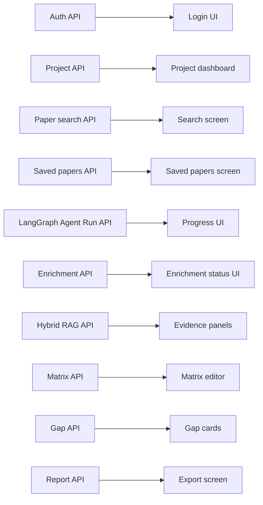

# Team Plan

## Team Structure

The project is designed for two members over eight weeks. The split should be
based on ownership boundaries, not isolated tasks. Member A owns the user
experience and frontend workflow. Member B owns backend workflows, paper source
integration, AI generation, and citation validation. Both members share product
decisions, demo preparation, and final testing.

The split is:

- Member A: Frontend, authentication UI, UI/UX, project management screens.
- Member B: FastAPI, Dockerized PostgreSQL + pgvector, paper search, backend
  research enrichment, LangGraph workflow orchestration, opencode-go/DeepSeek
  V4 integration, Hybrid RAG, Ragas evaluation, gap detection, citation
  validation.

The team should avoid parallel implementation without contracts. Before Member
A builds a screen, Member B should provide API schemas or mocked responses.
Before Member B finalizes endpoints, Member A should confirm the frontend can
render the necessary states.

## Dependency Map

The most important dependency is API shape. The team should define request and
response schemas early and keep them stable unless a real issue appears.

## Week 1: Research and Scope Lock

Member A deliverables:

- Review similar products and collect UI references for research dashboards.
- Draft the project dashboard, project workspace, search results, matrix, gap,
  and export screen wireframes.
- Define the frontend route structure.
- Estimate which UI components are reusable.

Estimated hours: 8 to 10.

Member B deliverables:

- Review Semantic Scholar, OpenAlex, arXiv, Exa, and Firecrawl API behavior.
- Define canonical paper schema and enrichment schema.
- Define language-bias audit fields for search results.
- Define LangGraph state shape and Hybrid RAG evidence schema.
- Decide deduplication rules.
- Draft initial FastAPI project structure and database model plan.

Estimated hours: 10 to 12.

Dependencies:

- Both members must agree on MVP scope.
- Both members must agree that knowledge map, contradiction detection, and PDF
  parsing are out of MVP unless core workflow finishes early.

## Week 2: Architecture and Setup

Member A deliverables:

- Initialize Next.js 16 + TypeScript + Tailwind.
- Implement app shell, routes, layout, and basic form components.
- Implement mocked login, project dashboard, and project workspace screens.
- Create API client wrapper with token support.

Estimated hours: 12 to 14.

Member B deliverables:

- Initialize FastAPI backend.
- Set up Dockerized PostgreSQL + pgvector connection and migrations.
- Implement user, project, paper, project paper, matrix, gap, and report tables.
- Implement auth endpoints and project CRUD endpoints.

Estimated hours: 14 to 16.

Dependencies:

- Member A needs endpoint paths and response examples.
- Member B needs confirmation that frontend route names match API resources.

## Week 3: Backend Core

Member A deliverables:

- Connect login and project dashboard to real API.
- Build project creation form.
- Build paper search screen with mocked results if backend search is not ready.
- Build saved papers table shell.

Estimated hours: 12 to 15.

Member B deliverables:

- Implement Semantic Scholar adapter.
- Implement OpenAlex adapter.
- Implement arXiv adapter.
- Implement Exa search adapter.
- Implement Firecrawl search/crawl adapter.
- Implement language-aware query planner.
- Implement normalization and deduplication.
- Implement save papers endpoint.
- Add tests for normalization and deduplication.

Estimated hours: 16 to 20.

Dependencies:

- Member A depends on search response schema.
- Member B depends on agreed UI needs for search metadata.

## Week 4: Frontend Core

Member A deliverables:

- Connect paper search to backend.
- Implement save selected papers workflow.
- Implement saved papers screen with status and relevance labels.
- Implement loading, empty, and error states.
- Improve visual consistency and navigation.

Estimated hours: 16 to 20.

Member B deliverables:

- Harden project ownership checks.
- Implement matrix generation endpoint skeleton.
- Implement opencode-go/DeepSeek V4 provider adapter.
- Implement backend enrichment job schema.
- Implement LangGraph run table and first graph skeleton.
- Implement structured output validation for matrix rows.
- Add seeded demo data script or endpoint for development.

Estimated hours: 14 to 18.

Dependencies:

- Matrix UI can start only after the matrix response schema is stable.
- Demo seed data should match the frontend topic flow.

## Week 5: AI Features

Member A deliverables:

- Build literature matrix table.
- Add editable matrix fields.
- Build gap card UI with evidence display.
- Build report generation and validation status UI.

Estimated hours: 18 to 22.

Member B deliverables:

- Implement research enrichment with source metadata, citation/reference
  signals, Exa related pages, Firecrawl crawl data, and opencode-go/DeepSeek V4
  research facet extraction.
- Implement language-bias ranking and search audit output.
- Implement Hybrid RAG over full-text search, pgvector, metadata filters, and
  reranking.
- Implement LangGraph nodes for matrix, gap, report, and citation validation.
- Add a small Ragas evaluation set for retrieval and citation support.
- Implement matrix extraction using opencode-go/DeepSeek V4.
- Implement gap detection from matrix rows.
- Implement citation-safe report generation.
- Implement citation guardrail validation.
- Add tests for invalid citation rejection.

Estimated hours: 20 to 24.

Dependencies:

- Gap generation depends on matrix rows.
- Report generation depends on saved papers, matrix rows, and citation
  validation.

## Week 6: Integration

Member A deliverables:

- Connect matrix, gap, and report screens to real endpoints.
- Add UI for regeneration, validation errors, and low-confidence fields.
- Add Markdown export button.
- Polish demo flow.

Estimated hours: 16 to 20.

Member B deliverables:

- Fix API integration issues.
- Improve error handling across source and AI failures.
- Add report export endpoint.
- Add admin user list and deactivate endpoint if required.
- Add backend integration tests for the MVP path.

Estimated hours: 18 to 22.

Dependencies:

- Frontend polish depends on stable backend status and error models.
- Backend tests should use representative saved papers.

## Week 7: Testing and Hardening

Member A deliverables:

- Test full user flow in deployed frontend.
- Fix layout issues and confusing states.
- Verify mobile or tablet fallback does not break core screens.
- Prepare screenshots for final report.

Estimated hours: 14 to 18.

Member B deliverables:

- Deploy backend container through Coolify.
- Deploy PostgreSQL + pgvector container and persistent volume through Coolify.
- Verify GitHub Actions pushes images to GHCR.
- Run backend tests.
- Verify environment variables and API keys are not exposed.
- Verify citation guardrail with invalid citation test cases.

Estimated hours: 16 to 20.

Dependencies:

- End-to-end testing requires deployed frontend, backend, and database.
- Demo reliability requires seeded project data.

## Week 8: Final Demo

Member A deliverables:

- Final UI polish.
- Prepare demo script.
- Prepare user-facing slides or screenshots.
- Verify export output formatting.

Estimated hours: 10 to 14.

Member B deliverables:

- Freeze API changes.
- Prepare seeded demo project.
- Monitor deployment during rehearsal.
- Prepare technical explanation of source integration, AI workflows, and
  citation guardrails.

Estimated hours: 10 to 14.

Dependencies:

- No new feature scope should be accepted in Week 8.
- Only bug fixes, demo data, and documentation polish should happen.

## Coordination Rules

The team should have a short daily sync during implementation weeks. Each sync
should answer three questions: what changed, what is blocked, and whether API
contracts changed. API contract changes should be written down immediately.

The team should not split work by "frontend person waits for backend person."
Member A can build against typed mock responses while Member B implements the
real endpoints. Member B can write endpoint tests while Member A finalizes UI.

## Technical Rules

1. The frontend must not use `useEffect` for data fetching. Use server
   components, Server Actions, or `useSWR` instead. See
   `architecture/frontend-architecture.md` for the full policy and lint rule.
2. All backend API calls go through `lib/api/client.ts`. Do not call `fetch`
   directly in components.
3. Every project-scoped backend endpoint must check ownership. Do not rely on
   frontend filtering.

The success measure is an end-to-end deployed workflow, not the number of
features implemented.
